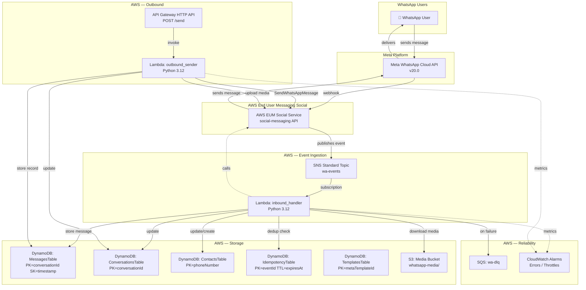

# AWS End User Messaging Social — Master Reference Implementation

**Date**: 2026-02-11
**Scope**: WhatsApp via AWS EUM Social ONLY (NO SAM / NO CloudFormation / NO CDK / NO Amazon Connect / NO direct Meta Graph API)
**Event Destination**: Amazon SNS (standard topic, NOT FIFO)
**Sources**: AWS EUM Social User Guide + API Reference (all nested pages crawled), Meta WhatsApp docs (capability requirements only)

---

## TABLE OF CONTENTS

1. [Checklist A — AWS Track Completeness](#1-checklist-a--aws-track-completeness)
2. [Checklist B — WhatsApp Capability Checklist (Meta-derived)](#2-checklist-b--whatsapp-capability-checklist-meta-derived)
3. [Checklist C — Coverage & Gaps (AWS EUM Social-only Feasibility)](#3-checklist-c--coverage--gaps-aws-eum-social-only-feasibility)
4. [Mapping Table A — AWS Implementation Map](#4-mapping-table-a--aws-implementation-map)
5. [Mapping Table B — WhatsApp Capability Table (Meta → AWS)](#5-mapping-table-b--whatsapp-capability-table-meta--aws)
6. [Event Crosswalk — Meta Webhooks → AWS SNS → Internal Schema](#6-event-crosswalk--meta-webhooks--aws-sns--internal-schema)
7. [Architecture](#7-architecture)
8. [Resource List & Naming](#8-resource-list--naming)
9. [Provisioning Scripts (AWS CLI, NO SAM/CFN)](#9-provisioning-scripts)
10. [Application Code — Lambda Handlers](#10-application-code)
11. [Shared Libraries](#11-shared-libraries)
12. [Event Destination Setup (SNS)](#12-event-destination-setup)
13. [IAM Policies (Least Privilege)](#13-iam-policies)
14. [Testing & Fixtures](#14-testing--fixtures)
15. [Runbook & Operational Notes](#15-runbook--operational-notes)

---

## 1. CHECKLIST A — AWS Track Completeness

Complete inventory of every AWS EUM Social API operation needed for end-to-end WhatsApp integration.

### 1.1 Onboarding / Linking WABA + Phone Numbers

| # | Operation | API | Method & Path | Required? | Notes |
|---|-----------|-----|---------------|-----------|-------|
| 1 | Link WABA to AWS account | `AssociateWhatsAppBusinessAccount` | `POST /v1/whatsapp/signup` | YES (one-time) | Console-only during initial signup. Accepts `setupFinalization` (phone numbers, WABA, event destinations, 2FA PINs) or `signupCallback` (OAuth token). |
| 2 | List linked WABAs | `ListLinkedWhatsAppBusinessAccounts` | `GET /v1/whatsapp/waba/list` | YES | Paginated (maxResults 1-100). Returns `linkedAccounts[]` with `wabaId`, `registrationStatus`, `eventDestinations[]`, `enableSending`, `enableReceiving`. |
| 3 | Get WABA details | `GetLinkedWhatsAppBusinessAccount` | `GET /v1/whatsapp/waba/details?id=` | YES | Returns full account object including `phoneNumbers[]` array with `phoneNumberId`, `metaPhoneNumberId`, `displayPhoneNumber`, `qualityRating`. |
| 4 | Get phone number details | `GetLinkedWhatsAppBusinessAccountPhoneNumber` | `GET /v1/whatsapp/waba/phone/details?id=` | OPTIONAL | Returns `linkedWhatsAppBusinessAccountId` + phone detail object. |
| 5 | Disassociate WABA | `DisassociateWhatsAppBusinessAccount` | `DELETE /v1/whatsapp/waba/disassociate?id=` | CLEANUP | Unlinks WABA from AWS account. |

### 1.2 Event Destination Configuration (SNS)

| # | Operation | API | Method & Path | Required? | Notes |
|---|-----------|-----|---------------|-----------|-------|
| 6 | Set event destination | `PutWhatsAppBusinessAccountEventDestinations` | `PUT /v1/whatsapp/waba/eventdestinations` | YES (critical) | `{id: wabaId, eventDestinations: [{eventDestinationArn: snsTopicArn, roleArn: iamRoleArn}]}`. Max 1 destination per WABA. MUST be enabled to receive inbound messages. |

### 1.3 Sending Messages

| # | Operation | API | Method & Path | Required? | Notes |
|---|-----------|-----|---------------|-----------|-------|
| 7 | Send message (all types) | `SendWhatsAppMessage` | `POST /v1/whatsapp/send` | YES (core) | `message` field is a base64-encoded WhatsApp Message object (text/media/template/interactive/reaction/location/contacts). `metaApiVersion` required (e.g. `v20.0`). `originationPhoneNumberId` in format `phone-number-id-xxx`. Returns `{messageId}`. Quota: 1,000 req/sec. |

### 1.4 Media Operations

| # | Operation | API | Method & Path | Required? | Notes |
|---|-----------|-----|---------------|-----------|-------|
| 8 | Upload media | `PostWhatsAppMessageMedia` | `POST /v1/whatsapp/media` | YES | Source: `sourceS3File` (bucket+key) OR `sourceS3PresignedUrl`. Returns `{mediaId}`. Only the origination phone that uploaded can send it. Quota: 100 req/sec. |
| 9 | Download media | `GetWhatsAppMessageMedia` | `POST /v1/whatsapp/media/get` | YES | Destination: `destinationS3File` OR `destinationS3PresignedUrl`. `metadataOnly=true` for size/mime only. Returns `{fileSize, mimeType}`. Quota: 100 req/sec. |
| 10 | Delete media | `DeleteWhatsAppMessageMedia` | `DELETE /v1/whatsapp/media?mediaId=&originationPhoneNumberId=` | OPTIONAL | Deletes from WhatsApp servers. S3 copy must be deleted separately. Returns `{success: boolean}`. Quota: 100 req/sec. |

### 1.5 Template Management

| # | Operation | API | Method & Path | Required? | Notes |
|---|-----------|-----|---------------|-----------|-------|
| 11 | Create template | `CreateWhatsAppMessageTemplate` | `POST /v1/whatsapp/template/put` | YES | `{id: wabaId, templateDefinition: blob}`. Returns `{category, metaTemplateId, templateStatus}`. AWS does NOT store template content. |
| 12 | Get template | `GetWhatsAppMessageTemplate` | `GET /v1/whatsapp/template?id=&metaTemplateId=` | YES | Returns `{template: jsonString}` (max 6000 chars). |
| 13 | List templates | `ListWhatsAppMessageTemplates` | `GET /v1/whatsapp/template/list?id=` | YES | Paginated. Returns `{templates: [{metaTemplateId, templateName, templateCategory, templateLanguage, templateStatus, templateQualityScore}]}`. |
| 14 | Update template | `UpdateWhatsAppMessageTemplate` | `POST /v1/whatsapp/template` | OPTIONAL | `{id, metaTemplateId, templateComponents?, templateCategory?, parameterFormat?, ctaUrlLinkTrackingOptedOut?}`. |
| 15 | Delete template | `DeleteWhatsAppMessageTemplate` | `DELETE /v1/whatsapp/template?id=&templateName=&metaTemplateId=&deleteAllTemplates=` | OPTIONAL | `deleteAllLanguages` flag available. |
| 16 | List template library | `ListWhatsAppTemplateLibrary` | `GET /v1/whatsapp/template/library/list` | OPTIONAL | Lists Meta's pre-approved sample templates. |

### 1.6 Tagging

| # | Operation | API | Method & Path | Required? | Notes |
|---|-----------|-----|---------------|-----------|-------|
| 17 | Tag resource | `TagResource` | `POST /v1/tags/tag-resource` | OPTIONAL | Tags WABAs or phone numbers. Quota: 10 req/sec. |
| 18 | Untag resource | `UntagResource` | `DELETE /v1/tags/untag-resource` | OPTIONAL | Quota: 10 req/sec. |
| 19 | List tags | `ListTagsForResource` | `GET /v1/tags/list?resourceArn=` | OPTIONAL | Quota: 10 req/sec. |

### 1.7 Required AWS Resources (End-to-End)

| # | Resource | Purpose | Required? |
|---|----------|---------|-----------|
| 1 | SNS Standard Topic | Event destination for WABA (inbound messages, statuses, template updates) | YES |
| 2 | SNS Topic Policy | Allow `social-messaging.amazonaws.com` to publish | YES |
| 3 | Lambda (inbound_handler) | Process SNS events | YES |
| 4 | Lambda (outbound_sender) | Send messages via `SendWhatsAppMessage` | YES |
| 5 | IAM Role (Lambda execution) | Basic execution + DynamoDB + SNS + S3 + social-messaging | YES |
| 6 | IAM Role (event destination) | Allow EUM Social to publish to SNS | YES (if using roleArn in event destination) |
| 7 | DynamoDB — MessagesTable | Store inbound/outbound messages | YES |
| 8 | DynamoDB — ConversationsTable | Track conversation state, 24h window | YES |
| 9 | DynamoDB — ContactsTable | Store contact info, opt-in status | YES |
| 10 | DynamoDB — IdempotencyTable | Deduplicate events (TTL-based) | YES |
| 11 | DynamoDB — TemplatesTable | Cache template metadata locally | RECOMMENDED |
| 12 | S3 Bucket | Media upload/download (required by `PostWhatsAppMessageMedia` / `GetWhatsAppMessageMedia`) | YES |
| 13 | SQS DLQ | Dead-letter queue for failed Lambda invocations | RECOMMENDED |
| 14 | CloudWatch Log Groups | Lambda logs with retention | YES |
| 15 | CloudWatch Alarms | Lambda errors, SNS delivery failures, DynamoDB throttles | RECOMMENDED |
| 16 | Secrets Manager / Parameter Store | Access tokens, app secrets (if needed for any direct config) | OPTIONAL |

### 1.8 Required IAM Permissions (Least Privilege)

```json
{
  "Version": "2012-10-17",
  "Statement": [
    {
      "Sid": "EUMSocialMessaging",
      "Effect": "Allow",
      "Action": [
        "social-messaging:SendWhatsAppMessage",
        "social-messaging:GetWhatsAppMessageMedia",
        "social-messaging:PostWhatsAppMessageMedia",
        "social-messaging:DeleteWhatsAppMessageMedia",
        "social-messaging:GetLinkedWhatsAppBusinessAccount",
        "social-messaging:GetLinkedWhatsAppBusinessAccountPhoneNumber",
        "social-messaging:ListLinkedWhatsAppBusinessAccounts",
        "social-messaging:PutWhatsAppBusinessAccountEventDestinations",
        "social-messaging:CreateMessageTemplate",
        "social-messaging:GetMessageTemplate",
        "social-messaging:ListMessageTemplates",
        "social-messaging:UpdateMessageTemplate",
        "social-messaging:DeleteMessageTemplate",
        "social-messaging:ListWhatsAppTemplateLibrary",
        "social-messaging:TagResource",
        "social-messaging:UntagResource",
        "social-messaging:ListTagsForResource"
      ],
      "Resource": "*"
    },
    {
      "Sid": "DynamoDB",
      "Effect": "Allow",
      "Action": [
        "dynamodb:PutItem",
        "dynamodb:GetItem",
        "dynamodb:UpdateItem",
        "dynamodb:DeleteItem",
        "dynamodb:Query",
        "dynamodb:Scan"
      ],
      "Resource": [
        "arn:aws:dynamodb:REGION:ACCOUNT:table/wa-MessagesTable",
        "arn:aws:dynamodb:REGION:ACCOUNT:table/wa-MessagesTable/index/*",
        "arn:aws:dynamodb:REGION:ACCOUNT:table/wa-ConversationsTable",
        "arn:aws:dynamodb:REGION:ACCOUNT:table/wa-ContactsTable",
        "arn:aws:dynamodb:REGION:ACCOUNT:table/wa-ContactsTable/index/*",
        "arn:aws:dynamodb:REGION:ACCOUNT:table/wa-IdempotencyTable",
        "arn:aws:dynamodb:REGION:ACCOUNT:table/wa-TemplatesTable"
      ]
    },
    {
      "Sid": "S3Media",
      "Effect": "Allow",
      "Action": [
        "s3:GetObject",
        "s3:PutObject",
        "s3:DeleteObject",
        "s3:ListBucket"
      ],
      "Resource": [
        "arn:aws:s3:::MEDIA_BUCKET",
        "arn:aws:s3:::MEDIA_BUCKET/*"
      ]
    },
    {
      "Sid": "SQS",
      "Effect": "Allow",
      "Action": [
        "sqs:SendMessage"
      ],
      "Resource": "arn:aws:sqs:REGION:ACCOUNT:wa-dlq"
    },
    {
      "Sid": "CloudWatchLogs",
      "Effect": "Allow",
      "Action": [
        "logs:CreateLogGroup",
        "logs:CreateLogStream",
        "logs:PutLogEvents"
      ],
      "Resource": "arn:aws:logs:REGION:ACCOUNT:*"
    }
  ]
}
```


---

## 2. CHECKLIST B — WhatsApp Capability Checklist (Meta-derived)

Requirements derived from Meta WhatsApp docs (links 5-12 in prompt). These define WHAT WhatsApp can do; Section 3 maps whether AWS EUM Social supports each.

### 2.1 Calling (Meta docs link 5-6)

| # | Capability | Setup Requirements | Constraints | Event Types |
|---|-----------|-------------------|-------------|-------------|
| B1 | Business-initiated outbound calls | Enable calling on WABA via Meta Graph API. Send permission request message first. SIP trunk integration required. | Requires SIP infrastructure. User must grant permission via interactive message before business can call. | `voice_call_status` webhook events (ringing, answered, ended, failed) |
| B2 | User-initiated inbound calls | Configure call-to-action in business profile or send interactive message with call button. | Business must accept/reject/terminate. Requires SIP forwarding setup. | `voice_call_status` webhook events |
| B3 | Call permission request | Send interactive message with `call_permission_request` action before outbound call. | Required before every business-initiated call. 24h window does NOT apply to calls. | Standard message webhook for permission response |

### 2.2 Business Profile (Meta docs link 7)

| # | Capability | Setup Requirements | Constraints |
|---|-----------|-------------------|-------------|
| B4 | Get business profile | `GET /v20.0/{PHONE_NUMBER_ID}/whatsapp_business_profile` | Fields: about, address, description, email, profile_picture_url, websites, vertical |
| B5 | Update business profile | `POST /v20.0/{PHONE_NUMBER_ID}/whatsapp_business_profile` | Can update about, address, description, email, profile_picture_url, websites |

### 2.3 Webhooks / Event Model (Meta docs link 8)

| # | Event Category | Event Types | Payload Location |
|---|---------------|-------------|-----------------|
| B6 | Inbound messages | text, image, video, audio, document, sticker, location, contacts, reaction, interactive (button_reply, list_reply, nfm_reply), button, order, system, unsupported, request_welcome, ephemeral | `changes[].value.messages[]` |
| B7 | Status updates | sent, delivered, read, failed | `changes[].value.statuses[]` |
| B8 | Payment statuses | pending, captured, failed (India only) | `changes[].value.statuses[]` with `type=payment` |
| B9 | Template status updates | APPROVED, REJECTED, PAUSED, DISABLED | `changes[].field = message_template_status_update` |
| B10 | Phone quality updates | GREEN, YELLOW, RED quality rating changes | `changes[].field = phone_number_quality_update` |
| B11 | Account updates | Messaging limit changes, account restrictions | `changes[].field = account_update` |
| B12 | Webhook signature validation | HMAC-SHA256 with App Secret in `X-Hub-Signature-256` header | Request header |

### 2.4 Groups (Meta docs link 9)

| # | Capability | Setup Requirements | Constraints |
|---|-----------|-------------------|-------------|
| B13 | Create/manage WhatsApp groups | Graph API group management endpoints | Business API groups are separate from consumer groups. Limited availability. |
| B14 | Send messages to groups | `POST /{GROUP_ID}/messages` | Different from 1:1 messaging. Group admin controls. |

### 2.5 Payments — India (Meta docs link 10)

| # | Capability | Setup Requirements | Constraints |
|---|-----------|-------------------|-------------|
| B15 | Send payment request (order_details) | Configure payment provider (Razorpay/PayU). Set up `payment_configuration` on WABA. | India only. UPI payments. Requires MCC code, purpose code. |
| B16 | Receive payment status | Webhook events for payment lifecycle | `pending` → `captured` or `failed` |
| B17 | Send order_status confirmation | Interactive `order_status` message after payment | Must reference original `reference_id` |

### 2.6 Interactive List Messages (Meta docs link 11)

| # | Capability | Setup Requirements | Constraints |
|---|-----------|-------------------|-------------|
| B18 | Send list messages | Part of interactive message type | Max 10 sections, max 10 rows total. Row title max 24 chars, description max 72 chars. Button text max 20 chars. |
| B19 | Receive list_reply | Webhook `interactive.type=list_reply` | Returns `list_reply.id`, `list_reply.title`, `list_reply.description` |

### 2.7 WhatsApp Flows (Meta docs link 12)

| # | Capability | Setup Requirements | Constraints |
|---|-----------|-------------------|-------------|
| B20 | Create/manage Flows | Flows API: `POST /{WABA_ID}/flows` | JSON-based screen definitions. Requires Flow JSON validation. |
| B21 | Send Flow trigger message | Interactive message with `type=flow` | `flow_action`: navigate or data_exchange. Requires `flow_id`, `flow_token`. |
| B22 | Receive Flow response | Webhook `interactive.type=nfm_reply` | `nfm_reply.response_json` contains form data |
| B23 | Flow data exchange endpoint | Business hosts HTTPS endpoint for dynamic data | Endpoint receives encrypted requests, returns screen data |

---

## 3. CHECKLIST C — Coverage & Gaps (AWS EUM Social-only Feasibility)

For each Meta capability: is it achievable using ONLY AWS EUM Social APIs + SNS?

### 3.1 Messaging (Core)

| # | WhatsApp Capability | AWS EUM Social Support | AWS API(s) | Constraints | Verdict |
|---|--------------------|-----------------------|-----------|-------------|---------|
| C1 | Send text messages | YES | `SendWhatsAppMessage` | Message blob follows WhatsApp Message object format. 24h window for free-form; templates anytime. | ✅ SUPPORTED |
| C2 | Send media messages (image/video/audio/doc/sticker) | YES | `PostWhatsAppMessageMedia` → `SendWhatsAppMessage` | Upload to S3 first, get mediaId, then send. Only originating phone can use the mediaId. | ✅ SUPPORTED |
| C3 | Send template messages | YES | `SendWhatsAppMessage` with `type=template` | Template must be pre-approved by Meta. AWS has full template CRUD via API. | ✅ SUPPORTED |
| C4 | Send interactive messages (buttons, lists, CTA URL) | YES | `SendWhatsAppMessage` with `type=interactive` | Message blob supports all interactive types documented by Meta. | ✅ SUPPORTED |
| C5 | Send reaction messages | YES | `SendWhatsAppMessage` with `type=reaction` | Reaction payload in message blob. | ✅ SUPPORTED |
| C6 | Send location messages | YES | `SendWhatsAppMessage` with `type=location` | Location payload in message blob. | ✅ SUPPORTED |
| C7 | Send contact card messages | YES | `SendWhatsAppMessage` with `type=contacts` | Contacts payload in message blob. | ✅ SUPPORTED |
| C8 | Send read receipts | YES | `SendWhatsAppMessage` with `status=read` | Message blob: `{"messaging_product":"whatsapp","status":"read","message_id":"wamid.xxx"}` | ✅ SUPPORTED |
| C9 | Receive inbound messages (all types) | YES | SNS event destination → Lambda | AWS EUM Social wraps Meta webhook payload in SNS envelope. All message types pass through. | ✅ SUPPORTED |
| C10 | Receive status updates (sent/delivered/read/failed) | YES | SNS event destination → Lambda | Status events in `changes[].value.statuses[]` within SNS payload. | ✅ SUPPORTED |
| C11 | Download inbound media | YES | `GetWhatsAppMessageMedia` | Downloads from WhatsApp to S3. Returns `{fileSize, mimeType}`. | ✅ SUPPORTED |
| C12 | Delete media from WhatsApp | YES | `DeleteWhatsAppMessageMedia` | Deletes from WhatsApp servers. S3 copy separate. | ✅ SUPPORTED |

### 3.2 Templates

| # | WhatsApp Capability | AWS EUM Social Support | AWS API(s) | Verdict |
|---|--------------------|-----------------------|-----------|---------|
| C13 | Create templates | YES | `CreateWhatsAppMessageTemplate` | ✅ SUPPORTED |
| C14 | List templates | YES | `ListWhatsAppMessageTemplates` | ✅ SUPPORTED |
| C15 | Get template details | YES | `GetWhatsAppMessageTemplate` | ✅ SUPPORTED |
| C16 | Update templates | YES | `UpdateWhatsAppMessageTemplate` | ✅ SUPPORTED |
| C17 | Delete templates | YES | `DeleteWhatsAppMessageTemplate` | ✅ SUPPORTED |
| C18 | Browse template library | YES | `ListWhatsAppTemplateLibrary` | ✅ SUPPORTED |
| C19 | Template status webhooks | YES | Via SNS event (field=`message_template_status_update`) | ✅ SUPPORTED |

### 3.3 WABA & Phone Management

| # | WhatsApp Capability | AWS EUM Social Support | AWS API(s) | Verdict |
|---|--------------------|-----------------------|-----------|---------|
| C20 | Link WABA | YES | `AssociateWhatsAppBusinessAccount` (console) | ✅ SUPPORTED |
| C21 | List WABAs | YES | `ListLinkedWhatsAppBusinessAccounts` | ✅ SUPPORTED |
| C22 | Get WABA details | YES | `GetLinkedWhatsAppBusinessAccount` | ✅ SUPPORTED |
| C23 | Get phone details | YES | `GetLinkedWhatsAppBusinessAccountPhoneNumber` | ✅ SUPPORTED |
| C24 | Configure event destination | YES | `PutWhatsAppBusinessAccountEventDestinations` | ✅ SUPPORTED |
| C25 | Disassociate WABA | YES | `DisassociateWhatsAppBusinessAccount` | ✅ SUPPORTED |

### 3.4 Advanced Capabilities (Meta-only features)

| # | WhatsApp Capability | AWS EUM Social Support | Gap Details | Business Impact | Verdict |
|---|--------------------|-----------------------|-------------|-----------------|---------|
| C26 | **Calling (voice)** | **NO** | AWS EUM Social has no calling API. No SIP integration. No `voice_call_status` events in SNS. | Cannot make/receive WhatsApp voice calls via AWS EUM Social. Must use direct Meta Graph API + SIP provider. | ❌ NOT SUPPORTED |
| C27 | **Business profile get/update** | **NO** | No AWS EUM Social API maps to `GET/POST /{PHONE}/whatsapp_business_profile`. | Must update business profile via Meta Business Manager console or direct Graph API. | ❌ NOT SUPPORTED |
| C28 | **Groups** | **NO** | AWS EUM Social has no group management APIs. | Cannot create/manage WhatsApp groups via AWS. Must use Meta Graph API directly. | ❌ NOT SUPPORTED |
| C29 | **Payments (India UPI)** | **PARTIAL** | Sending `order_details` interactive messages works via `SendWhatsAppMessage`. Payment status webhooks arrive via SNS. But payment configuration (Razorpay/PayU setup on WABA) must be done via Meta Business Manager. | Can send payment requests and receive payment statuses. Cannot configure payment providers via AWS API. | ⚠️ PARTIAL |
| C30 | **WhatsApp Flows — create/manage** | **NO** | No AWS EUM Social API for Flows CRUD (`POST /{WABA_ID}/flows`). | Cannot create/edit/publish Flows via AWS. Must use Meta Graph API or Meta Business Manager. | ❌ NOT SUPPORTED |
| C31 | **WhatsApp Flows — send trigger** | **YES** | Flow trigger is an interactive message sent via `SendWhatsAppMessage`. | Can trigger existing Flows. | ✅ SUPPORTED |
| C32 | **WhatsApp Flows — receive response** | **YES** | `nfm_reply` events arrive via SNS like any other inbound message. | Can receive Flow responses. | ✅ SUPPORTED |
| C33 | **WhatsApp Flows — data exchange endpoint** | **N/A** | This is a business-hosted endpoint, not a Meta/AWS API. Implement with API Gateway + Lambda. | Not an AWS EUM Social concern. Build separately. | ✅ SUPPORTED (self-hosted) |
| C34 | **Webhook signature validation** | **N/A** | AWS EUM Social handles webhook receipt from Meta. SNS messages are authenticated via SNS message signing, not `X-Hub-Signature-256`. | No need to validate Meta webhook signatures — AWS does it. Validate SNS message authenticity instead. | ✅ HANDLED BY AWS |
| C35 | **Phone quality webhooks** | **YES** | Quality update events arrive via SNS. | Can monitor phone quality changes. | ✅ SUPPORTED |
| C36 | **Account update webhooks** | **YES** | Account update events arrive via SNS. | Can monitor messaging limit changes. | ✅ SUPPORTED |

### 3.5 Gap Summary

| Gap | Capability | AWS-only Alternative |
|-----|-----------|---------------------|
| Calling | Voice calls via WhatsApp | Use direct Meta Graph API + SIP provider (e.g., Twilio SIP, Amazon Chime SIP). Your existing `wecare-whatsapp-calling` Lambda does this. |
| Business Profile | Get/update WhatsApp business profile | Use Meta Business Manager console. Or add a thin Lambda that calls Meta Graph API directly (outside EUM Social). |
| Groups | WhatsApp group management | Use Meta Graph API directly. Limited business use case. |
| Flows CRUD | Create/edit/publish WhatsApp Flows | Use Meta Business Manager or Meta Graph API. Triggering and receiving responses works via EUM Social. |
| Payment Config | Configure payment providers on WABA | Use Meta Business Manager. Sending/receiving payment messages works via EUM Social. |


---

## 4. MAPPING TABLE A — AWS Implementation Map

AWS doc concept / API object → AWS resource(s) → Code module(s) → DynamoDB item(s) → Notes/constraints

| AWS Doc Concept | AWS API Operation | AWS Resources | Code Module | DynamoDB Table & Item Shape | Notes |
|----------------|-------------------|---------------|-------------|---------------------------|-------|
| Send message | `SendWhatsAppMessage` | Lambda (outbound_sender) + IAM | `outbound_sender/handler.py` → `_send_message()` | MessagesTable: `{conversationId, messageId, direction=outbound, content, messageType, status, whatsappMessageId, phoneNumberId, timestamp, expiresAt}` | Message blob is base64-encoded WhatsApp Message object. `metaApiVersion` required. 1,000 req/sec quota. |
| Upload media | `PostWhatsAppMessageMedia` | Lambda + S3 + IAM | `outbound_sender/handler.py` → `_upload_media()` | MessagesTable (media fields): `{mediaId, s3Key, mimeType}` | Source: S3 file or presigned URL. Only originating phone can send the media. 100 req/sec. |
| Download media | `GetWhatsAppMessageMedia` | Lambda + S3 + IAM | `inbound_handler/handler.py` → `_download_media()` | MessagesTable: `{s3Key, mediaId, mimeType, fileSize}` | Destination: S3 file or presigned URL. `metadataOnly=true` for size/mime only. 100 req/sec. |
| Delete media | `DeleteWhatsAppMessageMedia` | Lambda + IAM | `shared/social_client.py` → `delete_media()` | N/A (fire-and-forget) | Deletes from WhatsApp servers. S3 copy must be deleted separately. |
| Inbound event | SNS notification from EUM Social | SNS Topic + Lambda subscription | `inbound_handler/handler.py` → `handler()` | MessagesTable + ContactsTable + IdempotencyTable | SNS envelope wraps Meta webhook payload. Parse `whatsAppWebhookEntry` JSON string. |
| Event destination | `PutWhatsAppBusinessAccountEventDestinations` | SNS Topic + IAM Role | `infra/cli-scripts/setup-event-destination.sh` | N/A | Max 1 destination per WABA. SNS topic policy must allow `social-messaging.amazonaws.com`. |
| WABA details | `GetLinkedWhatsAppBusinessAccount` | Lambda + IAM | `shared/social_client.py` → `get_waba()` | N/A (read-only) | Returns phone numbers, quality ratings, registration status. |
| Phone details | `GetLinkedWhatsAppBusinessAccountPhoneNumber` | Lambda + IAM | `shared/social_client.py` → `get_phone()` | N/A (read-only) | Returns `linkedWhatsAppBusinessAccountId` + phone detail. |
| List WABAs | `ListLinkedWhatsAppBusinessAccounts` | Lambda + IAM | `shared/social_client.py` → `list_wabas()` | N/A (read-only) | Paginated. |
| Create template | `CreateWhatsAppMessageTemplate` | Lambda + IAM | `shared/social_client.py` → `create_template()` | TemplatesTable: `{metaTemplateId, templateName, category, status, language, createdAt}` | AWS does NOT store template content. Cache locally. |
| Get template | `GetWhatsAppMessageTemplate` | Lambda + IAM | `shared/social_client.py` → `get_template()` | TemplatesTable (cache) | Returns full template JSON (max 6000 chars). |
| List templates | `ListWhatsAppMessageTemplates` | Lambda + IAM | `shared/social_client.py` → `list_templates()` | TemplatesTable (cache) | Paginated. Returns summary objects. |
| Update template | `UpdateWhatsAppMessageTemplate` | Lambda + IAM | `shared/social_client.py` → `update_template()` | TemplatesTable (update cache) | Can update components, category, parameterFormat, ctaUrlLinkTrackingOptedOut. |
| Delete template | `DeleteWhatsAppMessageTemplate` | Lambda + IAM | `shared/social_client.py` → `delete_template()` | TemplatesTable (delete cache) | `deleteAllLanguages` flag. |
| Template library | `ListWhatsAppTemplateLibrary` | Lambda + IAM | `shared/social_client.py` → `list_template_library()` | N/A | Meta's pre-approved samples. |
| Idempotency | DynamoDB conditional write | DynamoDB IdempotencyTable | `inbound_handler/handler.py` → `_check_idempotency()` | IdempotencyTable: `{eventId, processedAt, expiresAt}` | TTL-based cleanup. Conditional PutItem prevents duplicate processing. |
| Conversation tracking | Application logic | DynamoDB ConversationsTable | `inbound_handler/handler.py` → `_update_conversation()` | ConversationsTable: `{conversationId, contactPhone, lastMessageAt, lastInboundAt, windowExpiresAt, status}` | 24h customer service window tracked via `lastInboundAt + 24h`. |
| Contact management | Application logic | DynamoDB ContactsTable | `inbound_handler/handler.py` → `_get_or_create_contact()` | ContactsTable: `{phoneNumber, contactId, name, optInWhatsApp, createdAt, updatedAt}` | GSI on `phoneNumber` for lookup. |

---

## 5. MAPPING TABLE B — WhatsApp Capability Table (Meta → AWS)

WhatsApp capability (Meta docs) → Required events/data → AWS EUM Social equivalent → Gaps → Notes

| WhatsApp Capability | Meta API/Event | Required Data | AWS EUM Social Equivalent | Gap? | Notes |
|--------------------|---------------|---------------|--------------------------|------|-------|
| Send text | `POST /{PHONE}/messages` type=text | `{to, type, text:{body}}` | `SendWhatsAppMessage` (message blob) | NO | Blob passes through to Meta. |
| Send image | `POST /{PHONE}/messages` type=image | `{to, type, image:{id or link, caption}}` | `PostWhatsAppMessageMedia` + `SendWhatsAppMessage` | NO | Upload S3→WhatsApp first if using mediaId. |
| Send template | `POST /{PHONE}/messages` type=template | `{to, type, template:{name, language, components}}` | `SendWhatsAppMessage` (message blob) | NO | Template must be APPROVED. |
| Send interactive list | `POST /{PHONE}/messages` type=interactive | `{to, type, interactive:{type:list, body, action:{button, sections}}}` | `SendWhatsAppMessage` (message blob) | NO | Max 10 sections, 10 rows. |
| Send interactive buttons | `POST /{PHONE}/messages` type=interactive | `{to, type, interactive:{type:button, body, action:{buttons}}}` | `SendWhatsAppMessage` (message blob) | NO | Max 3 buttons. |
| Send CTA URL | `POST /{PHONE}/messages` type=interactive | `{to, type, interactive:{type:cta_url, body, action:{name:cta_url, parameters:{display_text, url}}}}` | `SendWhatsAppMessage` (message blob) | NO | |
| Send location request | `POST /{PHONE}/messages` type=interactive | `{to, type, interactive:{type:location_request_message, body, action:{name:send_location}}}` | `SendWhatsAppMessage` (message blob) | NO | |
| Send reaction | `POST /{PHONE}/messages` type=reaction | `{to, type, reaction:{message_id, emoji}}` | `SendWhatsAppMessage` (message blob) | NO | |
| Send read receipt | `POST /{PHONE}/messages` status=read | `{messaging_product, status:read, message_id}` | `SendWhatsAppMessage` (message blob) | NO | |
| Send Flow trigger | `POST /{PHONE}/messages` type=interactive | `{to, type, interactive:{type:flow, body, action:{name:flow, parameters:{flow_id, flow_token, ...}}}}` | `SendWhatsAppMessage` (message blob) | NO | Flow must exist (created via Meta). |
| Send order_details (payment) | `POST /{PHONE}/messages` type=interactive | `{to, type, interactive:{type:order_details, body, action:{...payment config...}}}` | `SendWhatsAppMessage` (message blob) | NO | Payment config must be set up via Meta. |
| Send order_status | `POST /{PHONE}/messages` type=interactive | `{to, type, interactive:{type:order_status, body, action:{name:review_order, parameters:{reference_id, order:{status, description}}}}}` | `SendWhatsAppMessage` (message blob) | NO | |
| Receive messages | Meta webhook POST | `changes[].value.messages[]` | SNS event destination | NO | AWS wraps in SNS envelope with `whatsAppWebhookEntry`. |
| Receive statuses | Meta webhook POST | `changes[].value.statuses[]` | SNS event destination | NO | Same SNS envelope. |
| Receive payment status | Meta webhook POST | `changes[].value.statuses[]` type=payment | SNS event destination | NO | Same SNS envelope. |
| Template CRUD | Business Management API | Template definition JSON | `Create/Get/List/Update/DeleteWhatsAppMessageTemplate` | NO | Full CRUD via AWS API. |
| Template status webhook | Meta webhook POST | `changes[].field=message_template_status_update` | SNS event destination | NO | |
| Upload media | `POST /{PHONE}/media` | Binary file | `PostWhatsAppMessageMedia` (S3 source) | NO | S3-based upload. |
| Download media | `GET /{MEDIA_ID}` | mediaId | `GetWhatsAppMessageMedia` (S3 destination) | NO | S3-based download. |
| Delete media | `DELETE /{MEDIA_ID}` | mediaId | `DeleteWhatsAppMessageMedia` | NO | |
| **Voice calling** | Calling API + SIP | SIP trunk, call permissions | **NONE** | **YES** | Not available via AWS EUM Social. |
| **Business profile** | `GET/POST /{PHONE}/whatsapp_business_profile` | Profile fields | **NONE** | **YES** | Not available via AWS EUM Social. |
| **Groups** | Group management API | Group CRUD | **NONE** | **YES** | Not available via AWS EUM Social. |
| **Flows CRUD** | Flows API `POST /{WABA}/flows` | Flow JSON definition | **NONE** | **YES** | Only triggering/receiving works. |
| **Webhook signature** | `X-Hub-Signature-256` HMAC-SHA256 | App Secret | **N/A — handled by AWS** | N/A | AWS validates Meta webhooks internally. Use SNS message verification instead. |

---

## 6. EVENT CROSSWALK — Meta Webhooks → AWS SNS → Internal Schema

### 6.1 SNS Envelope Structure (from AWS EUM Social)

```json
{
  "Type": "Notification",
  "MessageId": "sns-uuid",
  "TopicArn": "arn:aws:sns:us-east-1:ACCOUNT:topic-name",
  "Message": "{...JSON string...}",
  "Timestamp": "2026-02-11T12:00:00.000Z",
  "SignatureVersion": "1",
  "Signature": "...",
  "SigningCertUrl": "..."
}
```

The `Message` field (JSON string) contains the AWS EUM Social event:

```json
{
  "context": {
    "MetaWabaIds": ["1912405516040025"],
    "MetaPhoneNumberIds": ["960395407161423"]
  },
  "whatsAppWebhookEntry": "{...Meta webhook JSON string...}",
  "aws_account_id": "775261844268",
  "message_timestamp": "2026-02-11T12:00:00.000Z",
  "messageId": "eum-uuid"
}
```

The `whatsAppWebhookEntry` field (JSON string) contains the standard Meta webhook format:

```json
{
  "id": "WABA_ID",
  "changes": [
    {
      "field": "messages",
      "value": {
        "messaging_product": "whatsapp",
        "metadata": {
          "display_phone_number": "919330994400",
          "phone_number_id": "960395407161423"
        },
        "contacts": [{"wa_id": "919876543210", "profile": {"name": "Customer Name"}}],
        "messages": [...],
        "statuses": [...]
      }
    }
  ]
}
```

### 6.2 Event Type Crosswalk

| # | Meta Webhook Concept | Meta Payload Location | AWS SNS Payload Location | Internal Normalized Event | Internal Schema |
|---|---------------------|----------------------|-------------------------|--------------------------|-----------------|
| 1 | Inbound text message | `changes[].value.messages[]` type=text | `Message.whatsAppWebhookEntry` → parse → `changes[].value.messages[]` | `INBOUND_MESSAGE` | `{eventType: "INBOUND_MESSAGE", messageId, conversationId, contactPhone, contactName, messageType: "text", content: text.body, whatsappMessageId, receivingPhone, timestamp}` |
| 2 | Inbound image | `changes[].value.messages[]` type=image | Same path | `INBOUND_MESSAGE` | `{...same, messageType: "image", content: caption, mediaId: image.id, mimeType: image.mime_type}` |
| 3 | Inbound video | `changes[].value.messages[]` type=video | Same path | `INBOUND_MESSAGE` | `{...same, messageType: "video", content: caption, mediaId: video.id}` |
| 4 | Inbound audio | `changes[].value.messages[]` type=audio | Same path | `INBOUND_MESSAGE` | `{...same, messageType: "audio", mediaId: audio.id}` |
| 5 | Inbound document | `changes[].value.messages[]` type=document | Same path | `INBOUND_MESSAGE` | `{...same, messageType: "document", content: filename, mediaId: document.id}` |
| 6 | Inbound sticker | `changes[].value.messages[]` type=sticker | Same path | `INBOUND_MESSAGE` | `{...same, messageType: "sticker", mediaId: sticker.id}` |
| 7 | Inbound location | `changes[].value.messages[]` type=location | Same path | `INBOUND_MESSAGE` | `{...same, messageType: "location", content: "lat,lng", latitude, longitude}` |
| 8 | Inbound contacts | `changes[].value.messages[]` type=contacts | Same path | `INBOUND_MESSAGE` | `{...same, messageType: "contacts", content: "[Contact Card]"}` |
| 9 | Inbound reaction | `changes[].value.messages[]` type=reaction | Same path | `INBOUND_MESSAGE` | `{...same, messageType: "reaction", content: emoji, referencedMessageId}` |
| 10 | Inbound button reply | `changes[].value.messages[]` type=interactive, interactive.type=button_reply | Same path | `INBOUND_MESSAGE` | `{...same, messageType: "interactive_button", content: button_reply.title, buttonId: button_reply.id}` |
| 11 | Inbound list reply | `changes[].value.messages[]` type=interactive, interactive.type=list_reply | Same path | `INBOUND_MESSAGE` | `{...same, messageType: "interactive_list", content: list_reply.title, listItemId: list_reply.id}` |
| 12 | Inbound Flow response | `changes[].value.messages[]` type=interactive, interactive.type=nfm_reply | Same path | `INBOUND_MESSAGE` | `{...same, messageType: "flow_response", content: nfm_reply.response_json}` |
| 13 | Inbound order | `changes[].value.messages[]` type=order | Same path | `INBOUND_MESSAGE` | `{...same, messageType: "order", content: "[Order]"}` |
| 14 | Status: sent | `changes[].value.statuses[]` status=sent | Same path | `STATUS_UPDATE` | `{eventType: "STATUS_UPDATE", whatsappMessageId, status: "sent", timestamp, recipientPhone}` |
| 15 | Status: delivered | `changes[].value.statuses[]` status=delivered | Same path | `STATUS_UPDATE` | `{...same, status: "delivered"}` |
| 16 | Status: read | `changes[].value.statuses[]` status=read | Same path | `STATUS_UPDATE` | `{...same, status: "read"}` |
| 17 | Status: failed | `changes[].value.statuses[]` status=failed | Same path | `STATUS_UPDATE` | `{...same, status: "failed", errorCode, errorMessage}` |
| 18 | Payment: pending | `changes[].value.statuses[]` type=payment, payment.status=pending | Same path | `PAYMENT_STATUS` | `{eventType: "PAYMENT_STATUS", whatsappMessageId, paymentStatus: "pending", referenceId, amount, currency}` |
| 19 | Payment: captured | `changes[].value.statuses[]` type=payment, payment.status=captured | Same path | `PAYMENT_STATUS` | `{...same, paymentStatus: "captured"}` |
| 20 | Payment: failed | `changes[].value.statuses[]` type=payment, payment.status=failed | Same path | `PAYMENT_STATUS` | `{...same, paymentStatus: "failed"}` |
| 21 | Template status | `changes[].field=message_template_status_update` | Same path | `TEMPLATE_STATUS` | `{eventType: "TEMPLATE_STATUS", templateName, templateId, newStatus, reason}` |
| 22 | Phone quality | `changes[].field=phone_number_quality_update` | Same path | `PHONE_QUALITY` | `{eventType: "PHONE_QUALITY", phoneNumber, currentQuality, previousQuality}` |
| 23 | Account update | `changes[].field=account_update` | Same path | `ACCOUNT_UPDATE` | `{eventType: "ACCOUNT_UPDATE", updateType, details}` |


---

## 7. ARCHITECTURE

### 7.1 Mermaid Diagram



### 7.2 Data Flow — Inbound

```
1. WhatsApp user sends message
2. Meta receives → forwards to AWS EUM Social (webhook)
3. AWS EUM Social publishes to SNS topic (configured event destination)
4. SNS delivers to Lambda (inbound_handler) via subscription
5. Lambda parses SNS envelope → extracts whatsAppWebhookEntry → parses Meta webhook JSON
6. For each change:
   a. Messages: normalize → idempotency check → store in MessagesTable → update ContactsTable → update ConversationsTable
   b. Media messages: additionally call GetWhatsAppMessageMedia → download to S3
   c. Statuses: update existing message record in MessagesTable
   d. Template/quality/account updates: log + optionally store
7. On failure: send to DLQ
```

### 7.3 Data Flow — Outbound

```
1. Internal system calls POST /send (API Gateway → outbound_sender Lambda)
2. Lambda validates request (E.164 phone, required fields, rate limit check)
3. If media: upload to S3 → PostWhatsAppMessageMedia → get mediaId
4. Build WhatsApp Message object (text/template/interactive/media/reaction)
5. Call SendWhatsAppMessage(originationPhoneNumberId, message, metaApiVersion)
6. Store outbound record in MessagesTable with whatsappMessageId correlation
7. Update ConversationsTable
8. Return {messageId, whatsappMessageId, status} to caller
```

---

## 8. RESOURCE LIST & NAMING

| # | Resource Type | Name | ARN Pattern | Purpose |
|---|-------------|------|-------------|---------|
| 1 | SNS Topic | `wa-events` | `arn:aws:sns:REGION:ACCOUNT:wa-events` | Event destination for WABA |
| 2 | Lambda | `wa-inbound-handler` | `arn:aws:lambda:REGION:ACCOUNT:function:wa-inbound-handler` | Process SNS events |
| 3 | Lambda | `wa-outbound-sender` | `arn:aws:lambda:REGION:ACCOUNT:function:wa-outbound-sender` | Send messages |
| 4 | IAM Role | `wa-lambda-role` | `arn:aws:iam::ACCOUNT:role/wa-lambda-role` | Lambda execution role |
| 5 | IAM Role | `wa-eum-sns-role` | `arn:aws:iam::ACCOUNT:role/wa-eum-sns-role` | EUM Social → SNS publish role |
| 6 | DynamoDB | `wa-MessagesTable` | `arn:aws:dynamodb:REGION:ACCOUNT:table/wa-MessagesTable` | Messages (PK=conversationId, SK=timestamp) |
| 7 | DynamoDB | `wa-ConversationsTable` | `arn:aws:dynamodb:REGION:ACCOUNT:table/wa-ConversationsTable` | Conversations (PK=conversationId) |
| 8 | DynamoDB | `wa-ContactsTable` | `arn:aws:dynamodb:REGION:ACCOUNT:table/wa-ContactsTable` | Contacts (PK=phoneNumber) |
| 9 | DynamoDB | `wa-IdempotencyTable` | `arn:aws:dynamodb:REGION:ACCOUNT:table/wa-IdempotencyTable` | Dedup (PK=eventId, TTL=expiresAt) |
| 10 | DynamoDB | `wa-TemplatesTable` | `arn:aws:dynamodb:REGION:ACCOUNT:table/wa-TemplatesTable` | Template cache (PK=metaTemplateId) |
| 11 | S3 Bucket | `wa-media-ACCOUNT` | `arn:aws:s3:::wa-media-ACCOUNT` | Media upload/download |
| 12 | SQS Queue | `wa-dlq` | `arn:aws:sqs:REGION:ACCOUNT:wa-dlq` | Dead letter queue |
| 13 | CloudWatch Log Group | `/aws/lambda/wa-inbound-handler` | — | Inbound handler logs (30d retention) |
| 14 | CloudWatch Log Group | `/aws/lambda/wa-outbound-sender` | — | Outbound sender logs (30d retention) |

---

## 9. PROVISIONING SCRIPTS

All scripts use AWS CLI. NO SAM, NO CloudFormation, NO CDK.

### 9.1 Create SNS Topic + Policy

```bash
#!/bin/bash
# 01-create-sns.sh
set -euo pipefail

REGION="${AWS_REGION:-us-east-1}"
ACCOUNT=$(aws sts get-caller-identity --query Account --output text)
TOPIC_NAME="wa-events"

echo "Creating SNS topic: $TOPIC_NAME"
TOPIC_ARN=$(aws sns create-topic --name "$TOPIC_NAME" --region "$REGION" --query TopicArn --output text)
echo "Topic ARN: $TOPIC_ARN"

echo "Setting topic policy to allow EUM Social to publish..."
POLICY=$(cat <<EOF
{
  "Version": "2012-10-17",
  "Statement": [
    {
      "Sid": "AllowEUMSocialPublish",
      "Effect": "Allow",
      "Principal": {
        "Service": "social-messaging.amazonaws.com"
      },
      "Action": "sns:Publish",
      "Resource": "$TOPIC_ARN",
      "Condition": {
        "StringEquals": {
          "aws:SourceAccount": "$ACCOUNT"
        }
      }
    }
  ]
}
EOF
)

aws sns set-topic-attributes \
  --topic-arn "$TOPIC_ARN" \
  --attribute-name Policy \
  --attribute-value "$POLICY" \
  --region "$REGION"

echo "SNS topic created and policy set."
echo "TOPIC_ARN=$TOPIC_ARN"
```

### 9.2 Create DynamoDB Tables

```bash
#!/bin/bash
# 02-create-tables.sh
set -euo pipefail

REGION="${AWS_REGION:-us-east-1}"

echo "Creating MessagesTable..."
aws dynamodb create-table \
  --table-name wa-MessagesTable \
  --attribute-definitions \
    AttributeName=conversationId,AttributeType=S \
    AttributeName=timestamp,AttributeType=N \
    AttributeName=whatsappMessageId,AttributeType=S \
  --key-schema \
    AttributeName=conversationId,KeyType=HASH \
    AttributeName=timestamp,KeyType=RANGE \
  --global-secondary-indexes '[
    {
      "IndexName": "whatsappMessageId-index",
      "KeySchema": [{"AttributeName":"whatsappMessageId","KeyType":"HASH"}],
      "Projection": {"ProjectionType":"ALL"}
    }
  ]' \
  --billing-mode PAY_PER_REQUEST \
  --region "$REGION" 2>/dev/null || echo "MessagesTable already exists"

echo "Enabling TTL on MessagesTable..."
aws dynamodb update-time-to-live \
  --table-name wa-MessagesTable \
  --time-to-live-specification Enabled=true,AttributeName=expiresAt \
  --region "$REGION" 2>/dev/null || true

echo "Creating ConversationsTable..."
aws dynamodb create-table \
  --table-name wa-ConversationsTable \
  --attribute-definitions \
    AttributeName=conversationId,AttributeType=S \
  --key-schema \
    AttributeName=conversationId,KeyType=HASH \
  --billing-mode PAY_PER_REQUEST \
  --region "$REGION" 2>/dev/null || echo "ConversationsTable already exists"

echo "Creating ContactsTable..."
aws dynamodb create-table \
  --table-name wa-ContactsTable \
  --attribute-definitions \
    AttributeName=phoneNumber,AttributeType=S \
  --key-schema \
    AttributeName=phoneNumber,KeyType=HASH \
  --billing-mode PAY_PER_REQUEST \
  --region "$REGION" 2>/dev/null || echo "ContactsTable already exists"

echo "Creating IdempotencyTable..."
aws dynamodb create-table \
  --table-name wa-IdempotencyTable \
  --attribute-definitions \
    AttributeName=eventId,AttributeType=S \
  --key-schema \
    AttributeName=eventId,KeyType=HASH \
  --billing-mode PAY_PER_REQUEST \
  --region "$REGION" 2>/dev/null || echo "IdempotencyTable already exists"

aws dynamodb update-time-to-live \
  --table-name wa-IdempotencyTable \
  --time-to-live-specification Enabled=true,AttributeName=expiresAt \
  --region "$REGION" 2>/dev/null || true

echo "Creating TemplatesTable..."
aws dynamodb create-table \
  --table-name wa-TemplatesTable \
  --attribute-definitions \
    AttributeName=metaTemplateId,AttributeType=S \
  --key-schema \
    AttributeName=metaTemplateId,KeyType=HASH \
  --billing-mode PAY_PER_REQUEST \
  --region "$REGION" 2>/dev/null || echo "TemplatesTable already exists"

echo "All tables created."
```

### 9.3 Create IAM Roles

```bash
#!/bin/bash
# 03-create-iam.sh
set -euo pipefail

REGION="${AWS_REGION:-us-east-1}"
ACCOUNT=$(aws sts get-caller-identity --query Account --output text)

# Lambda execution role
echo "Creating Lambda execution role..."
aws iam create-role \
  --role-name wa-lambda-role \
  --assume-role-policy-document '{
    "Version": "2012-10-17",
    "Statement": [{
      "Effect": "Allow",
      "Principal": {"Service": "lambda.amazonaws.com"},
      "Action": "sts:AssumeRole"
    }]
  }' 2>/dev/null || echo "Role already exists"

aws iam attach-role-policy \
  --role-name wa-lambda-role \
  --policy-arn arn:aws:iam::aws:policy/service-role/AWSLambdaBasicExecutionRole

# Inline policy for app permissions
cat > /tmp/wa-lambda-policy.json <<EOF
{
  "Version": "2012-10-17",
  "Statement": [
    {
      "Sid": "SocialMessaging",
      "Effect": "Allow",
      "Action": [
        "social-messaging:SendWhatsAppMessage",
        "social-messaging:GetWhatsAppMessageMedia",
        "social-messaging:PostWhatsAppMessageMedia",
        "social-messaging:DeleteWhatsAppMessageMedia",
        "social-messaging:GetLinkedWhatsAppBusinessAccount",
        "social-messaging:GetLinkedWhatsAppBusinessAccountPhoneNumber",
        "social-messaging:ListLinkedWhatsAppBusinessAccounts",
        "social-messaging:CreateMessageTemplate",
        "social-messaging:GetMessageTemplate",
        "social-messaging:ListMessageTemplates",
        "social-messaging:UpdateMessageTemplate",
        "social-messaging:DeleteMessageTemplate"
      ],
      "Resource": "*"
    },
    {
      "Sid": "DynamoDB",
      "Effect": "Allow",
      "Action": ["dynamodb:PutItem","dynamodb:GetItem","dynamodb:UpdateItem","dynamodb:DeleteItem","dynamodb:Query","dynamodb:Scan"],
      "Resource": [
        "arn:aws:dynamodb:${REGION}:${ACCOUNT}:table/wa-*",
        "arn:aws:dynamodb:${REGION}:${ACCOUNT}:table/wa-*/index/*"
      ]
    },
    {
      "Sid": "S3",
      "Effect": "Allow",
      "Action": ["s3:GetObject","s3:PutObject","s3:DeleteObject","s3:ListBucket"],
      "Resource": ["arn:aws:s3:::wa-media-${ACCOUNT}","arn:aws:s3:::wa-media-${ACCOUNT}/*"]
    },
    {
      "Sid": "SQS",
      "Effect": "Allow",
      "Action": ["sqs:SendMessage"],
      "Resource": "arn:aws:sqs:${REGION}:${ACCOUNT}:wa-dlq"
    }
  ]
}
EOF

aws iam put-role-policy \
  --role-name wa-lambda-role \
  --policy-name wa-lambda-permissions \
  --policy-document file:///tmp/wa-lambda-policy.json

# EUM Social → SNS publish role
echo "Creating EUM Social SNS role..."
aws iam create-role \
  --role-name wa-eum-sns-role \
  --assume-role-policy-document '{
    "Version": "2012-10-17",
    "Statement": [{
      "Effect": "Allow",
      "Principal": {"Service": "social-messaging.amazonaws.com"},
      "Action": "sts:AssumeRole"
    }]
  }' 2>/dev/null || echo "Role already exists"

aws iam put-role-policy \
  --role-name wa-eum-sns-role \
  --policy-name wa-eum-sns-publish \
  --policy-document "{
    \"Version\": \"2012-10-17\",
    \"Statement\": [{
      \"Effect\": \"Allow\",
      \"Action\": \"sns:Publish\",
      \"Resource\": \"arn:aws:sns:${REGION}:${ACCOUNT}:wa-events\"
    }]
  }"

echo "IAM roles created."
```

### 9.4 Deploy Lambdas

```bash
#!/bin/bash
# 04-deploy-lambdas.sh
set -euo pipefail

REGION="${AWS_REGION:-us-east-1}"
ACCOUNT=$(aws sts get-caller-identity --query Account --output text)
ROLE_ARN="arn:aws:iam::${ACCOUNT}:role/wa-lambda-role"
TOPIC_ARN="arn:aws:sns:${REGION}:${ACCOUNT}:wa-events"

# Common env vars
ENV_VARS="Variables={
  MESSAGES_TABLE=wa-MessagesTable,
  CONVERSATIONS_TABLE=wa-ConversationsTable,
  CONTACTS_TABLE=wa-ContactsTable,
  IDEMPOTENCY_TABLE=wa-IdempotencyTable,
  TEMPLATES_TABLE=wa-TemplatesTable,
  MEDIA_BUCKET=wa-media-${ACCOUNT},
  DLQ_URL=https://sqs.${REGION}.amazonaws.com/${ACCOUNT}/wa-dlq,
  META_API_VERSION=v20.0,
  LOG_LEVEL=INFO
}"

# Deploy inbound handler
echo "Packaging inbound_handler..."
(cd lambdas/inbound_handler && zip -r /tmp/wa-inbound.zip handler.py)
(cd shared && zip -r /tmp/wa-inbound.zip .)

echo "Creating/updating inbound_handler Lambda..."
aws lambda create-function \
  --function-name wa-inbound-handler \
  --runtime python3.12 \
  --handler handler.handler \
  --role "$ROLE_ARN" \
  --zip-file fileb:///tmp/wa-inbound.zip \
  --timeout 60 \
  --memory-size 512 \
  --environment "$ENV_VARS" \
  --region "$REGION" 2>/dev/null || \
aws lambda update-function-code \
  --function-name wa-inbound-handler \
  --zip-file fileb:///tmp/wa-inbound.zip \
  --region "$REGION"

# Subscribe to SNS
echo "Subscribing inbound_handler to SNS topic..."
aws sns subscribe \
  --topic-arn "$TOPIC_ARN" \
  --protocol lambda \
  --notification-endpoint "arn:aws:lambda:${REGION}:${ACCOUNT}:function:wa-inbound-handler" \
  --region "$REGION"

# Grant SNS permission to invoke Lambda
aws lambda add-permission \
  --function-name wa-inbound-handler \
  --statement-id sns-invoke \
  --action lambda:InvokeFunction \
  --principal sns.amazonaws.com \
  --source-arn "$TOPIC_ARN" \
  --region "$REGION" 2>/dev/null || true

# Deploy outbound sender
echo "Packaging outbound_sender..."
(cd lambdas/outbound_sender && zip -r /tmp/wa-outbound.zip handler.py)
(cd shared && zip -r /tmp/wa-outbound.zip .)

echo "Creating/updating outbound_sender Lambda..."
aws lambda create-function \
  --function-name wa-outbound-sender \
  --runtime python3.12 \
  --handler handler.handler \
  --role "$ROLE_ARN" \
  --zip-file fileb:///tmp/wa-outbound.zip \
  --timeout 30 \
  --memory-size 256 \
  --environment "$ENV_VARS" \
  --region "$REGION" 2>/dev/null || \
aws lambda update-function-code \
  --function-name wa-outbound-sender \
  --zip-file fileb:///tmp/wa-outbound.zip \
  --region "$REGION"

# Create Function URL for outbound sender (alternative to API Gateway)
echo "Creating Function URL for outbound_sender..."
aws lambda create-function-url-config \
  --function-name wa-outbound-sender \
  --auth-type AWS_IAM \
  --region "$REGION" 2>/dev/null || true

echo "Lambdas deployed."
```

### 9.5 Create DLQ + Alarms

```bash
#!/bin/bash
# 05-create-dlq-alarms.sh
set -euo pipefail

REGION="${AWS_REGION:-us-east-1}"

echo "Creating DLQ..."
aws sqs create-queue --queue-name wa-dlq --region "$REGION" 2>/dev/null || echo "DLQ already exists"

echo "Creating CloudWatch alarms..."

# Lambda error alarm
aws cloudwatch put-metric-alarm \
  --alarm-name wa-inbound-handler-errors \
  --metric-name Errors \
  --namespace AWS/Lambda \
  --dimensions Name=FunctionName,Value=wa-inbound-handler \
  --statistic Sum \
  --period 300 \
  --threshold 5 \
  --comparison-operator GreaterThanThreshold \
  --evaluation-periods 1 \
  --treat-missing-data notBreaching \
  --region "$REGION"

aws cloudwatch put-metric-alarm \
  --alarm-name wa-outbound-sender-errors \
  --metric-name Errors \
  --namespace AWS/Lambda \
  --dimensions Name=FunctionName,Value=wa-outbound-sender \
  --statistic Sum \
  --period 300 \
  --threshold 5 \
  --comparison-operator GreaterThanThreshold \
  --evaluation-periods 1 \
  --treat-missing-data notBreaching \
  --region "$REGION"

# DLQ depth alarm
aws cloudwatch put-metric-alarm \
  --alarm-name wa-dlq-depth \
  --metric-name ApproximateNumberOfMessagesVisible \
  --namespace AWS/SQS \
  --dimensions Name=QueueName,Value=wa-dlq \
  --statistic Sum \
  --period 300 \
  --threshold 10 \
  --comparison-operator GreaterThanThreshold \
  --evaluation-periods 1 \
  --treat-missing-data notBreaching \
  --region "$REGION"

echo "DLQ and alarms created."
```

### 9.6 Configure Event Destination

```bash
#!/bin/bash
# 06-setup-event-destination.sh
set -euo pipefail

REGION="${AWS_REGION:-us-east-1}"
ACCOUNT=$(aws sts get-caller-identity --query Account --output text)
WABA_ID="${1:?Usage: $0 <waba-id>}"
TOPIC_ARN="arn:aws:sns:${REGION}:${ACCOUNT}:wa-events"
ROLE_ARN="arn:aws:iam::${ACCOUNT}:role/wa-eum-sns-role"

echo "Configuring event destination for WABA: $WABA_ID"
echo "  SNS Topic: $TOPIC_ARN"
echo "  Role: $ROLE_ARN"

aws socialmessaging put-whatsapp-business-account-event-destinations \
  --id "$WABA_ID" \
  --event-destinations "[{\"eventDestinationArn\":\"${TOPIC_ARN}\",\"roleArn\":\"${ROLE_ARN}\"}]" \
  --region "$REGION"

echo "Event destination configured."
echo "Verify with: aws socialmessaging get-linked-whatsapp-business-account --id $WABA_ID --region $REGION"
```

### 9.7 Manual Steps (Console Only)

These steps cannot be fully automated via CLI:

1. **Link WABA to AWS account**: Open AWS EUM Social console → Business accounts → Launch Facebook portal → Complete Meta OAuth flow → Select/create WABA → Add phone number → Verify phone → Enable event publishing → Select SNS topic.

2. **Business verification**: Complete Meta Business Verification in Meta Business Manager (required for production messaging limits).

3. **Template approval**: After creating templates via API, Meta reviews them (up to 24h). Monitor status via console or `ListWhatsAppMessageTemplates`.


---


## 10. APPLICATION CODE

Code is Python 3.12 + boto3. All handlers use the shared libraries from Section 11.

```
lambdas/
  inbound_handler/handler.py    # SNS → parse → normalize → store
  outbound_sender/handler.py    # HTTP → validate → send → store
shared/
  __init__.py
  social_client.py              # boto3 socialmessaging wrapper
  validators.py                 # E.164, required fields
  storage.py                    # DynamoDB CRUD
  models.py                     # Normalized event model
  config.py                     # Env vars + config
tests/
  fixtures/                     # SNS event JSON samples (Section 14)
  test_inbound.py
  test_outbound.py
  test_validators.py
tools/
  replay/replay.py              # Local replay tool
```

### 10.1 inbound_handler/handler.py

```python
"""
Inbound WhatsApp Handler — SNS → parse → normalize → store.
Triggered by SNS subscription from AWS EUM Social event destination.
Python 3.12 | boto3 socialmessaging client | NO direct Meta Graph API.
"""
import os
import json
import uuid
import time
import logging
import boto3
from typing import Dict, Any, Optional
from decimal import Decimal

from shared.config import Config
from shared.models import InboundMessage, StatusUpdate
from shared.storage import Storage
from shared.social_client import SocialClient

logger = logging.getLogger()
logger.setLevel(os.environ.get('LOG_LEVEL', 'INFO'))

cfg = Config()
storage = Storage(cfg)
social = SocialClient(cfg)

# Map display phone numbers → AWS phone-number-id
PHONE_NUMBER_MAP = {
    '919330994400': cfg.PHONE_NUMBER_ID_1,
    '919903300044': cfg.PHONE_NUMBER_ID_2,
}


def handler(event: Dict[str, Any], context: Any) -> Dict[str, Any]:
    """
    Process inbound WhatsApp messages from SNS.

    SNS Record → Message JSON:
    {
      "context": {"MetaWabaIds": [...], "MetaPhoneNumberIds": [...]},
      "whatsAppWebhookEntry": "{...Meta webhook JSON string...}",
      "aws_account_id": "775261844268",
      "message_timestamp": "...",
      "messageId": "eum-uuid"
    }
    """
    request_id = getattr(context, 'aws_request_id', 'local')
    processed = 0
    errors = 0

    for record in event.get('Records', []):
        try:
            sns_message = json.loads(record['Sns']['Message'])
            context_data = sns_message.get('context', {})
            meta_waba_ids = context_data.get('MetaWabaIds', [])
            webhook_entry = json.loads(sns_message.get('whatsAppWebhookEntry', '{}'))

            for change in webhook_entry.get('changes', []):
                field = change.get('field', '')
                value = change.get('value', {})
                metadata = value.get('metadata', {})
                display_phone = metadata.get('display_phone_number', '')
                aws_phone_id = _resolve_phone_id(display_phone)

                # Build contacts lookup {wa_id: profile_name}
                contacts_map = {
                    c.get('wa_id', ''): c.get('profile', {}).get('name', '')
                    for c in value.get('contacts', [])
                }

                # --- Inbound messages ---
                for msg in value.get('messages', []):
                    try:
                        _process_message(msg, contacts_map, aws_phone_id,
                                         display_phone, meta_waba_ids, request_id)
                        processed += 1
                    except Exception as e:
                        logger.error(json.dumps({
                            'event': 'message_error', 'id': msg.get('id'),
                            'error': str(e), 'requestId': request_id
                        }))
                        errors += 1

                # --- Status updates ---
                for status in value.get('statuses', []):
                    try:
                        _process_status(status, request_id)
                    except Exception as e:
                        logger.error(json.dumps({
                            'event': 'status_error', 'error': str(e),
                            'requestId': request_id
                        }))

                # --- System events ---
                if field == 'message_template_status_update':
                    _process_system_event('TEMPLATE_STATUS', value, request_id)
                elif field == 'phone_number_quality_update':
                    _process_system_event('PHONE_QUALITY', value, request_id)
                elif field == 'account_update':
                    _process_system_event('ACCOUNT_UPDATE', value, request_id)

        except Exception as e:
            logger.error(json.dumps({
                'event': 'record_error', 'error': str(e), 'requestId': request_id
            }))
            _send_to_dlq(record, str(e), request_id)
            errors += 1

    logger.info(json.dumps({
        'event': 'complete', 'processed': processed,
        'errors': errors, 'requestId': request_id
    }))
    return {'statusCode': 200, 'body': json.dumps({'processed': processed, 'errors': errors})}


def _resolve_phone_id(display_phone: str) -> str:
    """Map display phone number to AWS EUM phone-number-id."""
    clean = display_phone.replace('+', '').replace(' ', '').replace('-', '')
    return PHONE_NUMBER_MAP.get(clean, cfg.PHONE_NUMBER_ID_1)


def _process_message(msg: Dict, contacts_map: Dict, aws_phone_id: str,
                     display_phone: str, meta_waba_ids: list, request_id: str):
    """Parse, deduplicate, normalize, and store a single inbound message."""
    wa_msg_id = msg.get('id', '')
    sender_phone = msg.get('from', '')
    msg_type = msg.get('type', 'text')
    timestamp = int(msg.get('timestamp', time.time()))
    sender_name = contacts_map.get(sender_phone, '')

    # Idempotency check — skip if already processed
    if not storage.check_idempotency(wa_msg_id):
        logger.info(json.dumps({'event': 'duplicate_skipped', 'waMessageId': wa_msg_id}))
        return

    content = _extract_content(msg, msg_type)
    contact = storage.get_or_create_contact(sender_phone, sender_name)
    contact_id = contact['contactId']
    conversation_id = f"wa-{sender_phone}-{display_phone.replace('+', '')}"
    message_id = str(uuid.uuid4())

    inbound = InboundMessage(
        messageId=message_id,
        conversationId=conversation_id,
        contactId=contact_id,
        contactPhone=sender_phone,
        contactName=sender_name,
        messageType=msg_type,
        content=content,
        whatsappMessageId=wa_msg_id,
        receivingPhone=display_phone,
        phoneNumberId=aws_phone_id,
        timestamp=timestamp,
        rawPayload=msg
    )

    storage.store_inbound_message(inbound)
    storage.update_conversation(conversation_id, sender_phone, display_phone, timestamp)
    storage.update_contact_timestamp(contact_id, timestamp)

    # Download media if applicable
    media_types = {'image', 'video', 'audio', 'document', 'sticker'}
    if msg_type in media_types:
        media_id = msg.get(msg_type, {}).get('id')
        if media_id:
            _download_media(media_id, message_id, msg_type, aws_phone_id, request_id)

    logger.info(json.dumps({
        'event': 'message_stored', 'messageId': message_id,
        'type': msg_type, 'waMessageId': wa_msg_id, 'requestId': request_id
    }))


def _extract_content(msg: Dict, msg_type: str) -> str:
    """Extract human-readable content from any WhatsApp message type."""
    extractors = {
        'text': lambda m: m.get('text', {}).get('body', ''),
        'image': lambda m: m.get('image', {}).get('caption', '[Image]'),
        'video': lambda m: m.get('video', {}).get('caption', '[Video]'),
        'audio': lambda m: '[Audio]',
        'document': lambda m: m.get('document', {}).get('filename', '[Document]'),
        'sticker': lambda m: '[Sticker]',
        'location': lambda m: f"{m.get('location',{}).get('latitude','')},{m.get('location',{}).get('longitude','')}",
        'contacts': lambda m: '[Contact Card]',
        'reaction': lambda m: m.get('reaction', {}).get('emoji', ''),
        'interactive': lambda m: _extract_interactive(m),
        'button': lambda m: m.get('button', {}).get('text', ''),
        'order': lambda m: '[Order]',
    }
    extractor = extractors.get(msg_type, lambda m: f'[{msg_type}]')
    return extractor(msg) or f'[{msg_type}]'


def _extract_interactive(msg: Dict) -> str:
    """Extract content from interactive message subtypes."""
    interactive = msg.get('interactive', {})
    itype = interactive.get('type', '')
    if itype == 'button_reply':
        return interactive.get('button_reply', {}).get('title', '[Button Reply]')
    elif itype == 'list_reply':
        return interactive.get('list_reply', {}).get('title', '[List Reply]')
    elif itype == 'nfm_reply':
        return interactive.get('nfm_reply', {}).get('response_json', '[Flow Response]')
    return f'[Interactive: {itype}]'


def _process_status(status: Dict, request_id: str):
    """Update existing outbound message record with delivery status."""
    wa_msg_id = status.get('id', '')
    new_status = status.get('status', '')  # sent, delivered, read, failed
    timestamp = int(status.get('timestamp', time.time()))
    recipient = status.get('recipient_id', '')

    if status.get('type') == 'payment':
        _process_payment_status(status, request_id)
        return

    error_code = None
    error_message = None
    if new_status == 'failed':
        errs = status.get('errors', [])
        if errs:
            error_code = errs[0].get('code')
            error_message = errs[0].get('title', errs[0].get('message', ''))

    update = StatusUpdate(
        whatsappMessageId=wa_msg_id,
        status=new_status,
        timestamp=timestamp,
        recipientPhone=recipient,
        errorCode=error_code,
        errorMessage=error_message
    )
    storage.update_message_status(update)
    logger.info(json.dumps({
        'event': 'status_updated', 'waMessageId': wa_msg_id,
        'status': new_status, 'requestId': request_id
    }))


def _process_payment_status(status: Dict, request_id: str):
    """Handle payment status events (India UPI)."""
    payment = status.get('payment', {})
    logger.info(json.dumps({
        'event': 'payment_status', 'status': payment.get('status'),
        'referenceId': payment.get('reference_id'), 'requestId': request_id
    }))


def _process_system_event(event_type: str, value: Dict, request_id: str):
    """Log and store template status, phone quality, and account update events."""
    logger.info(json.dumps({
        'event': f'system_{event_type.lower()}', 'data': value,
        'requestId': request_id
    }))
    storage.store_system_event(event_type, value)


def _download_media(media_id: str, message_id: str, media_type: str,
                    phone_number_id: str, request_id: str):
    """Download inbound media from WhatsApp to S3 via GetWhatsAppMessageMedia."""
    try:
        s3_key = f"whatsapp-media/incoming/{message_id}/{media_id}"
        social.download_media(
            media_id=media_id,
            phone_number_id=phone_number_id,
            s3_bucket=cfg.MEDIA_BUCKET,
            s3_key=s3_key
        )
        storage.update_message_media(message_id, s3_key, media_id)
        logger.info(json.dumps({
            'event': 'media_downloaded', 'mediaId': media_id,
            's3Key': s3_key, 'requestId': request_id
        }))
    except Exception as e:
        logger.error(json.dumps({
            'event': 'media_download_failed', 'mediaId': media_id,
            'error': str(e), 'requestId': request_id
        }))


def _send_to_dlq(record: Dict, error: str, request_id: str):
    """Send failed record to SQS DLQ for later reprocessing."""
    if not cfg.DLQ_URL:
        return
    try:
        sqs = boto3.client('sqs', region_name=cfg.REGION)
        sqs.send_message(
            QueueUrl=cfg.DLQ_URL,
            MessageBody=json.dumps({
                'originalRecord': record,
                'error': error,
                'requestId': request_id,
                'timestamp': int(time.time())
            })
        )
    except Exception as e:
        logger.error(json.dumps({'event': 'dlq_send_failed', 'error': str(e)}))
```