# Three accent questions — footer, band 3 ticks, terminal dots

> Rendered from `docs/accent-review.html` by `tools/browser/accentshots.js`, because GitHub
> serves raw `.html` as `text/plain` and shows it as source. The HTML version has the
> animations running live with Replay buttons; these PNGs render here with no proxy.
>
> The filmstrips are **four real copies** armed at staggered times and caught in one
> screenshot — every column is a genuine frame of the real transition, not an interpolated guess.

You asked for all three as one thing: *three colours, with animation.* The measurement says
they are **not** one thing.

## The one number that decides it

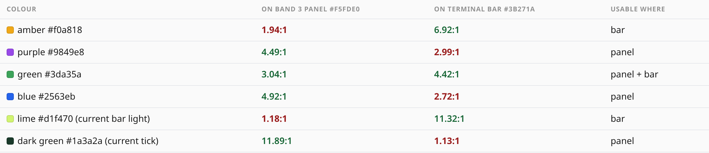

The three elements sit on three different backgrounds — footer `#ffffff`, band 3 panel
`#f5fde0` (lime `.22` over white), terminal bar `#3b271a`. A mid-tone hue cannot clear 3:1
on both a near-white panel and a dark brown bar: too light for one, too dark for the other.

**Only green `#3da35a` clears 3:1 on both** — 3.04:1 and 4.42:1.

So "the same three colours everywhere" is not available. Two specifics:

| | |
|---|---|
| **amber `#f0a818`** | **1.94:1** on the band 3 panel — worse than on white, because the panel is itself yellow-green |
| **purple `#9849e8`** | **2.99:1** on the terminal bar — a mid-tone on dark brown |

---

# 1 · Footer tagline

Already live since #78: 14 px rise over 560 ms. You were right that 6 px was invisible — the
probe found it playing perfectly at ~11 px/s.

| 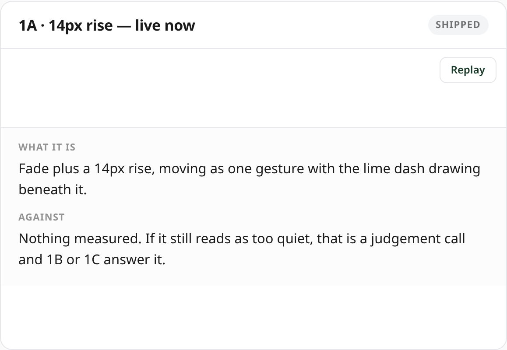 | 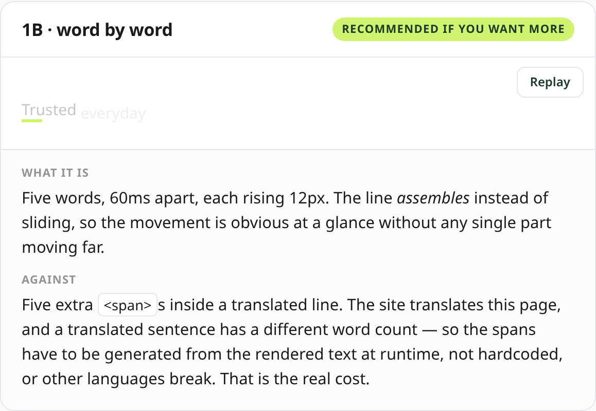 |
|---|---|
| 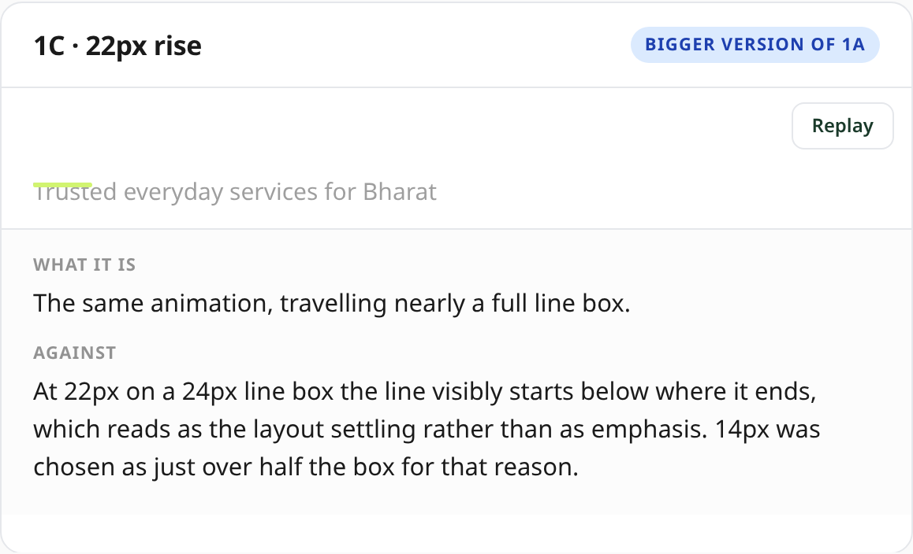 | 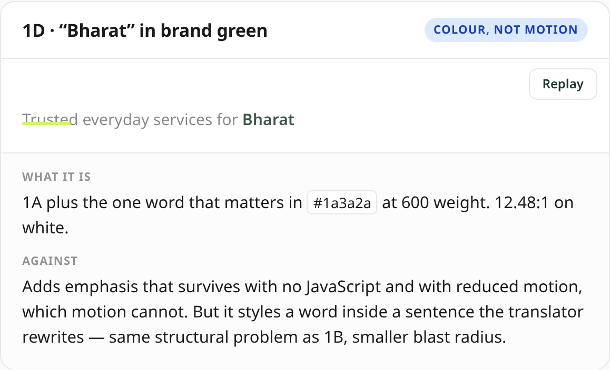 |

**1A in motion:**

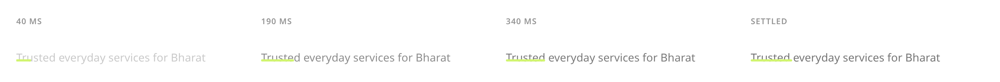

**1B, word by word — five words 60 ms apart:**

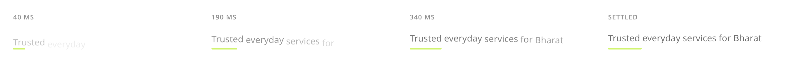

**1B's real cost:** this line is translated, and a translated sentence has a different word
count — so the spans must be generated from rendered text at runtime, not hardcoded, or other
languages break.

---

# 2 · Band 3's three ticks

Currently all three are `#1a3a2a` at 11.89:1. Matching the beats works — **but not with amber.**

| 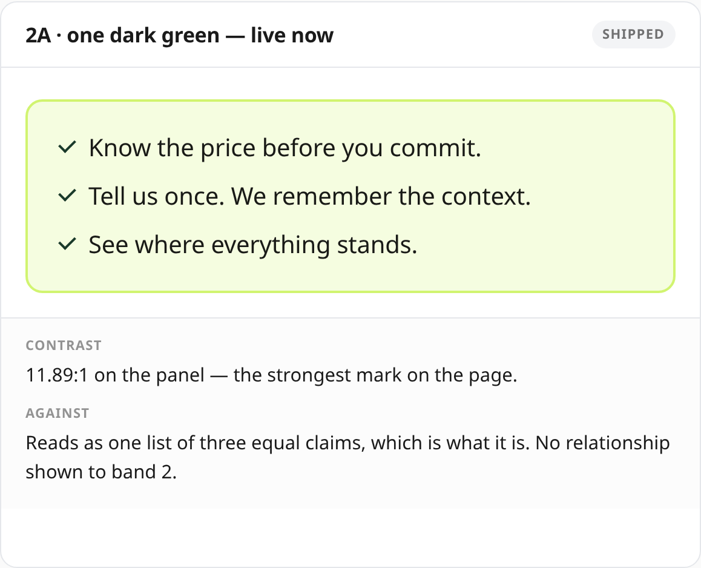 | 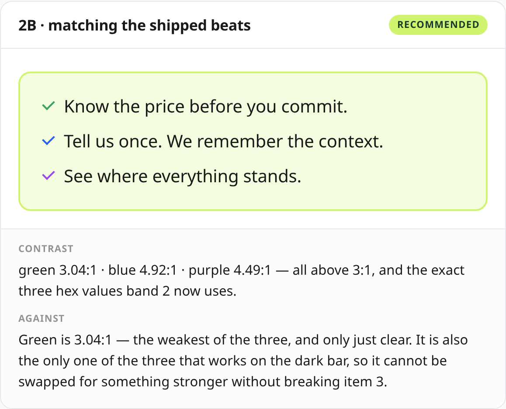 |
|---|---|
| 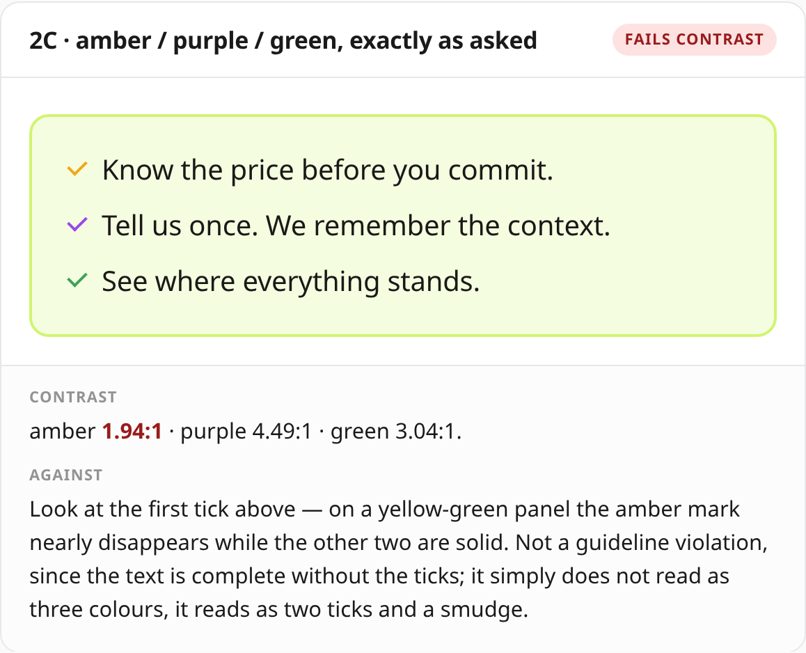 | 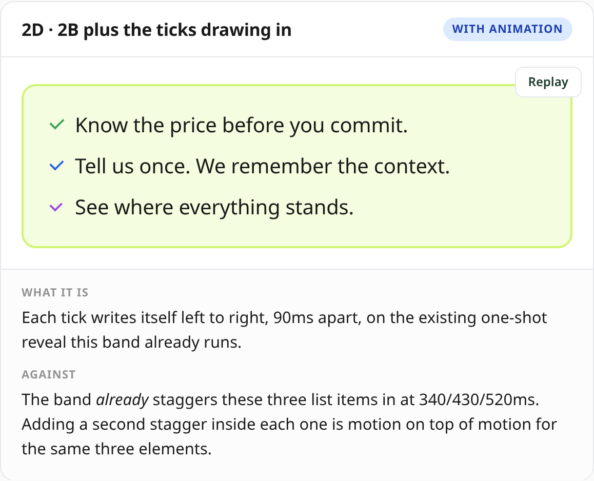 |

Look at the first tick in **2C** — on a yellow-green panel the amber mark nearly disappears
while the other two are solid. Not a guideline violation (the text is complete without the
ticks); it just does not read as three colours, it reads as two ticks and a smudge.

**2B** uses the exact three hex values band 2 already ships — green / blue / purple, all above
3:1, no new colour anywhere.

**2D, ticks drawing in:**

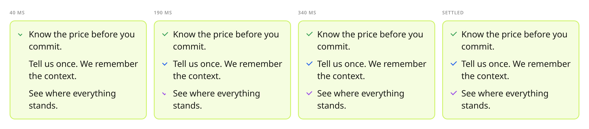

---

# 3 · The three dots before "platform / production"

> ### This one reverses an instruction of yours that is in the code
>
> `WorkflowTerminal.tsx`, verbatim: *"LIME AND NEUTRALS ONLY, on instruction. The window
> lights were red/amber/lime borrowed from macOS; the first two are the only warm hues on the
> page and they pulled the eye to chrome rather than to content."*
>
> The same file warns that colour here *"competes with the lime step dots that mark actual
> state"* — inside the panel, lime dots mean **this service ran**. Three coloured dots on the
> window frame mean nothing, and would be the most colourful thing in a panel whose only real
> signal is lime.
>
> You may well want to reverse it. It should just be on purpose.

| 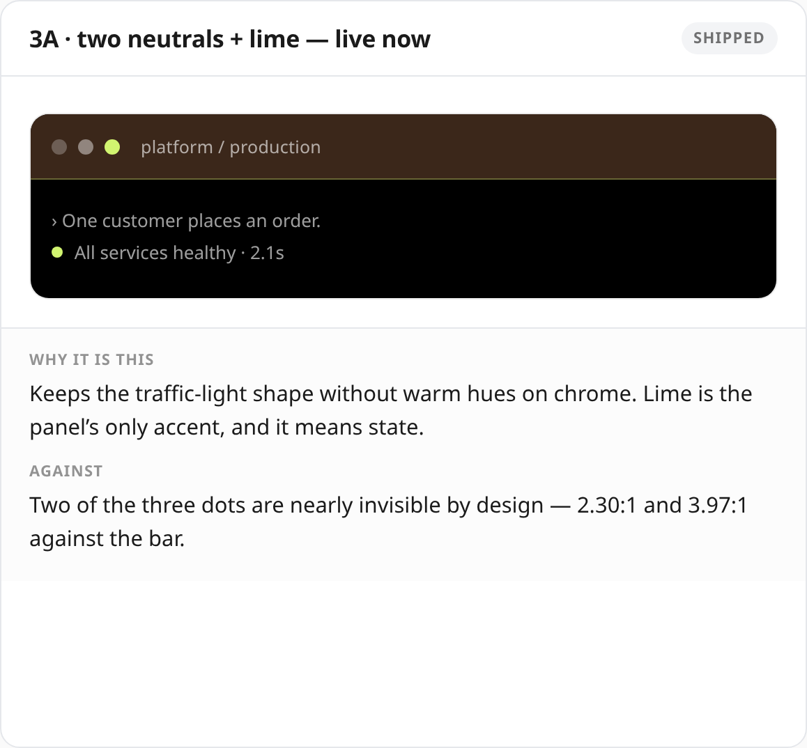 | 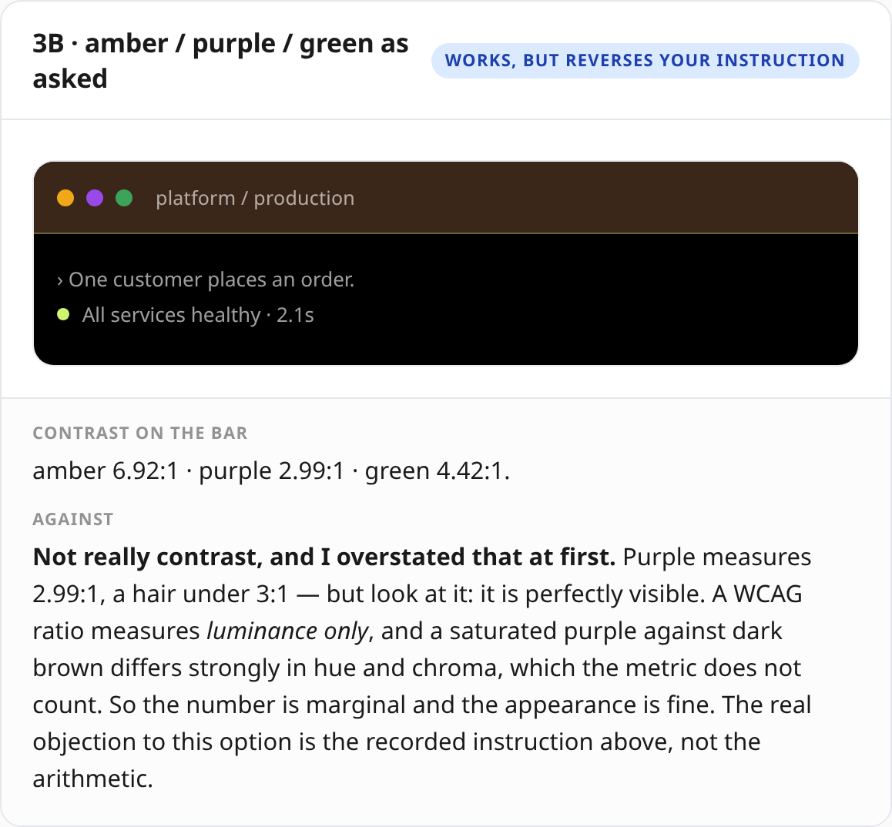 |
|---|---|
| 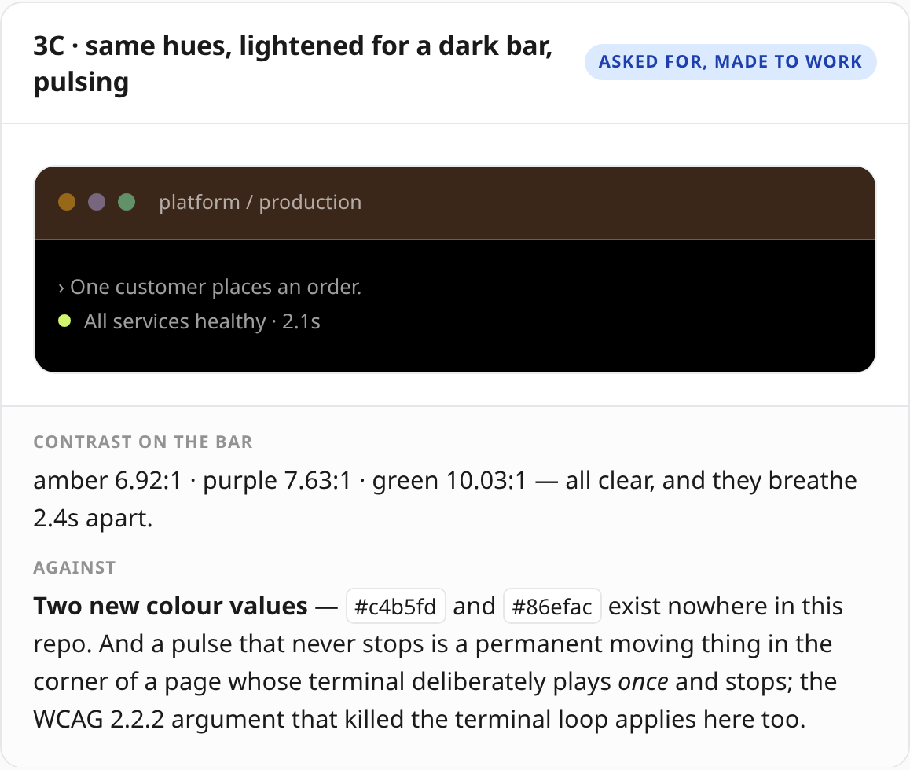 | 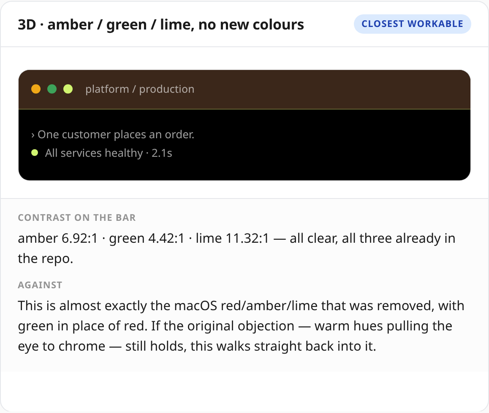 |

**A correction I owe you on 3B.** I first wrote that purple "sits almost on top of" the bar at
2.99:1. Look at it — it is perfectly visible. A WCAG ratio measures **luminance only**, and a
saturated purple against dark brown differs strongly in hue and chroma, which the metric does
not count. The number is marginal; the appearance is fine. So **3B has no contrast problem** —
only the recorded-instruction problem.

**3C** makes the colours work by lightening them for a dark bar — but costs **two new colour
values** that exist nowhere in the repo, plus an endless pulse in a panel whose terminal
deliberately plays *once and stops* (the WCAG 2.2.2 argument that killed the loop applies here).

**3D** is amber / green / lime — no new colours, all legible. It is also almost exactly the
macOS set that was removed, with green in place of red.

---

# What I would do

**1 → 1A, unchanged.** Live, measured, and 1B's translation cost is real. If 14 px still reads
too quiet, take **1D** — colour on "Bharat" survives no-JS *and* reduced motion, which motion
cannot.

**2 → 2B.** Matching the beats is a good instinct and costs nothing: the hex values are already
on the page and all three clear 3:1. Not 2C. I would skip 2D — this band already staggers these
exact three items at 340/430/520 ms, so a second stagger inside each is motion for its own sake.

**3 → 3A, keep it** — and *not* for contrast reasons, which I got wrong above and corrected. The
dots are `aria-hidden` window chrome carrying no meaning, and the panel's whole argument is that
*lime means something happened*. Three coloured dots make the frame louder than the content —
your own recorded instruction, in that file, in those words.

If you want colour there anyway, **3B** is the one I would take now: no new colour values and it
looks right. Not 3C (two new hexes plus an endless pulse), not 3D (walks back into the macOS set
you removed).

---

**Tell me per item — e.g. "1A, 2B, 3A" — and I will ship it with probes asserting the contrast
on the real composited backgrounds.**
