# Design

How the requirements in [`docs/spec.md`](spec.md) (CI / OTP / ADR / SESS / ACC / PUB / VER)
and [`.kiro/specs/whatsapp-wix-commerce/requirements.md`](../.kiro/specs/whatsapp-wix-commerce/requirements.md)
(R0–R18) are actually built, against the environment measured in
[`docs/current-environment.md`](current-environment.md).

## The four constraints that shape everything below

Every design choice in this document traces back to one of these. They were measured, not
assumed, and none of them is negotiable without a separate decision.

1. **`output: 'export'` means there is no server.** No middleware, no route handlers, no
   `Set-Cookie` from the frontend, no server-side redirect. Anything requiring a secret or a
   trust decision happens in a Lambda. This is why the Wix SDK's `OAuthStrategy` +
   `middleware.js` visitor-session pattern cannot be copied from the vendored reference
   templates, and why a tracking token can never be validated in the browser.
2. **56 of 65 Lambdas sit behind a `live` alias.** `$LATEST` is not production. Deployment is
   `update-function-code` → publish → move the alias, or the API keeps serving old code.
3. **361 routes, 0 authorizers, every route `AuthorizationType=NONE`.** Authorisation is
   in-handler via `require_auth`. A route's `NONE` says nothing about whether it is protected,
   and it must be asserted per handler.
4. **The working tree is shared by several live sessions.** Ownership is by path; commits name
   paths explicitly.

## Architecture decision records

Numbered because later work will want to know why, and "it seemed obvious" is not a reason.

### ADR-1 — Next.js 16 stays; Astro is not adopted

The brief names Astro. This repo has 127 pages, a hardened public-route allowlist, an SEO and
JSON-LD convention, and a Capacitor 8 wrapper pointed at `out/`. A second framework would
split the build and duplicate the allowlist — the one file whose omission renders a public
page as an empty HTTP 200. **Cost accepted:** no server-rendered routes, so every dynamic
page is `getStaticPaths` or client-fetched.

### ADR-2 — The Contact is extended, not replaced

`ContactsTable` holds the live customer rows, keyed on `id` with `contactId` as an enforced
alias (`lambda_utils/contact_key.py`, 20 call sites, 3 GSIs). Repointing a live partition key
means recreating the table and its indexes to gain nothing.

So `customerId` is a **new** identity that links to the Contact rather than supplanting it:

```
CUSTOMER#<customerId>  PROFILE      contactId  -> the existing Contact row
                                    cognitoUsername -> "+<E164>" in us-east-1_46ULYuukt
```

**Cost accepted:** two identifiers for one human during the transition. Mitigated by a single
resolver, in the shape of `contact_key.py`, so no call site chooses.

### ADR-3 — OTP moves out of the Cognito session and into DynamoDB

Today the code lives only in Cognito's `privateChallengeParameters`: unhashed, with no
resend counter and no send-side limit. Cognito cannot provide what the spec needs — it has no
per-phone counter, and a Cognito trigger **receives no source IP**, so per-IP limiting is
impossible there.

The challenge therefore becomes a DynamoDB record with an HMAC, a TTL, and atomic counters.
Cognito remains the **session issuer**; it stops being the challenge store.

**Cost accepted:** one more round trip per verification, and the `CUSTOM_AUTH` trigger has to
consult the table rather than its own event. Worth it: it is the only way to get hashing,
resend limits and IP limits at all.

### ADR-4 — Limits fail closed here, unlike the existing probe counter

`_probe_budget_exhausted` fails **open** on any error, deliberately: it guards a
usability flag whose worst case is a customer stranded on a code screen. Locking someone out
of their own files because a counter could not be read is the greater harm there.

That reasoning does **not** transfer. A limiter guarding OTP *sends* protects against
unbounded messaging spend and a brute-force window. Those limiters fail **closed**. The
two behaviours are opposite on purpose and each is right for its own blast radius.

### ADR-5 — The registration surface does not expose `registered`

The existing trigger returns `registered: "false"` for an unknown number, with a long and
sound justification: every recipient is provisioned by hand, there is no self-signup, and
silence created a dead end where no code would ever arrive.

Public self-registration breaks that justification — the flag becomes a customer-list oracle.
So the registration endpoints omit it, and the dead end is solved differently: tell the user a
code is on its way if the number can receive one, offer resend, and offer a correction path.
The existing operator-provisioned `/get` flow keeps its current behaviour.

### ADR-6 — Bearer token retained for customer sessions, as a recorded decision

The spec requires `HttpOnly` cookies **or** a documented decision. Constraint 1 makes cookies
awkward: the frontend cannot set one, so it would have to be issued by a Lambda on a domain
that shares a cookie scope with the static site, and `api.wecare.digital` is a different host
from `wecare.digital`.

**Decision:** keep the bearer token, in `sessionStorage`, with a server-side session registry
so revocation is real.

**Blast radius, stated plainly:** the token is readable by script on the origin, so an XSS on
a public page can exfiltrate a customer session. Mitigations: `sessionStorage` dies with the
tab, the token is 60 minutes, `SESSION#` records make server-side revocation possible, and the
token grants only the customer's own data. **Revisit if** an API-Gateway custom domain under
`wecare.digital` is introduced, at which point the cookie becomes straightforward and should
be adopted.

### ADR-7 — Inventory is adjusted by Wix, never by us

`R8` requires exactly one decrement. Wix's own order lifecycle adjusts inventory. Doing it
again from our side is the double-decrement the requirement forbids. **Decision:** rely on the
Wix order lifecycle; do not call Inventory V3 to mutate. Read it only to display availability.
Revisit only for a documented multi-location flow, which needs custom checkout.

### ADR-8 — Billing stays homegrown

`R9` forbids a second payable order. The existing invoice engine has 16 routes, 5 tables, a
per-FY statutory sequence and GSTIN/HSN fields; Wix Invoices has none of that, and creating a
Wix invoice risks a second payable eCommerce order. **Decision:** the homegrown engine
produces the document; Wix records the payment against the order via Order Transactions.

### ADR-9 — Tracking tokens are hashed at rest

A token that can be read out of the database is a second credential store. **Decision:**
generate 256 bits from a CSPRNG, return it once in the URL, store only
`TRACKING#<sha256(token)>`. Lookup hashes the supplied token and does a point read. An
unknown token and an expired token produce a byte-identical response, following the
`_not_registered` precedent that returns one 403 for both wrong-owner and nonexistent-file so
ids cannot be probed.

---

## 1. Customer registration

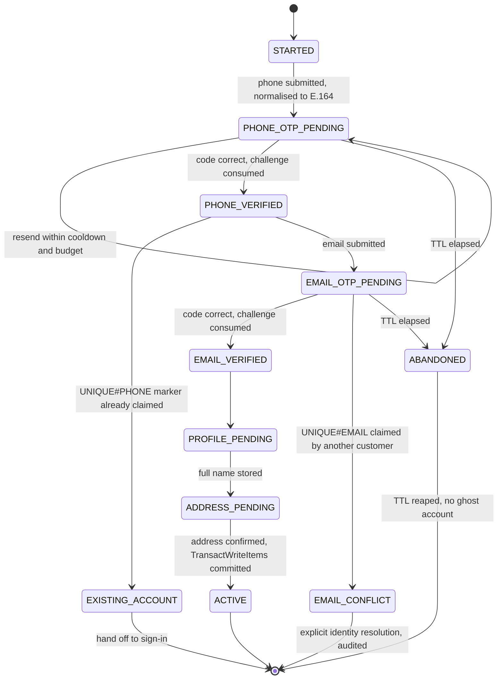

`ACTIVE` is unreachable without both `phoneVerifiedAt` and `emailVerifiedAt` — not by
convention but because the commit that writes the profile is the same transaction that
asserts them.

The commit is one `TransactWriteItems`:

| Item | Condition |
|---|---|
| `CUSTOMER#<customerId>` `PROFILE` | `attribute_not_exists(PK)` |
| `UNIQUE#PHONE#<normalisedPhone>` `CUSTOMER` | `attribute_not_exists(PK)` |
| `UNIQUE#EMAIL#<sha256(email)>` `CUSTOMER` | `attribute_not_exists(PK)` |
| `CUSTOMER#<customerId>` `ADDRESS#<addressId>` | — |
| `CUSTOMER#<customerId>` `EVENT#<ulid>` `CUSTOMER_ACTIVATED` | — |

All or nothing. `TransactionCanceledException` carries per-item reasons, so a
`ConditionalCheckFailed` on the phone marker routes to sign-in and one on the email marker
routes to conflict resolution — the two cases are distinguishable to us without being
distinguishable to the caller.

---

## 2. WhatsApp phone OTP

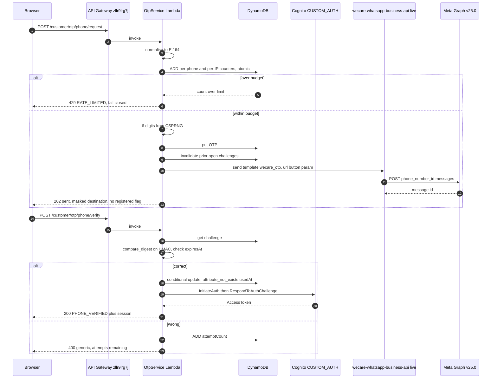

Three details that are load-bearing:

- **`url`, not `copy_code`.** Meta materialises an `AUTHENTICATION` template's copy affordance
  as a real URL button, so the OTP substitutes into that URL. `copy_code` is rejected with
  `(#132018) buttons: Button at index 0 must be of type Url`, which surfaces only as
  "sender returned HTTP 400".
- **The sender Lambda is `wecare-whatsapp-business-api`, not `wecare-outbound-whatsapp`**, so
  verification traffic does not create CRM side effects.
- **The WABA isolation gate stays.** A user whose `custom:partner_waba_id` does not match the
  configured WABA is refused before any send.

## 3. Email OTP

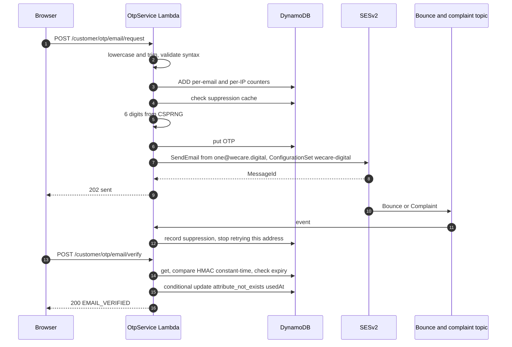

`one@wecare.digital` is already a verified SES identity with the domain DKIM-signed and
production access enabled — so there is **no provider work**, only the application path.

Two things that will bite if skipped. The identity carries **no default configuration set**,
so `ConfigurationSetName: wecare-digital` must be passed per send or reputation tracking and
suppression are silently skipped. And the domain is `DMARC p=reject` with MTA-STS `enforce`,
so an unaligned message **hard-bounces** rather than landing in spam; there is no soft-fail
state to catch a mistake.

`wecare-outbound-email` is not reused: it is SES v1, has no configuration set, and sends
`From: noreply@wecare.digital`.

## 4. Address capture

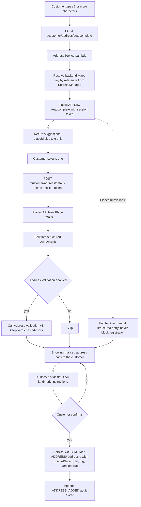

Delivery detail is stored **alongside** the canonical place reference, never merged into it,
so re-resolving the place later does not destroy "2nd floor, behind the temple".

**This flow is blocked on a key change, not on code.** `places.googleapis.com` is enabled on
project `wecaredigitalbw` but is absent from the unified key's `apiTargets`, so every New-API
call fails on key restriction until it is added. Enabling the service is not sufficient.

The key is also being split, per ADR in spec ADR-4: one browser key with referrer restrictions
limited to WECARE.DIGITAL domains, one backend key with server restrictions. The current single
key spans ~50 APIs and lists `places.googleapis.com` and `*.googleapis.com/*` as *referrers*,
which no browser ever sends — a restriction that does not restrict.

## 5. Session authentication

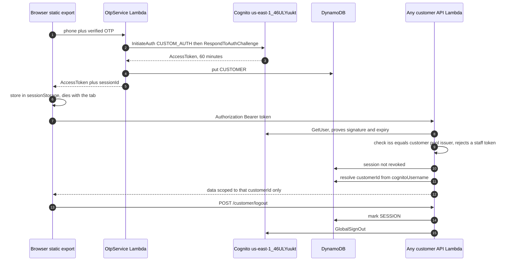

The `GetUser`-then-issuer-check ordering is the load-bearing part and is inherited from
`secure-files/handler.py::_customer_identity`. `GetUser` is pool-agnostic: it validates the
token against whichever pool issued it, which proves the token unmodified but is **not**
authorisation, because a staff token would also pass. Checking `iss` afterwards is sound
precisely *because* `GetUser` already proved integrity. Reversing the order would trust an
unverified claim.

Authorisation is always `session.customerId`, never an identifier from the request. That is
what closes IDOR on `/account/orders/[orderNumber]`.

## 6. Public Wix content flow

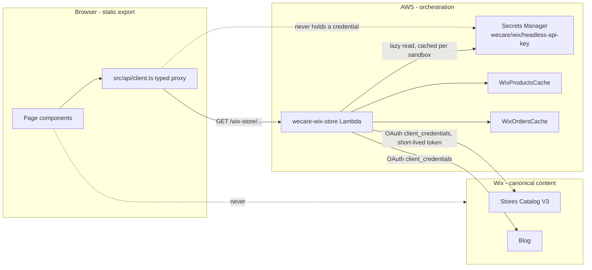

The browser never talks to Wix and never holds a Wix credential. Every call funnels through
one Lambda, with the 13 pure transforms in `lambda_utils/ecommerce/wix_domain.py` staying
AWS-free and unit-testable.

Auth moves from the permanent admin API key to OAuth `client_credentials`. The key is read
lazily and cached per sandbox — never at import scope — so replacing the value takes effect
when a sandbox recycles instead of being frozen in at module init.

**Wix is currently off four independent ways** and all of `R5`–`R10` and PUB-2's blog half are
blocked behind it: the secret holds 0 versions, `WIX_API_KEY_SECRET` is absent from the
function environment, `WIX_CREDENTIALS_DISABLED=true`, and the target site is unverified
against the published/draft pair. Only the owner can mint a new credential; Wix shows it once.

## 7. Page composition

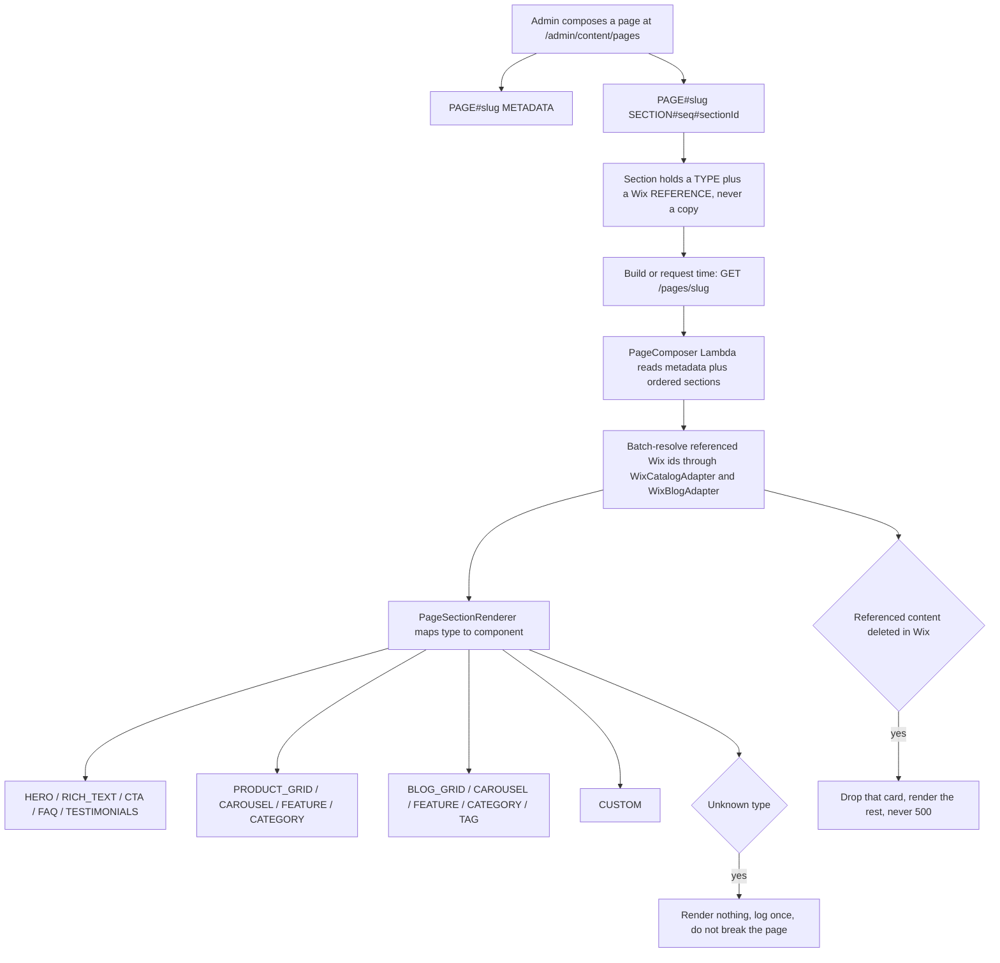

Storing a reference rather than a copy is what keeps Wix canonical: an edit in Wix shows up
without a republish, and there is no second copy to drift. The cost is a fan-out read per
page, which is why resolution is batched — `query-variants` already accepts a page of product
ids and cursor-pages to 1,000 variants per call.

## 8. WhatsApp checkout

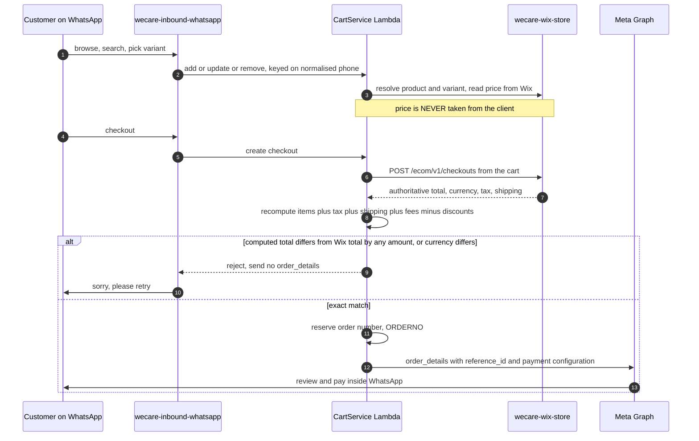

Money is integer minor units throughout; floating-point money is prohibited. The comparison
is **exact** — any difference rejects, because a tolerance is a licence to be wrong by the
tolerance. Currency is compared explicitly rather than assumed INR, even though the WABA is
INR.

`reference_id` is a distinct identifier mapped to the order. It is never the order number.

## 9. Payment reconciliation

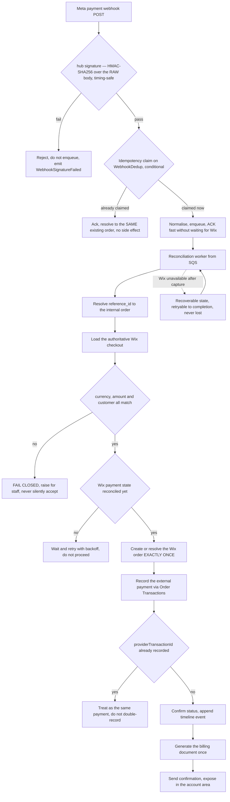

The rule that governs the whole diagram: **recording a payment is not collecting one.** After
an externally confirmed WhatsApp payment, no Wix API that would charge the customer again is
called. Order Transactions records; it does not collect.

Acknowledging the webhook does **not** imply reconciliation succeeded. The two are separated
by the queue on purpose, so Meta gets a fast ACK and reconciliation gets retries.

## 10. Order lifecycle

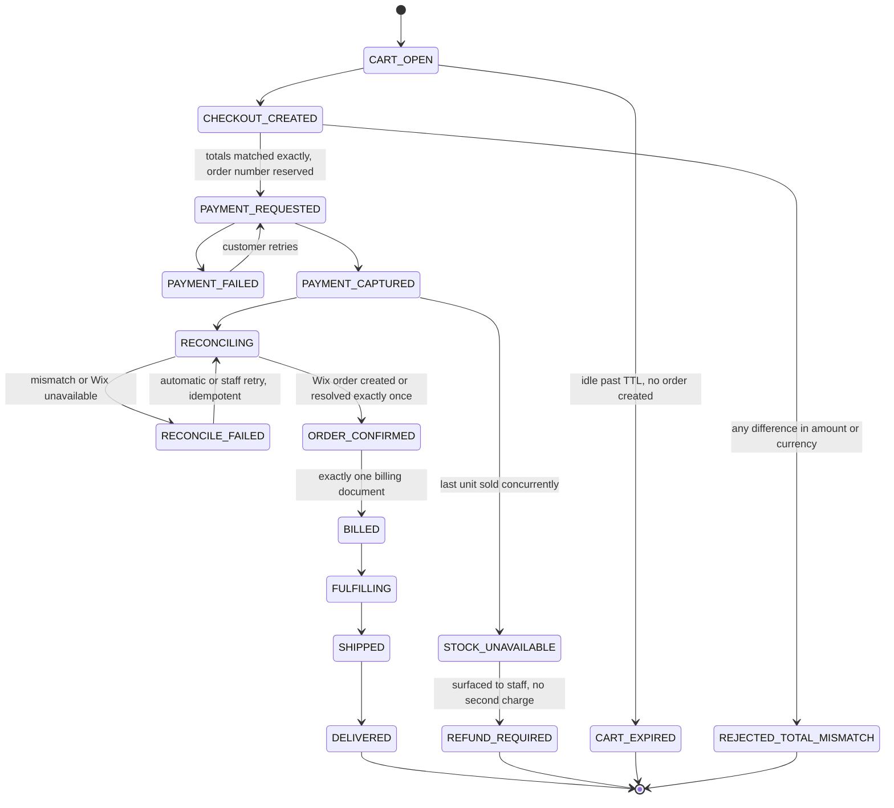

Transitions are applied with conditional writes, so a concurrent duplicate cannot advance the
same order twice. An illegal transition fails safely rather than corrupting state. A terminal
state moves only through an explicit, audited staff action.

`STOCK_UNAVAILABLE` exists because payment-succeeded-but-stock-gone is a real case that must
not be papered over: the customer is not charged twice, and the case surfaces with a refund
path rather than silently failing.

## 11. Billing

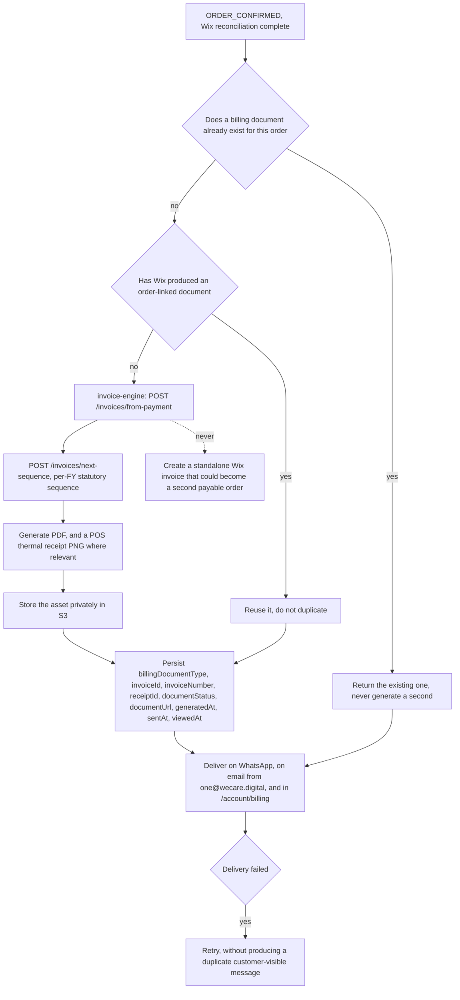

A permanent unrestricted document URL is never exposed. Where Wix gives a temporary URL the
document is proxied through an authenticated API or copied to a private S3 object served by a
short-lived signed URL.

One practical lesson already learned here and worth keeping: a link delivered over WhatsApp is
read when the person gets to it, not within 60 seconds, so its TTL is hours, not a minute —
while a browser redeem follows immediately and can be very short. And a SigV4 presigned URL
signed with temporary Lambda credentials cannot outlive the role session, which caps it.

## 12. Fulfillment

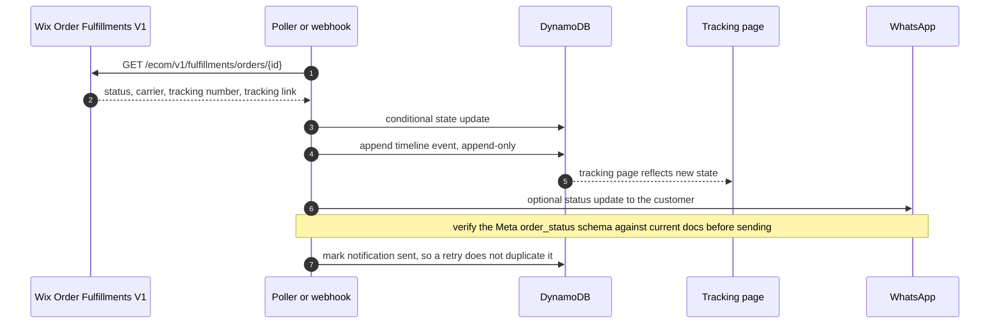

Wix is authoritative for fulfillment state. The timeline is append-only and backs **both** the
customer tracking page and the admin view, with the customer view *filtered* rather than
separately computed — two computations of the same history is how they disagree.

## 13. AWS architecture

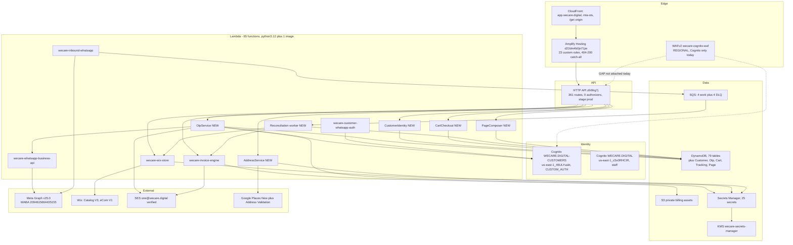

`WAF -.-> GW` is dashed because it is a **gap, not a fact**: the only regional WebACL is scoped
to Cognito managed login, so the 361-route API has none. Owner overrides list WAF as a
required target while removing its blocking semantics — the work remains.

---

## Data model additions

All new items live in the existing single-table style, `stack-wecare-digital-*`.

| PK | SK | Notes |
|---|---|---|
| `CUSTOMER#<customerId>` | `PROFILE` | links `contactId` and `cognitoUsername` |
| `CUSTOMER#<customerId>` | `ADDRESS#<addressId>` | structured, `googlePlaceId`, lat/lng |
| `CUSTOMER#<customerId>` | `SESSION#<sessionId>` | revocable; TTL |
| `CUSTOMER#<customerId>` | `EVENT#<ulid>` | append-only audit |
| `UNIQUE#PHONE#<normalisedPhone>` | `CUSTOMER` | `attribute_not_exists` |
| `UNIQUE#EMAIL#<sha256(email)>` | `CUSTOMER` | hash, so the key space is not a harvestable list |
| `OTP#PHONE#<normalisedPhone>` | `CHALLENGE#<challengeId>` | `otpHash`, TTL, counters |
| `OTP#EMAIL#<sha256(email)>` | `CHALLENGE#<challengeId>` | same shape |
| `ORDER#<commerceOrderId>` | `METADATA` | |
| `ORDERNO#<commerceOrderNumber>` | `UNIQUE` | reserved **before** the number is accepted |
| `TRACKING#<sha256(token)>` | `ORDER` | token itself never stored |
| `PAGE#<slug>` | `METADATA` | |
| `PAGE#<slug>` | `SECTION#<sequence>#<sectionId>` | Wix reference, not a copy |

GSIs: `customerId` by normalised phone, by normalised-email hash, and by `contactId`; orders
by `customerId` and by `commerceOrderNumber`.

## Deployment

Per `.kiro/steering/lambda-snapstart-deploy.md`, and it is the `live` alias that makes this
mandatory, not SnapStart — which is `ApplyOn=None` on every function.

```
python scripts/deploy_all_lambdas.py <function>   # build, validate imports, upload
python scripts/snapstart_publish.py <function>    # publish version, wait Active, move live
```

A `$LATEST` update alone is not a deployment for any function carrying a `live` alias. There
is a second reason to move the alias: a function caches its secrets on first use, so replacing
a value in Secrets Manager does not change what a warm sandbox serves. A freshly published
version has no warm environments.

## What blocks what

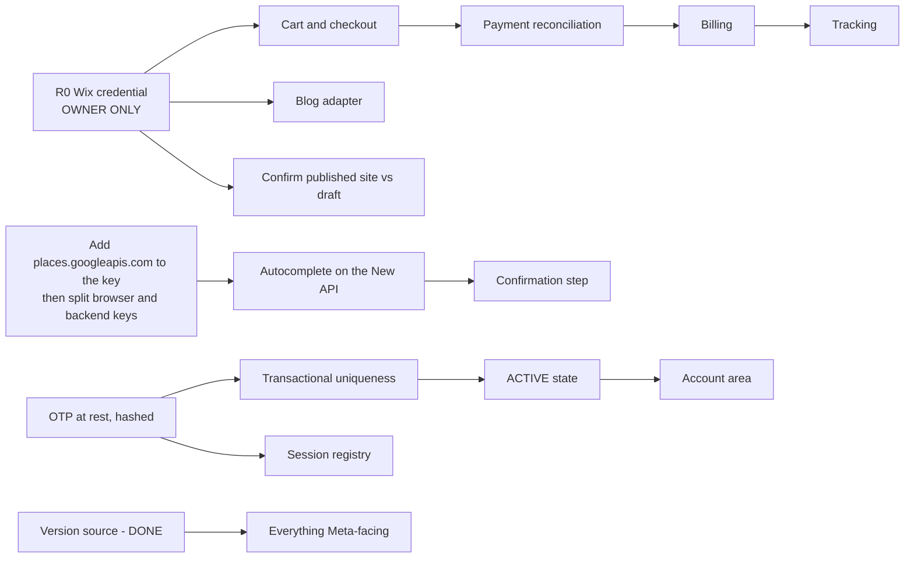

Two blockers are outside this repository's reach and neither can be worked around:

- **`R0`** — the Wix credential. Wix displays a key or client secret exactly once, at creation,
  with no read-back API. `MANUAL_OWNER_ACTION`.
- **The Google key** — `places.googleapis.com` must be added to `apiTargets`, then the key
  split into browser and backend halves. Google-console and `gcloud` work.

Everything on the identity, OTP, email, session, account, composition, responsive and
accessibility tracks is buildable today, because SES and Meta are both verified live and
neither is blocked.
