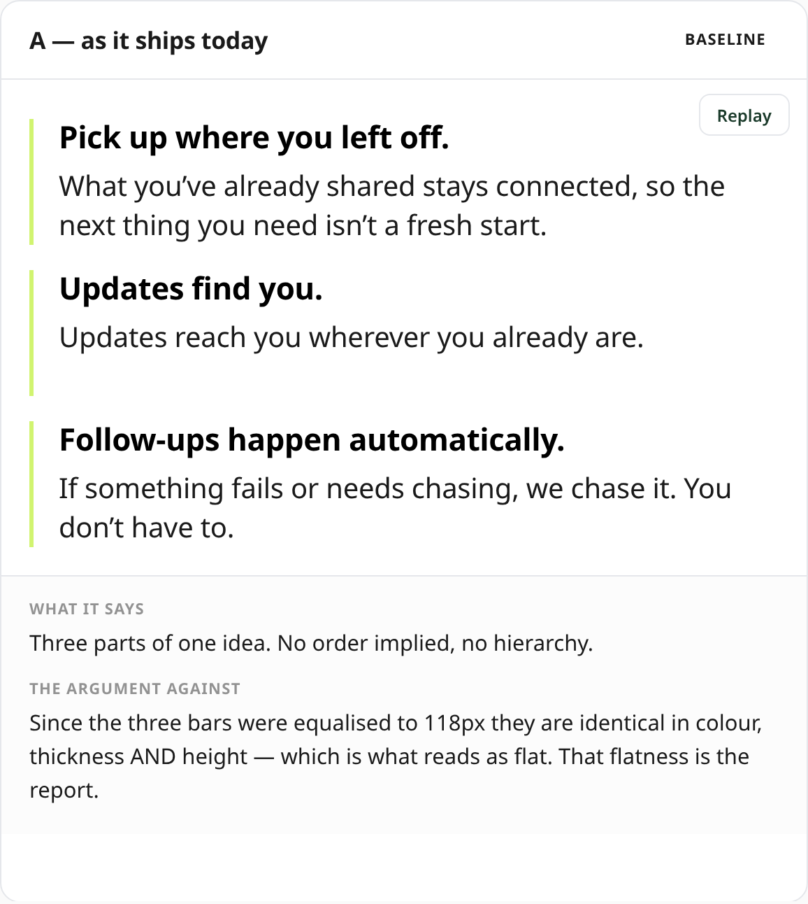
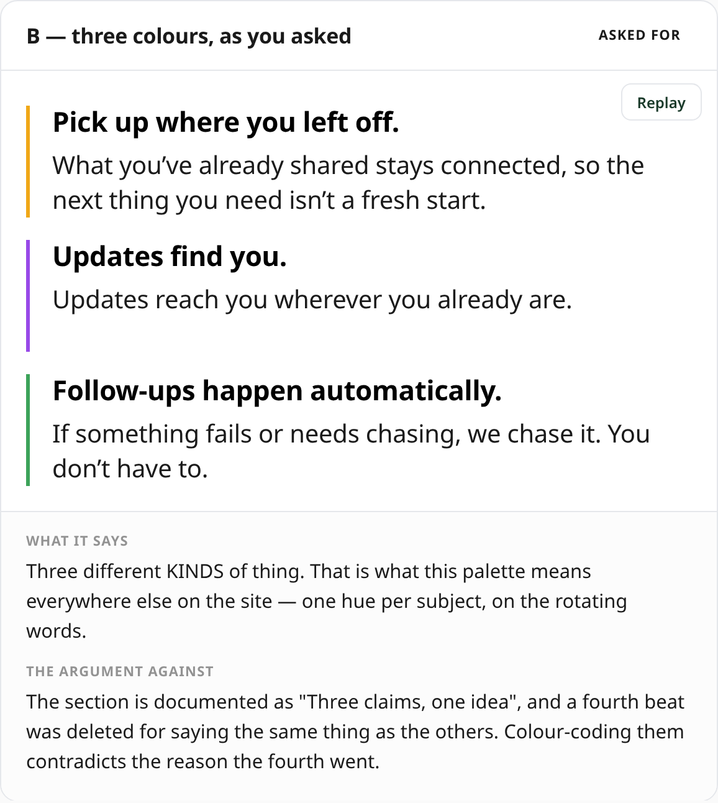
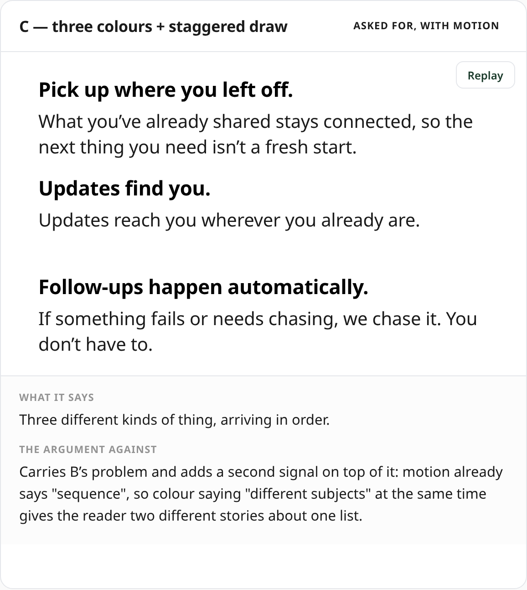
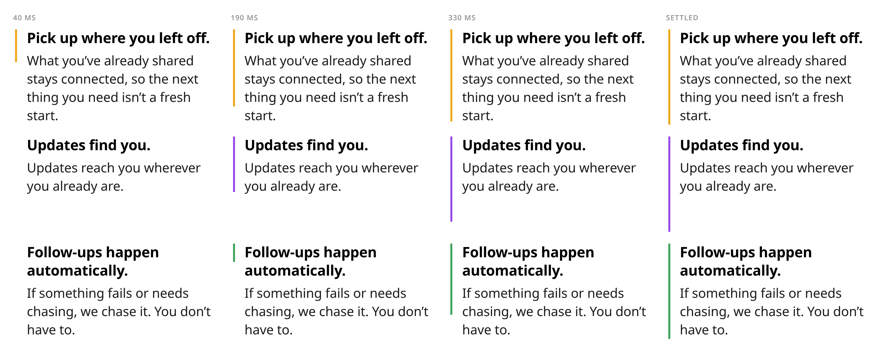
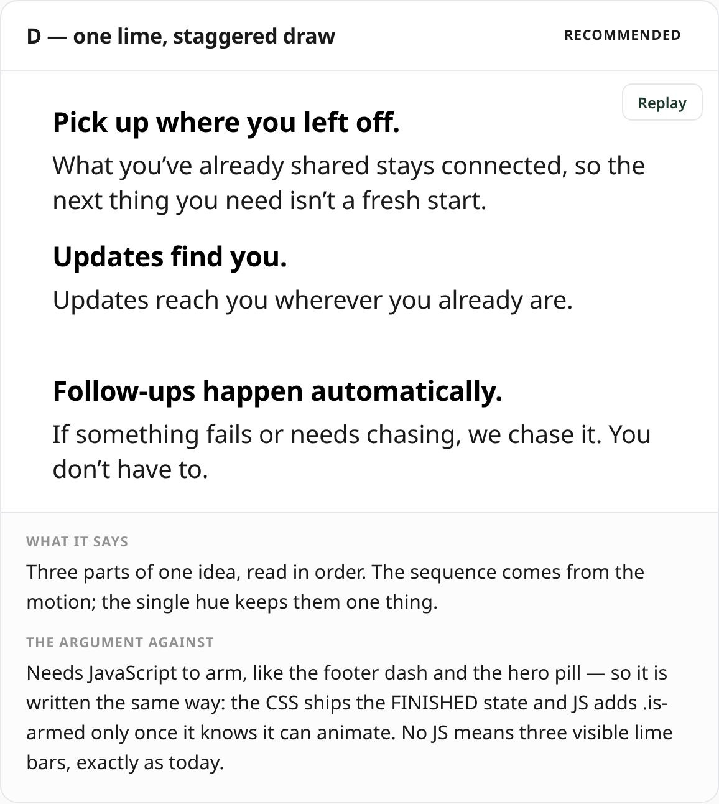
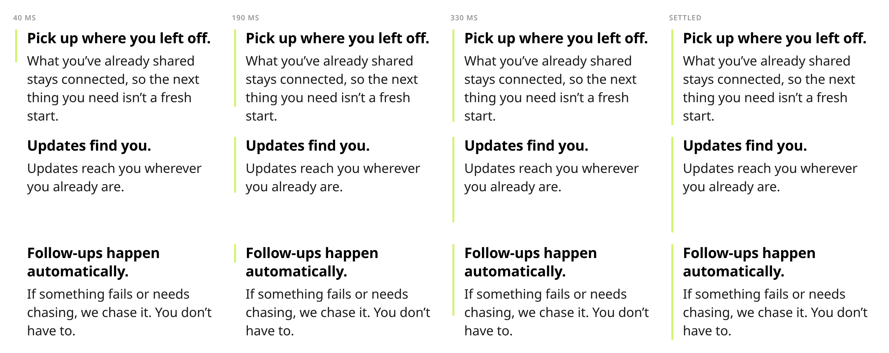
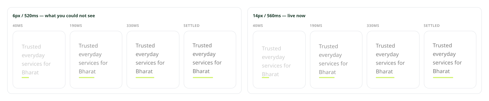

# Band 2's three dividers, and the footer entrance

> **Why this file exists as Markdown.** `docs/divider-review.html` is the better artefact —
> the animations run in it, with a Replay button — but GitHub serves raw `.html` as
> `text/plain`, so it shows as source rather than rendering, and the proxy that works around
> that did not open. These PNGs are rendered **from that same file** by
> `tools/browser/dividershots.js`, so the two cannot drift. GitHub renders them inline with no
> proxy and no login.
>
> The four-column strips are **not simulated**. Each column is a real copy of the component
> armed at a staggered time and captured in a single screenshot, so every column is a genuine
> frame of the real transition with the real easing and the real 90 ms inter-bar delay.

## The question, and what it is really about

Should the three lime rules in band 2 stay one colour or become three, with animation?

It is not a CSS question. The five tint/dot pairs in this repo are documented as
*"a per-subject system that sits outside the brand palette by design"*, and they are used where
each item names a **different subject** — the rotating words in three separate heroes. So
colour-coding a list is this site saying *these are different kinds of thing*.

The source already answers whether that is true here. The section had **four** beats; the
fourth — "It remembers the context" — was deleted for saying the same thing as the first, and
the docblock records why: **"Three claims, one idea."**

---

## A — as it ships today

Three parts of one idea. No order implied, no hierarchy.

**The argument against:** since the bars were equalised to 118 px in #77 they are identical in
colour, thickness **and** height. That flatness is the report.

## B — three colours, as asked

Three different **kinds** of thing — which is what this palette means everywhere else.

**The argument against:** contradicts "Three claims, one idea", and the deletion of the fourth
beat that the phrase was written to explain.

## C — three colours + staggered draw

**The argument against:** carries B's problem and adds a second signal on top. Motion already
says *sequence*; colour saying *different subjects* at the same time tells the reader two
different stories about one list.

## D — one lime + staggered draw  ·  **recommended**

Three parts of one idea, read in order. The sequence comes from the motion; the single hue
keeps them one thing.

**Why this one.** The flatness you are reacting to is real and it is my doing — equalising the
bars removed the last thing that differed between them. Motion restores the difference without
making a claim: it says **order**, which the list has, rather than **category**, which it does
not. If you want colour anyway, take **B** over **C**.

---

## Cost of each option

| Option | New colour values | Needs JS | Reduced motion | Contrast risk |
|---|---|---|---|---|
| **A** today | none | no | n/a | none |
| **B** three colours | none — reuses three existing subject hues | no | n/a | none, all ≥3:1 on white at 3px |
| **C** colours + draw | none | yes, to arm | bars visible, no draw | none |
| **D** lime + draw | none | yes, to arm | bars visible, no draw | none |

"Needs JS to arm" is the pattern the footer dash and the hero pill already use: the stylesheet
ships the **finished** state, and JavaScript adds `.is-armed` to hide the start state only once
it has confirmed it can animate. No JS, or `prefers-reduced-motion`, leaves three visible lime
bars — exactly what ships today.

---

## The footer tagline

Already live on `stack` at 14 px, merged in #78. You reported it as "not showing" twice while
it was 6 px, and you were right — `footerprobe.js` found the reveal playing perfectly (34
hidden frames, 48 mid-fade, finishing at opacity 1) travelling **6 px over 520 ms**, about
11 px/s, on a 15 px line beside a 56 px dash moving nine times faster.

14 px is a little over half this line's 24 px line box, so the movement registers without
reading as a jump. `footerprobe.js` now **asserts** travel ≥ 12 px, because every frame-level
check was already green at 6 px and so could not be the guard.

---

**Tell me a letter — A, B, C or D — and I will ship it with a probe that asserts the stagger,
the same way the footer one asserts the travel.**
