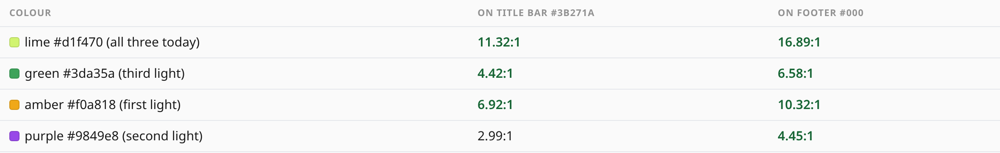
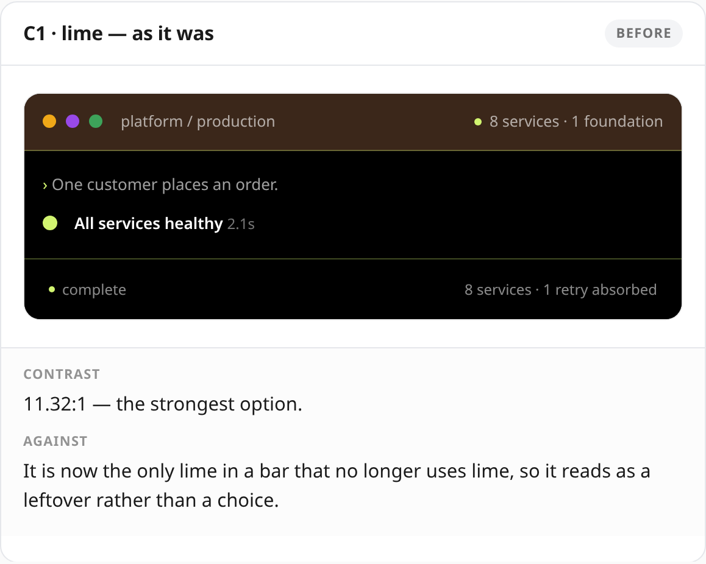
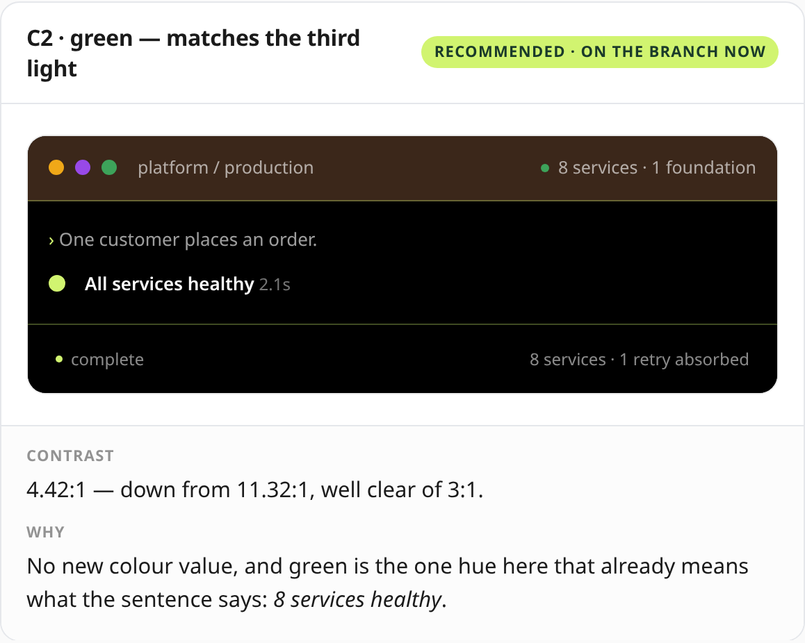
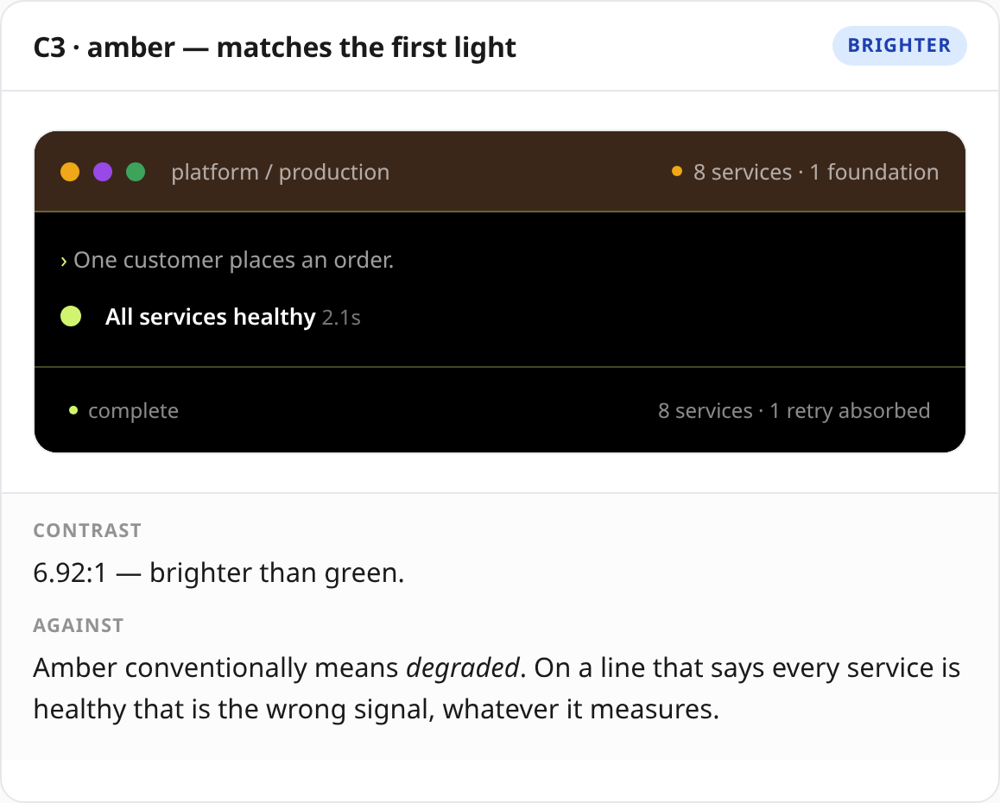
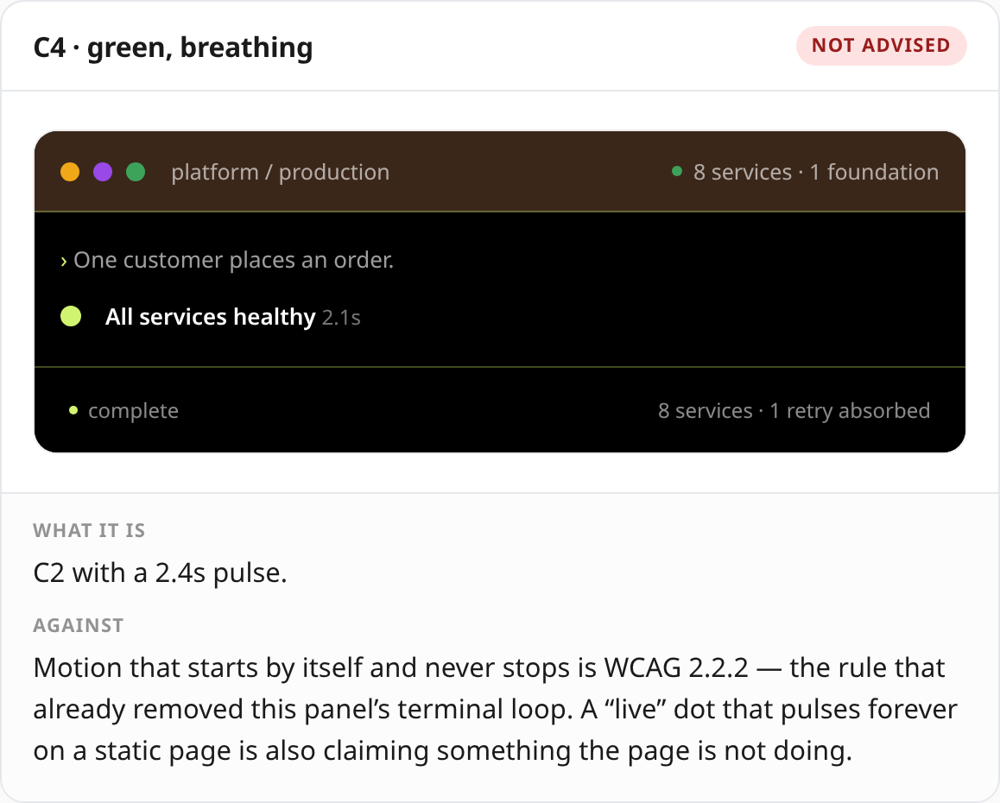
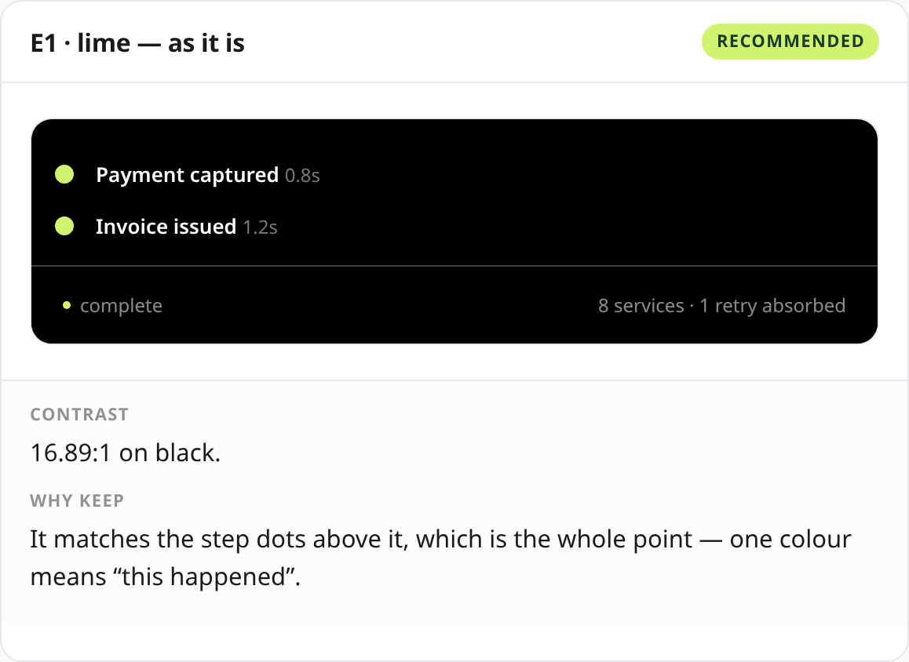
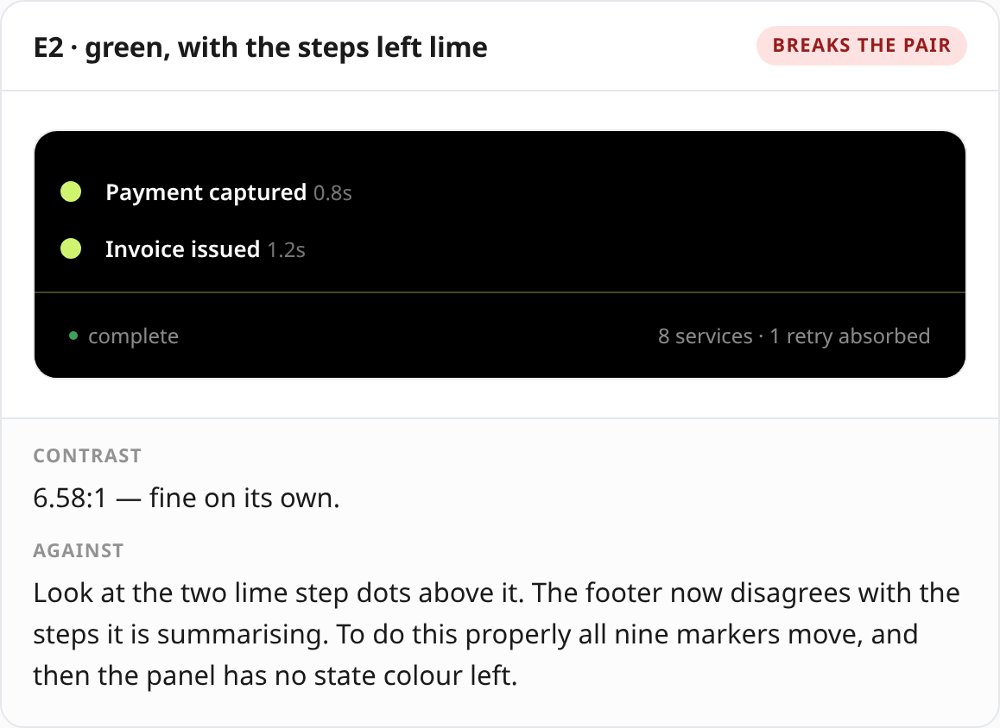
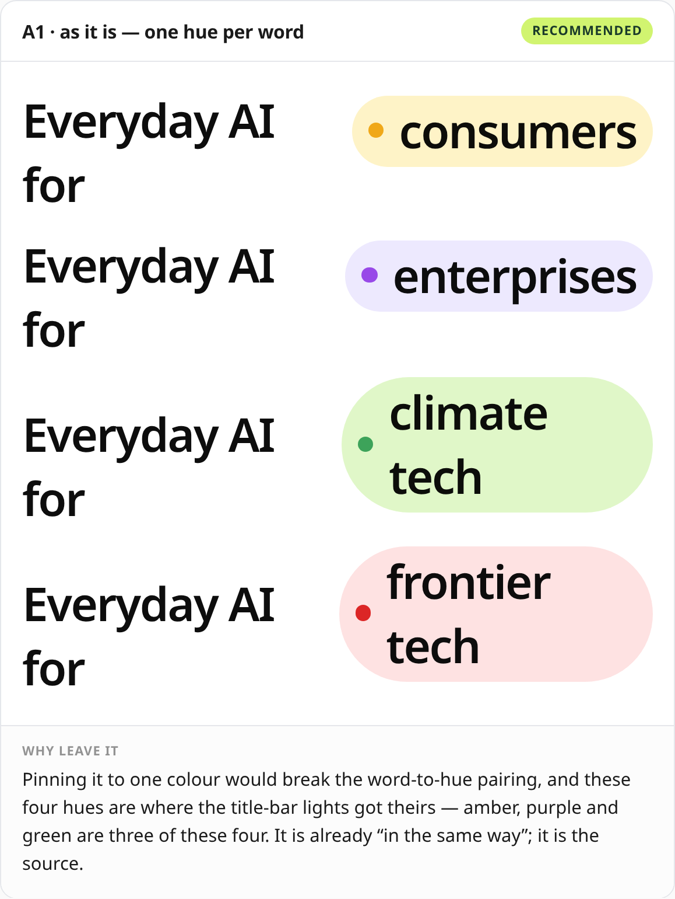
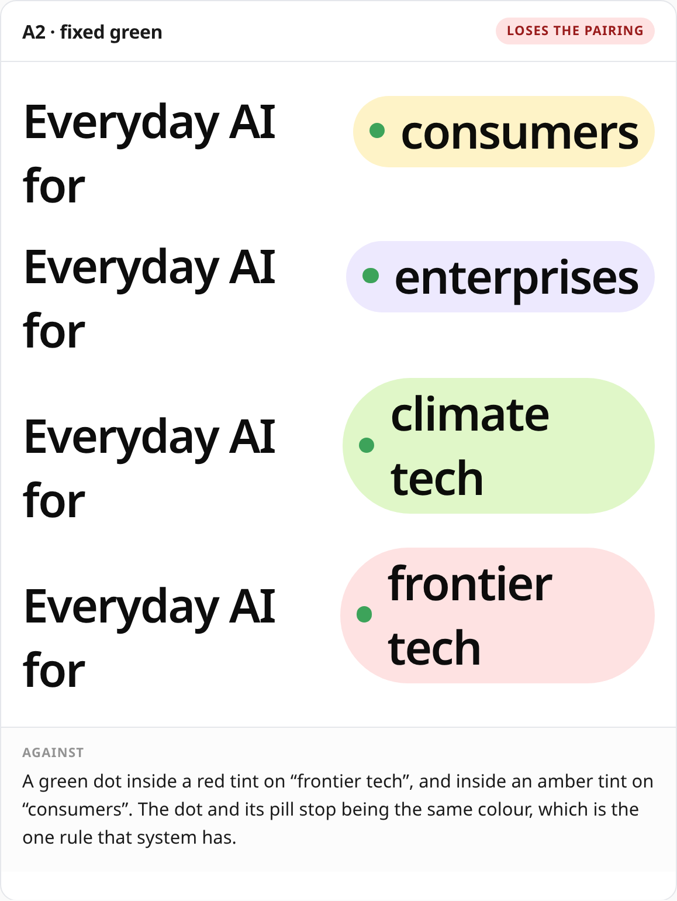

# The three remaining lime dots

> Rendered from `docs/dot-review.html` by `tools/browser/dotreview.js`. GitHub serves raw
> `.html` as `text/plain`, so these PNGs are the openable version; the HTML has the pulsing
> option actually pulsing.

After 3B recoloured the window lights, three lime dots are left. *"Update the copy section's dot
in the same way"* did not say which — and they are **not interchangeable**. Two of them carry
meaning; one is already a colour system, and is the one 3B borrowed from.

Contrast is measured against **each dot's own background** — the title bar is `#3b271a`, the
footer is `#000`, and the same hue scores very differently on each.

---

## C · `.wt-state-dot` — the dot attached to copy in the title bar

6px, beside "8 services · 1 foundation", in the same 47px strip as the three lights.
**This is the one I think you meant.**

| | |
|---|---|
|  |  |
|  |  |

- **C1 lime** — 11.32:1, strongest, but now the only lime in a bar that uses none.
- **C2 green** — 4.42:1. No new colour, and green already means *healthy*, which is
  what the sentence says. **On the branch now.**
- **C3 amber** — 6.92:1, brighter, but amber conventionally means *degraded* on a
  line claiming every service is healthy.
- **C4 pulsing** — motion that starts by itself and never stops is WCAG 2.2.2, the rule that
  already removed this panel's terminal loop.

## E · `.wt-foot-dot` — beside "running" / "complete"

| | |
|---|---|
|  |  |

**I would leave this one.** It is not decoration — it reports live state and makes the same claim
as the lime step markers inside the panel, where lime means *this service ran*. Look at E2: the
footer now disagrees with the two lime step dots it is summarising. Doing it properly moves all
nine markers, and then the panel has no state colour left.

## A · `.home-mark-dot` — the hero pill

| | |
|---|---|
|  |  |

**Already a colour system, and the one the lights borrowed from** — amber, purple and green are
three of its four hues. Pinning it to one colour puts a green dot inside a red tint on "frontier
tech". It is already consistent, in the other direction.

---

## What I would do

**C2**, and leave **E** and **A** alone. C2 is on the branch now; reverting it is one line.

Say **C1 / C2 / C3 / C4**, plus **E2** or **A2** if you want those moved too.
