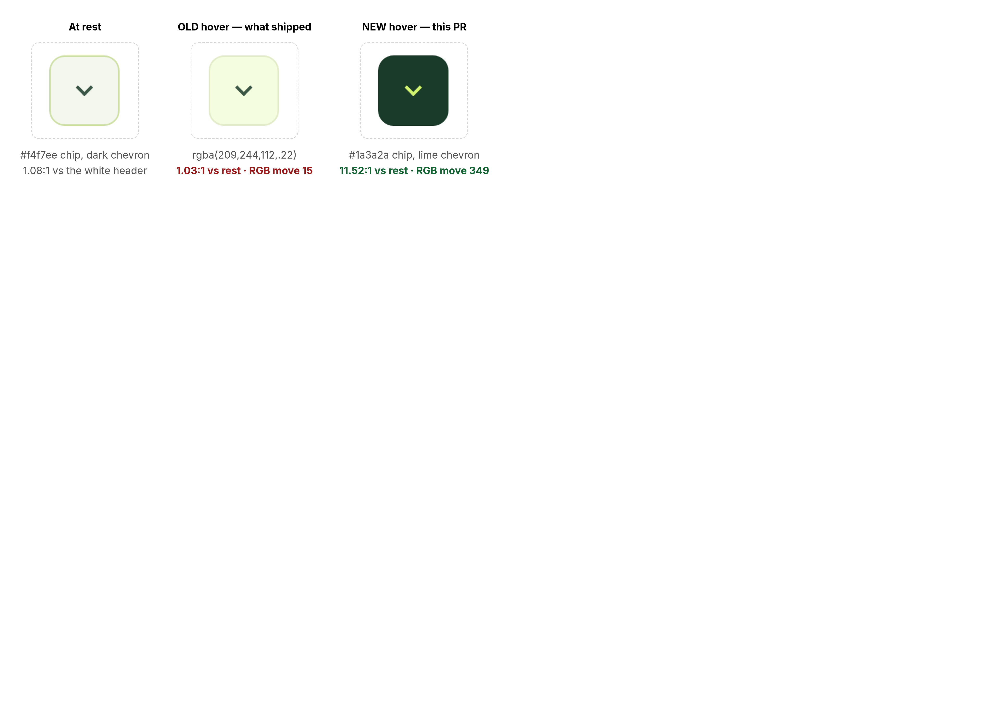
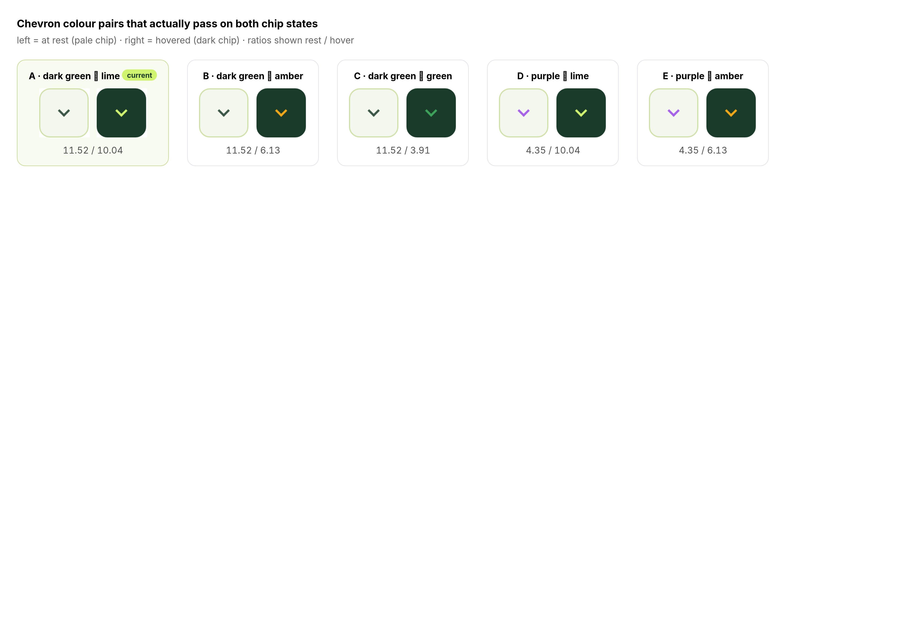

# Menu icon — mockups

Both images below are captured from the **real built page** at 3× scale, not drawn. The "old" state
is reconstructed by force-overriding the previous CSS declaration in the same browser session, so
every square is the same element under the same renderer.

Generators: `tools/browser/iconshot.js` and `tools/browser/iconhues.js` — rerun either after any
change to the trigger.

---

## 1 · What changed, and why it was reported as having no hover effect

| | | |
|---|---|---|
| **At rest** | `#f4f7ee` chip, dark chevron | 1.08:1 against the white header |
| **OLD hover** | `rgba(209,244,112,.22)` | **1.03:1 vs rest** · RGB move **15** of 441 |
| **NEW hover** | `#1a3a2a` chip, lime chevron | **11.52:1 vs rest** · RGB move **349** |

Compare the first two squares — they are almost the same colour. That is the defect, and
`Header.test.tsx` was pinning that exact value, so the test suite was guarding it.

**Lime cannot fix it.** Lime is a *light* colour: solid `#d1f470` on that chip is still only
1.15:1. Only an inversion produces a luminance step.

---

## 2 · Can the icon use the terminal palette?

Yes — **but only for the hover state.** Those ratios were measured against the terminal's surfaces
(`#3b271a` and `#000`, both dark). The menu chip is pale at rest and dark only on hover, so they do
not transfer. Re-measured against the chip's own two states:

| hue | on rest chip `#f4f7ee` | on hover chip `#1a3a2a` |
|---|---|---|
| lime `#d1f470` | 1.15 ✗ | **10.04** ✓ |
| green `#3da35a` | 2.94 ✗ | 3.91 ✓ |
| amber `#f0a818` | 1.88 ✗ | **6.13** ✓ |
| purple `#9849e8` | **4.35** ✓ | 2.65 ✗ |
| blue `#2563eb` | **4.77** ✓ | 2.41 ✗ |
| red `#dc2626` | **4.46** ✓ | 2.58 ✗ |
| dark green `#1a3a2a` | **11.52** ✓ | 1.00 ✗ |

**The two sets are disjoint.** Nothing clears 3:1 on both a pale and a dark chip, because a colour
light enough to read on dark is too light to read on near-white. That is *why* the icon needs two
colours rather than one — and it is the answer to "can we have the menu icon from this list":
**yes for hover, no for both.**

So **purple can only be the rest colour**, and **lime / amber / green only the hover colour.**

### The five viable pairs

Left square in each pair = at rest. Right square = hovered.

| | rest → hover | rest | hover |
|---|---|---|---|
| **A** — currently in the PR | dark green → **lime** | **11.52** | **10.04** |
| **B** | dark green → **amber** | **11.52** | 6.13 |
| **C** | dark green → **green** | **11.52** | 3.91 |
| **D** | **purple** → lime | 4.35 | **10.04** |
| **E** | **purple** → amber | 4.35 | 6.13 |

---

## Recommendation

**Keep A.** It is the only pair scoring double digits on *both* states, and lime-on-dark-green is
the pairing already used across the site. The rest state is what a reader sees almost all the time,
and A gives it 11.52:1.

**If you want a different hue, take B.** Dark green → amber keeps the 11.52:1 rest and gives 6.13:1
on hover — a clearly different colour at no real cost.

**Avoid D and E.** They drop the rest state from 11.52 to 4.35 in order to colour the chevron. Still
passing, but it weakens the state a reader actually looks at in exchange for colour on the state
they see for a fraction of a second.

**C is the weakest** — green at 3.91:1 is the dimmest hover of the five.

---

*The arrows in the second image render as boxes. That is this sandbox having 82 fonts, all Noto
Sans, with no symbol coverage — not a defect in the page.*
