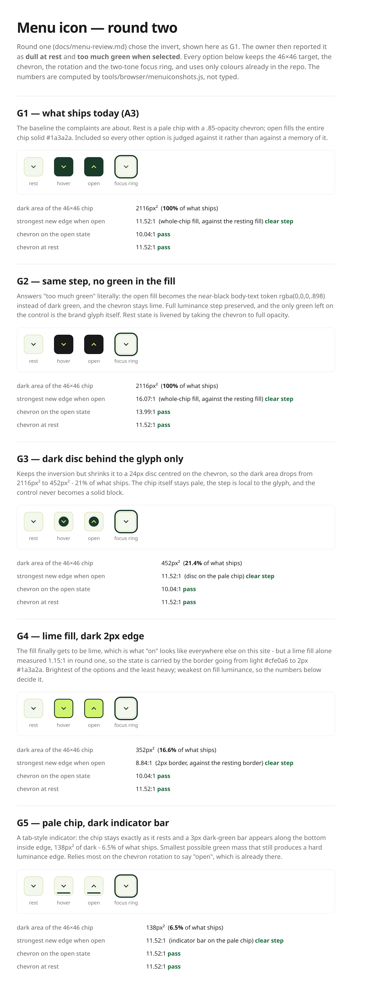
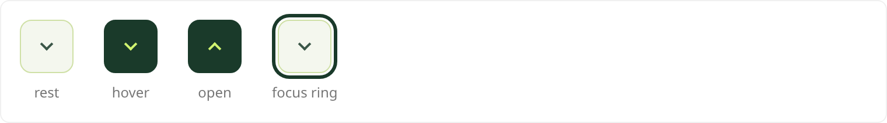
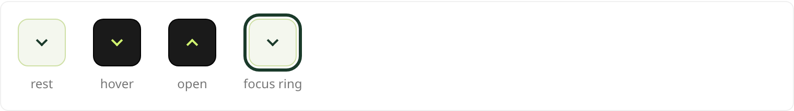
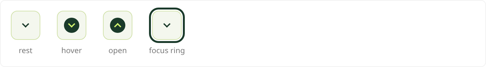
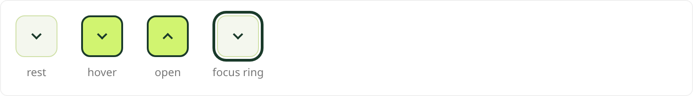
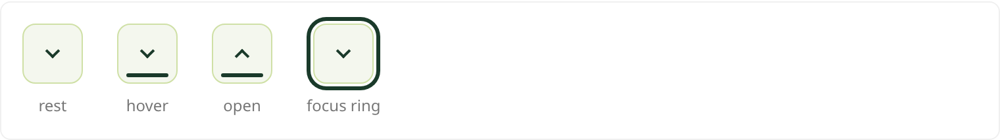

# Menu icon — round two

> Rendered from `docs/menu-icon-round-two.html` by `tools/browser/menuiconshots.js`. Every number
> is computed from the colour values, not typed. Open the HTML for the live version.

Round one is [`menu-review.md`](menu-review.md); it picked the invert, which ships today and is
**G1** here. The owner then reported that result as *dull at rest* and *too much green when
selected*. The table is ordered by how much dark area each option puts on the chip, because that
is what the second complaint is actually about.

| option | dark area | % of today | strongest new edge when open | what carries it | chevron on open | chevron at rest |
|---|---|---|---|---|---|---|
| [G1 — what ships today (A3)](menu-icon-mock/g1-shipping-now.png) | 2116px² | 100% | **11.52:1** | whole-chip fill, against the resting fill | 10.04:1 | 11.52:1 |
| [G2 — same step, no green in the fill](menu-icon-mock/g2-neutral-invert.png) | 2116px² | 100% | **16.07:1** | whole-chip fill, against the resting fill | 13.99:1 | 11.52:1 |
| [G3 — dark disc behind the glyph only](menu-icon-mock/g3-dark-disc.png) | 452px² | 21.4% | **11.52:1** | disc on the pale chip | 10.04:1 | 11.52:1 |
| [G4 — lime fill, dark 2px edge](menu-icon-mock/g4-lime-fill-dark-edge.png) | 352px² | 16.6% | **8.84:1** | 2px border, against the resting border | 10.04:1 | 11.52:1 |
| [G5 — pale chip, dark indicator bar](menu-icon-mock/g5-indicator-bar.png) | 138px² | 6.5% | **11.52:1** | indicator bar on the pale chip | 11.52:1 | 11.52:1 |

## G1 — what ships today (A3)

The baseline the complaints are about. Rest is a pale chip with a .85-opacity chevron; open fills the entire chip solid #1a3a2a. Included so every other option is judged against it rather than against a memory of it.

## G2 — same step, no green in the fill

Answers "too much green" literally: the open fill becomes the near-black body-text token rgba(0,0,0,.898) instead of dark green, and the chevron stays lime. Full luminance step preserved, and the only green left on the control is the brand glyph itself. Rest state is livened by taking the chevron to full opacity.

## G3 — dark disc behind the glyph only

Keeps the inversion but shrinks it to a 24px disc centred on the chevron, so the dark area drops from 2116px² to 452px² - 21% of what ships. The chip itself stays pale, the step is local to the glyph, and the control never becomes a solid block.

## G4 — lime fill, dark 2px edge

The fill finally gets to be lime, which is what "on" looks like everywhere else on this site - but a lime fill alone measured 1.15:1 in round one, so the state is carried by the border going from light #cfe0a6 to 2px #1a3a2a. Brightest of the options and the least heavy; weakest on fill luminance, so the numbers below decide it.

## G5 — pale chip, dark indicator bar

A tab-style indicator: the chip stays exactly as it rests and a 3px dark-green bar appears along the bottom inside edge, 138px² of dark - 6.5% of what ships. Smallest possible green mass that still produces a hard luminance edge. Relies most on the chevron rotation to say "open", which is already there.

## What does not change in any option

The 46×46 target (WCAG 2.5.8 asks 24×24, so there is room to spare), the single chevron, the
45°→225° rotation that carries "open" on its own, and the two-tone focus ring
`0 0 0 2px #fff, 0 0 0 5px #1a3a2a` — which exists because a single-colour ring cannot work
against a chip that inverts, and measures 12.48:1 against the header.

## The constraint that rules out the obvious fix

Lime is a light colour. Against the `#f4f7ee` rest fill, `rgba(209,244,112,.22)` measures
1.03:1 (RGB move 21/441) and solid `#d1f470` measures
1.15:1. Neither is a state change, which is why round one inverted. "Less green"
therefore has to mean less dark **area**, or a dark fill that is not green — not a return to a tint.
