# Menu icon, the panel, the step text, the footer trigger

> Rendered from `docs/menu-review.html` by `tools/browser/menureview.js`. GitHub serves raw
> `.html` as `text/plain`, so these PNGs are the openable version — **but open the HTML if you
> can**, because the chips and the tagline are live there: hover the chips, hover and click the line.

Nothing here is applied to the site. All numbers are computed in the mock from values measured on
the live page.

---

## 1 · The menu icon

**It has zero lines.** A single corner chevron, 8×8px, 2.5px strokes, `#1a3a2a` at .85 opacity,
in a 46×46 chip.

### The number that settles this section

Lime is a *light* colour, so **no lime fill can carry a hover state on a near-white chip**.
Measured against the rest fill `#f4f7ee`:

| hover fill | contrast vs rest | RGB move (of 441) |
|---|---|---|
| current `rgba(209,244,112,.22)` | **1.03:1** | 15 |
| solid lime `#d1f470` | 1.15:1 | 131 |
| dark green `#1a3a2a` | **11.52:1** | 349 |

Only an **inversion** produces a luminance step. Solid lime is a hue move — visible to most people,
nearly nothing to anyone with reduced colour discrimination. The chip is also **1.08:1** against the
white header at rest, so the box barely reads as a control before you touch it.

| | |
|---|---|
| 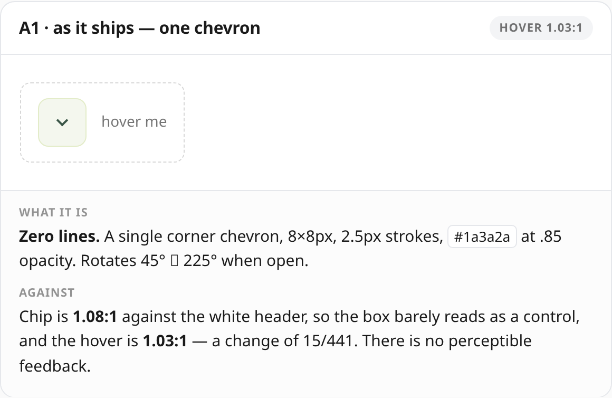 | 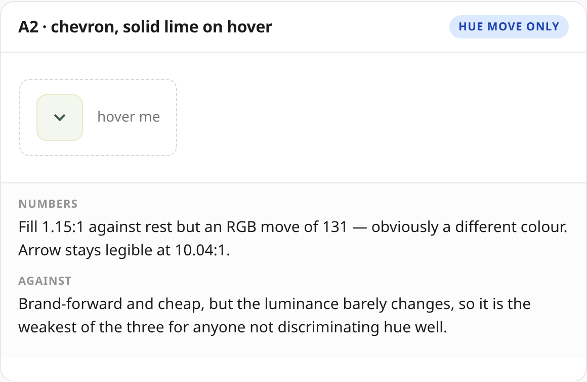 |
| 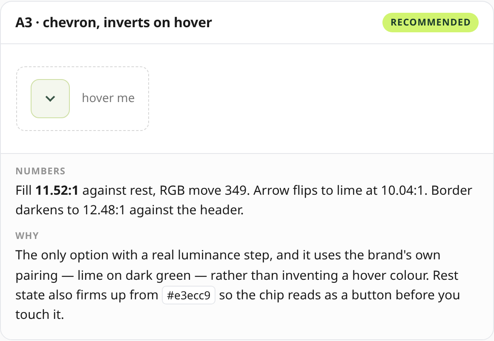 | 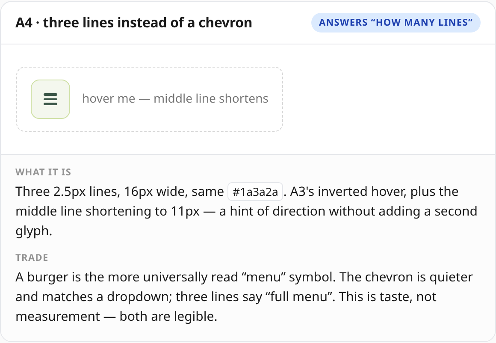 |

**The hover states, captured with the pointer actually on each chip:**

| A1 — today | A2 — solid lime |
|---|---|
| 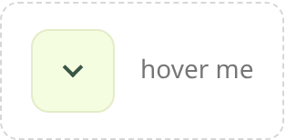 | 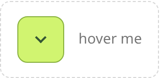 |

| A3 — inverts | A4 — three lines |
|---|---|
| 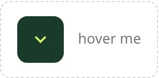 | 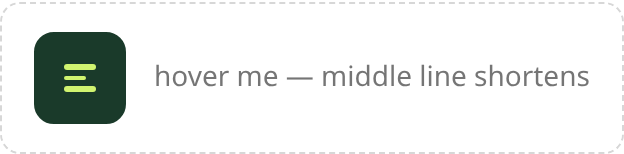 |

## 2 · The panel does not match the chip

You said the box matches the icon. Three things differ:

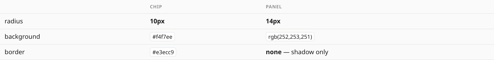

| B1 — as it ships | B2 — one family |
|---|---|
| 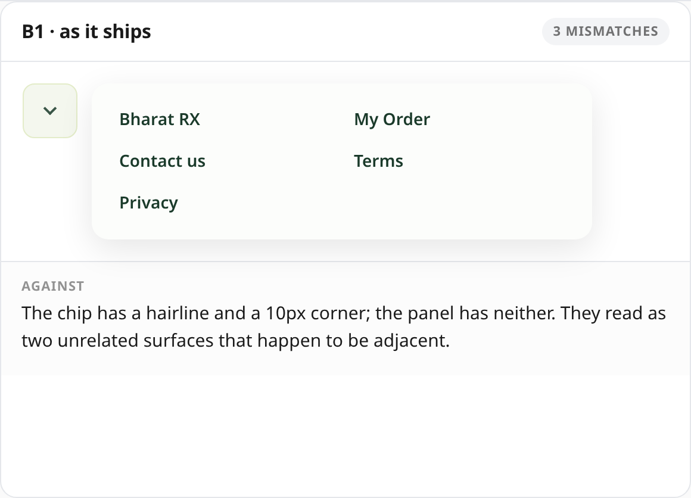 | 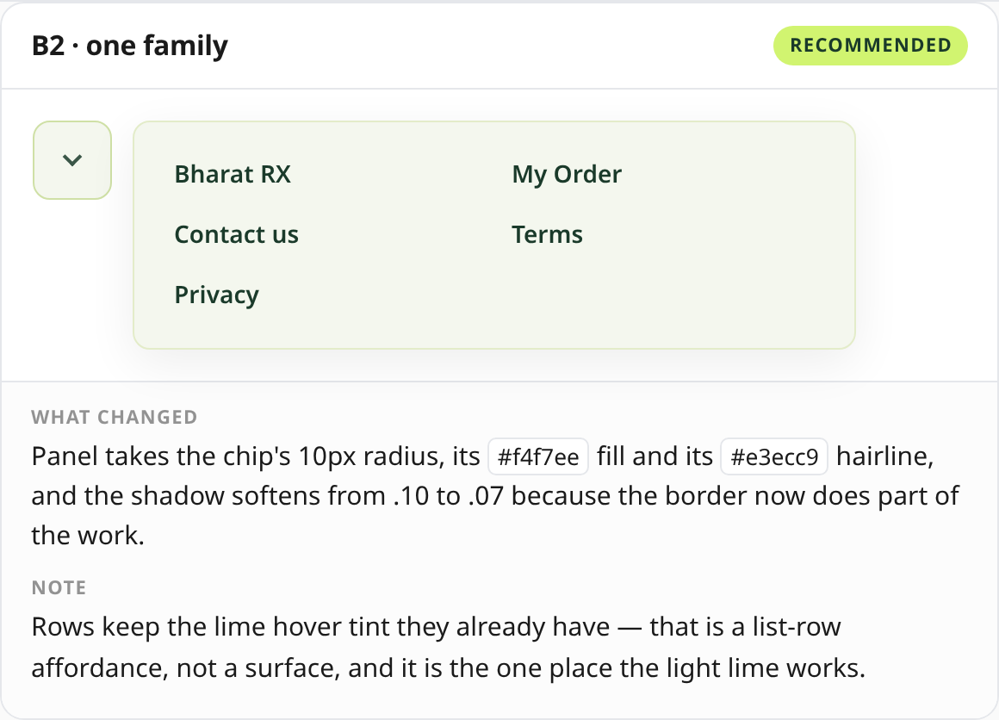 |

B2 gives the panel the chip's 10px radius, `#f4f7ee` fill and `#e3ecc9` hairline, and softens the
shadow from .10 to .07 because the border now does part of the work. Rows keep their lime hover
tint — that is a list-row affordance, and it is the one place light lime works.

## 3 · The step text — three different limes, not one

Measured: names are **white on steps 1–7**. Only **step 8** is lime, because it is the
`is-complete` one. The `.wt-svc` pill is lime on **all 8**, and the **✓** is lime.

So "the text is still lime" is precisely: **the pill, the tick, and step 8's name.**

| C1 — now | C2 — recommended | C3 — not advised |
|---|---|---|
| 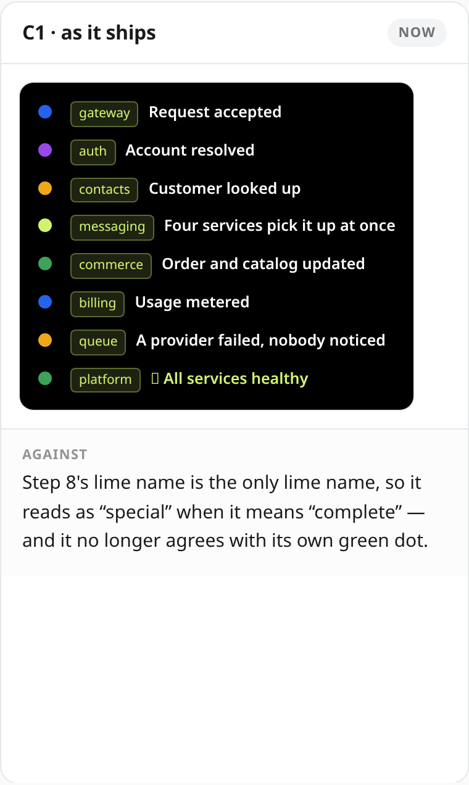 | 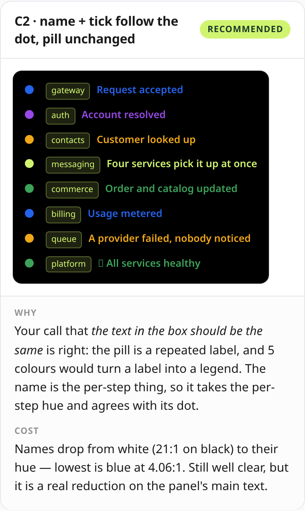 | 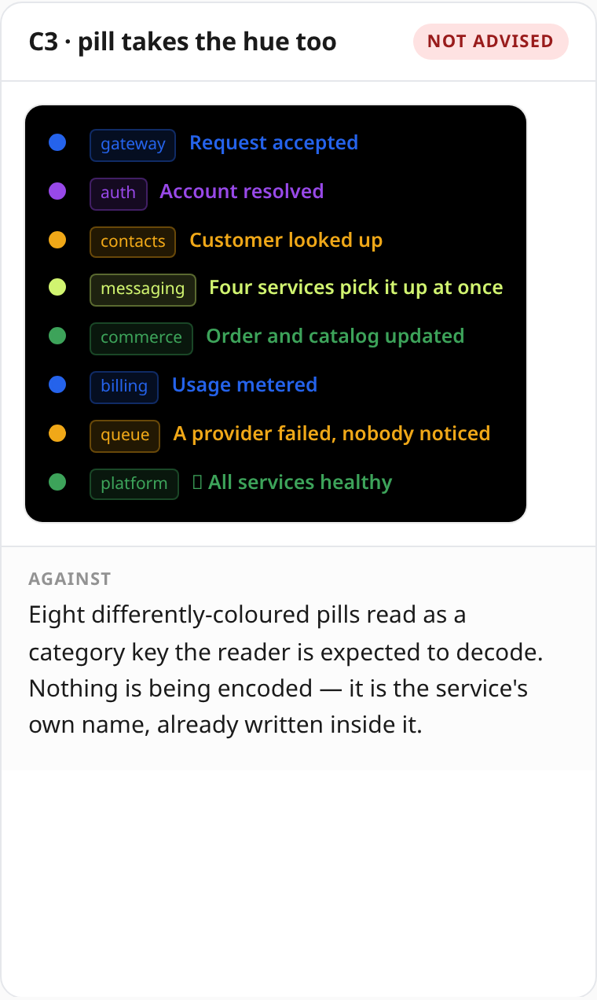 |

**C2 follows your instruction exactly** — name and tick take the dot's hue, the pill stays uniform.
Your call that *the text in the box should be the same* is right: the pill is a repeated label, and
five colours would turn a label into a legend.

**The cost, stated:** names drop from white (21:1 on black) to their own hue — lowest is blue at
4.06:1. Well clear, but a real reduction on the panel's main text.

## 4 · The footer effect on hover and click

Today the trigger is **scroll only**, and it fired once then disconnected.

| D1 — recommended | D2 — consider |
|---|---|
| 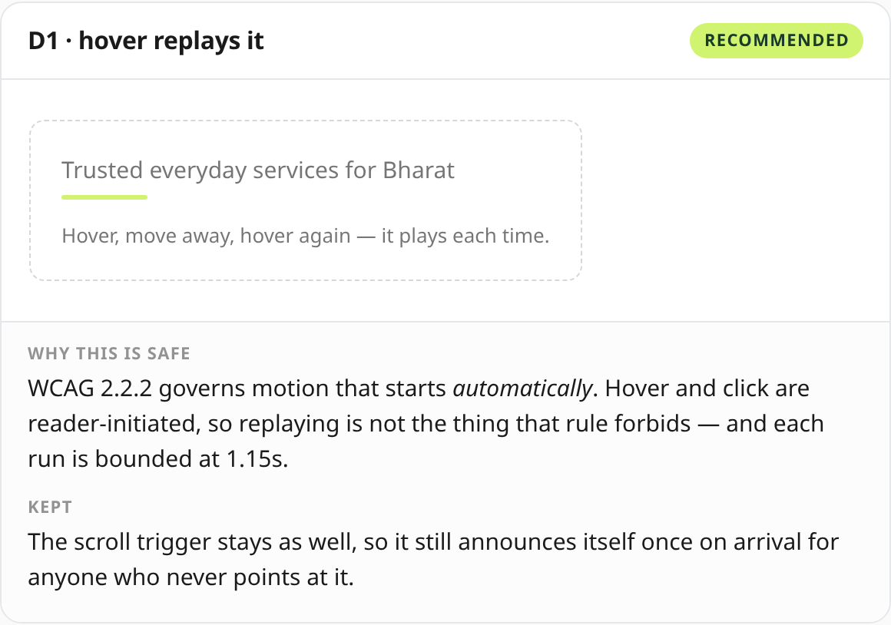 | 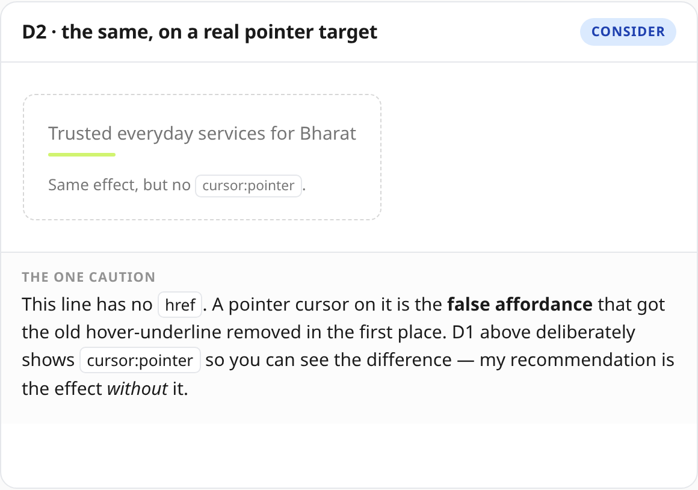 |

WCAG 2.2.2 governs motion that starts *automatically*. Hover and click are reader-initiated, so
replaying is not what that rule forbids, and each run is bounded at 1.15s. The scroll trigger stays
too, so it still announces itself once on arrival.

**The one caution:** this line has no `href`. A pointer cursor on it is the **false affordance**
that got the old hover-underline removed. My recommendation is the effect *without* `cursor:pointer`.

## 5 · Contact as the last item

| E1 — as it ships | E2 — Contact last |
|---|---|
| 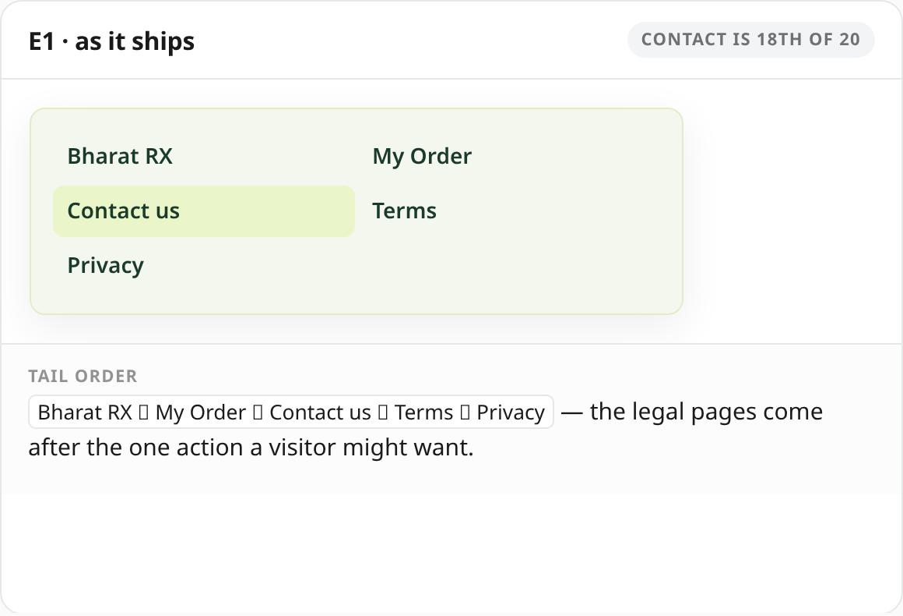 | 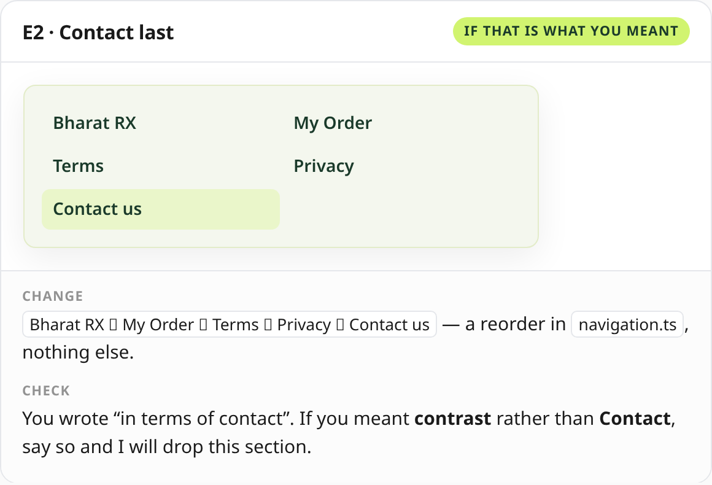 |

Tail today: `Contact us → Terms → Privacy` — Contact is 18th of 20, with the legal pages after the
one action a visitor might want. E2 is a reorder in `navigation.ts`, nothing else.

**One check:** you wrote "in terms of contact". If you meant **contrast** rather than **Contact**,
say so and I will drop this section.

---

## What I would ship

**A3, B2, C2, D1 without the pointer cursor, and E2 if you confirm it.**

- **A3** — the only hover with a measured luminance step (11.52:1 against
  1.03:1 today), using the brand's existing lime-on-dark-green pairing.
- **A4** is a free swap if you prefer three lines to a chevron — same hover, different glyph.
- **C2** — your instruction, exactly.
- **D1** — hover and click on top of scroll, minus `cursor:pointer`.

**Reply with letters — e.g. `A3, B2, C2, D1, E2` — and I will build them.**
