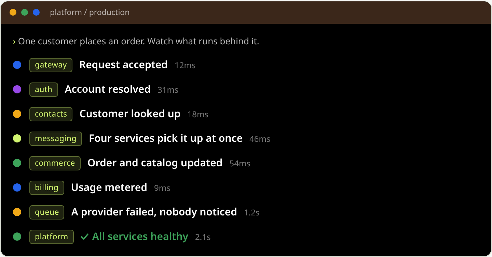
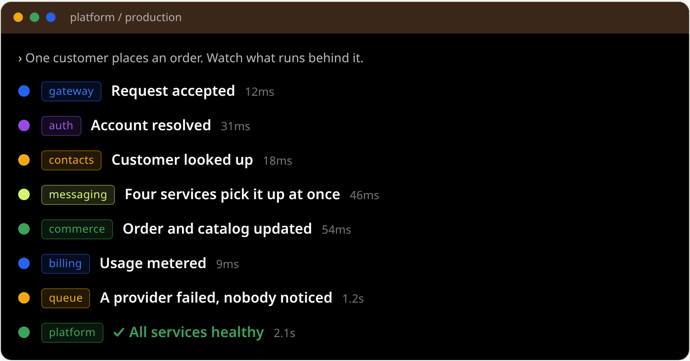
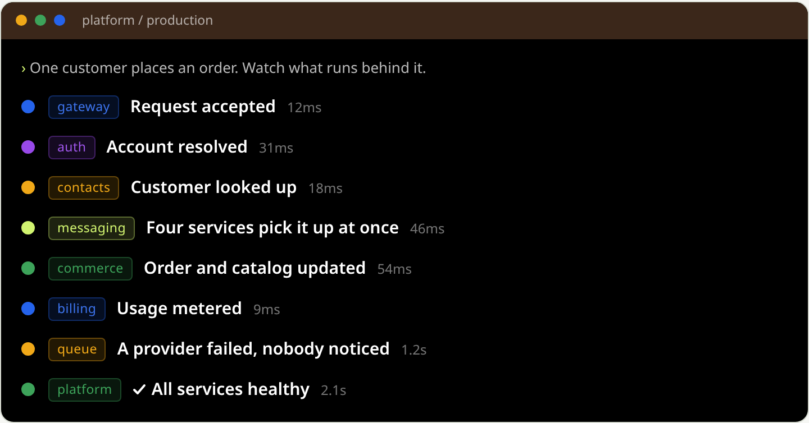
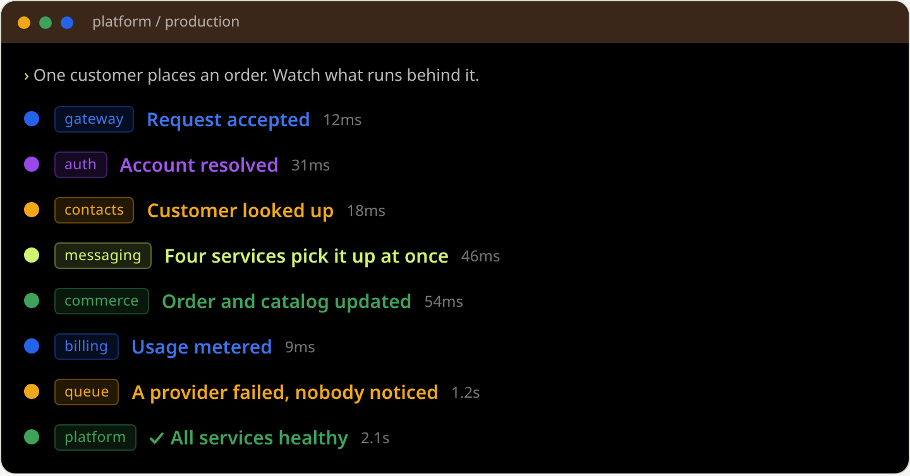
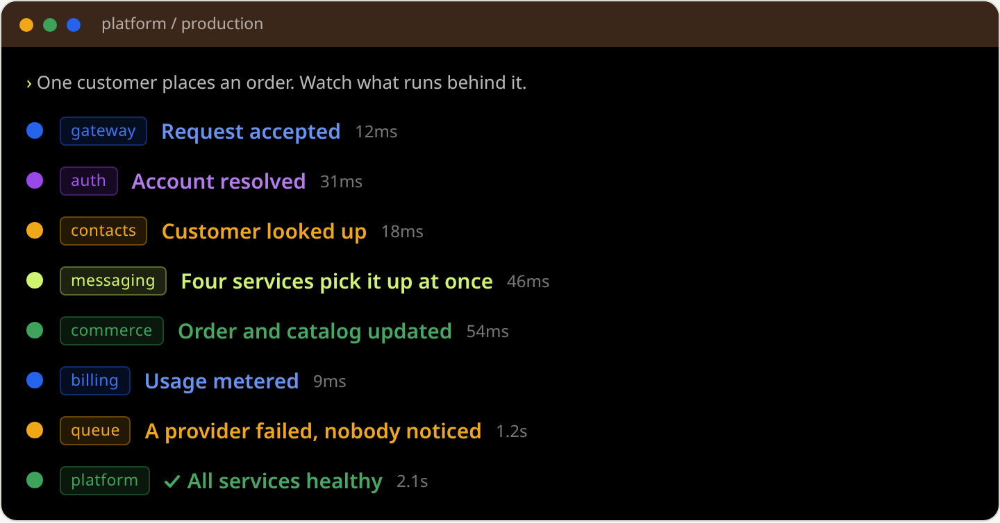

# Workflow terminal — step colours, five ways

The per-service dot hues shipped, and the report back was **"the dot colour changed, but the text colour is still lime green"**. That report was accurate. The reason was not visible in the diff.

`.wt-name.is-complete` is gated on `step.complete`, which is `true` for **exactly one of the eight steps**. So the rule recoloured a single line — lime `#d1f470` to green `#3da35a`, two greens, 16.89:1 down to 6.58:1 — while all eight `.wt-svc` pills stayed lime. The lime in the report was the pills.

Probed against the production export, `tools/browser/replaycheck.js`:

| # | service | dot | pill text | name text |
|---|---|---|---|---|
| 1 | `gateway` | blue `#2563eb` | lime `#d1f470` | white `#ffffff` |
| 2 | `auth` | purple `#9849e8` | lime `#d1f470` | white `#ffffff` |
| 3 | `contacts` | amber `#f0a818` | lime `#d1f470` | white `#ffffff` |
| 4 | `messaging` | lime `#d1f470` | lime `#d1f470` | white `#ffffff` |
| 5 | `commerce` | green `#3da35a` | lime `#d1f470` | white `#ffffff` |
| 6 | `billing` | blue `#2563eb` | lime `#d1f470` | white `#ffffff` |
| 7 | `queue` | amber `#f0a818` | lime `#d1f470` | white `#ffffff` |
| 8 | `platform` | green `#3da35a` | lime `#d1f470` | green `#3da35a` |

---

## The five panels

### TODAY — what ships now

Pill lime on all eight. Names white on seven, green on step 8 — the only row whose data says complete. This is the one-line change that was reported as "not showing".

### PILL ONLY — pill takes its service hue, names untouched

The change you asked for three times, shown on its own. The pill holds the service name, which is exactly what the dot hue encodes, so lime there had stopped meaning anything.

### A — pill hued, ALL names white

Hue stays decorative and lives only on the dot and the chip. Every name reads at 21:1, the highest on the panel. The tick alone carries "complete", and step 8 stops being the one dim row.

### B — pill hued, ALL names take their own hue (AA, ≥4.5:1)

Eight coloured names instead of one, so the change is finally visible. Blue and purple lift 11% and 7% toward white to clear the floor; amber, lime and green are untouched.

### C — pill hued, ALL names at AAA (≥7:1)

Same as B with a bigger lift. Safest to read and visibly pastel: blue and purple move 31% and 28% toward white, which changes the palette's character on the darkest panel on the site.

---

## Measured

Pill text sits on its own hue at 14% over black. Name text sits on the panel body, `#000`. Pill type is 11.5px and name type is 15px/600 — both count as normal text for WCAG, so the floor is **4.5:1** for AA and **7:1** for AAA.

| # | service | dot hue | pill ink on its chip | name at AA (B) | name at AAA (C) |
|---|---|---|---|---|---|
| 1 | `gateway` | blue `#2563eb` | `#3d74ed` on `#050e21` = **4.51:1** | `#3d74ed` = **4.92:1** | `#6993f1` = **7.04:1** |
| 2 | `auth` | purple `#9849e8` | `#9f56ea` on `#150a20` = **4.56:1** | `#9f56ea` = **4.99:1** | `#b57cee` = **7.08:1** |
| 3 | `contacts` | amber `#f0a818` | `#f0a818` on `#221803` = **8.60:1** | `#f0a818` = **10.32:1** | `#f0a818` = **10.32:1** |
| 4 | `messaging` | lime `#d1f470` | `#d1f470` on `#1d2210` = **13.10:1** | `#d1f470` = **16.89:1** | `#d1f470` = **16.89:1** |
| 5 | `commerce` | green `#3da35a` | `#3da35a` on `#09170d` = **5.78:1** | `#3da35a` = **6.58:1** | `#47a862` = **7.05:1** |
| 6 | `billing` | blue `#2563eb` | `#3d74ed` on `#050e21` = **4.51:1** | `#3d74ed` = **4.92:1** | `#6993f1` = **7.04:1** |
| 7 | `queue` | amber `#f0a818` | `#f0a818` on `#221803` = **8.60:1** | `#f0a818` = **10.32:1** | `#f0a818` = **10.32:1** |
| 8 | `platform` | green `#3da35a` | `#3da35a` on `#09170d` = **5.78:1** | `#3da35a` = **6.58:1** | `#47a862` = **7.05:1** |

### Why blue and purple need lifting at all

| hue | raw | on `#000` | verdict as text |
|---|---|---|---|
| lime | `#d1f470` | 16.89:1 | passes AAA |
| amber | `#f0a818` | 10.32:1 | passes AAA |
| green | `#3da35a` | 6.58:1 | passes AA, misses AAA |
| purple | `#9849e8` | 4.45:1 | **fails AA** |
| blue | `#2563eb` | 4.06:1 | **fails AA** |

This is also a **latent bug in what currently ships**, not only a question about the mock. The committed comment beside `.wt-name.is-complete` claims the lowest of the five is "blue at 4.06:1. Well clear of 4.5:1 for 15px/600 text". 4.06 is not clear of 4.5 — it is below it. Nothing is visibly broken today only because step 8, the single complete step, happens to be green. Mark step 1 or 6 complete and the panel ships failing text.

### The hues stay distinguishable

Closest pair after lifting is blue against purple at **131** RGB distance of a possible 765. Every other pair is 194 or more. And each lifted ink stays close enough to its own dot to read as the same colour — blue moves **43**.

---

## What each option costs

**A** — one hue per row, carried by the dot and the chip. Names all white at 21:1, the most readable text on the panel. "Complete" is carried by the tick and by the footer's *running* / *complete* wording, so nothing is lost that colour was uniquely saying. Step 8 stops being the only dim row.

**B** — the only option where the change is actually *visible*, because it colours eight names instead of one. Costs the panel's primary text: a completed name drops from 21:1 to as low as 4.51:1.

**C** — same idea, bigger margin. Blue and purple move 31% and 28% toward white, which reads pastel against a pure-black panel and pulls the palette away from the brand hues used elsewhere on the page.

None of the three changes what colour *means* here: hue says **which service**, while motion, the tick and the footer wording say **whether it ran**. WCAG 1.4.1 stays unengaged in all five panels.

---

Regenerate: `node tools/browser/stepreview.js`
