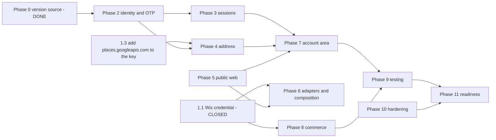

# Tasks

Ordering and status for the WECARE.DIGITAL commerce / identity brief.

## Which document governs what

**Three Kiro sessions worked this brief against one shared working tree**, and the resulting
authority split is worth stating plainly rather than leaving for the next reader to discover:

| Document | Authority | Owner |
|---|---|---|
| [`docs/spec.md`](spec.md) | **authoritative requirements** (`FR-*`, `TR-*`) | `sess_a140bc76` |
| [`docs/design.md`](design.md) | **authoritative design** (`ADR-001`…`ADR-008`, 20 diagrams) | `sess_a140bc76` |
| [`.kiro/specs/whatsapp-wix-commerce/requirements.md`](../.kiro/specs/whatsapp-wix-commerce/requirements.md) | commerce requirements `R0`–`R18` | `sess_a140bc76` |
| [`docs/current-environment.md`](current-environment.md) + [`docs/current-environment-addendum.md`](current-environment-addendum.md) | Phase 0 inventory | two independent passes |
| [`docs/compatibility.md`](compatibility.md) | vendor/version matrix | — |
| **this file**, [`docs/security.md`](security.md), [`docs/operations.md`](operations.md) | ordering, threat model, runbook | this session |

Earlier revisions of this file referenced a `CI-/OTP-/ADR-/SESS-/ACC-/PUB-/VER-` requirement
namespace. That namespace is **superseded** by the `FR-*` ids in `docs/spec.md`; the phases
below survive because ordering and blockers are independent of numbering, but where a task
names an outcome, the `FR-*` requirement in `spec.md` is the contract, not the wording here.

Requirement *state* changes in [`docs/execution/requirement-registry.md`](execution/requirement-registry.md),
which stays the one place state changes. This file is the ordering, not a second registry.

## Two corrections that invalidate earlier drafts

1. **`R0` — the Wix credential — is CLOSED.** Commit `82fa0d5a`: the owner supplied the key, it
   was stored without the value entering argv, and Catalog V3 is now **measured** rather than
   inferred — `/stores/v3/products/query` returns 7 products and a live invoke of
   `wecare-wix-store:live` returned three with prices and stock. Every `⏳ PENDING (1.1 now closed)`
   below is therefore unblocked; the annotations are kept so the dependency order stays legible.
2. **WAF on the API is not achievable as specified.** WAFv2 does not support API Gateway HTTP
   APIs. Measured, not assumed. See 1.6 and 10.1.

## How to read the status column

`✅ COMPLETE` means the intended result was **verified**. A command exiting zero is not
evidence of success. Anything unverified is not COMPLETE.

`⛔ BLOCKED` names the blocker and who holds the key.

---

## Phase 0 — Discovery and version control plane

| # | Task | Status | Evidence |
|---|---|---|---|
| 0.1 | Read-only inventory of AWS, Meta, SES, Google, Wix, frontend | ✅ COMPLETE | [`docs/current-environment.md`](current-environment.md) — 65 Lambdas, 79 tables, 361 routes, 0 authorizers, 19 gaps |
| 0.2 | Vendor capability and version matrix | ✅ COMPLETE | [`docs/compatibility.md`](compatibility.md) |
| 0.3 | Live Meta WABA, sender and template verification | ✅ COMPLETE | WABA `APPROVED`/`COMPLETE`, sender `+91 93309 94400` `GREEN`, `wecare_otp` `APPROVED` — measured via internal Lambda invoke, token never in context |
| 0.4 | SES sender identity verification | ✅ COMPLETE | `one@wecare.digital` verified, DKIM `SUCCESS`, production access, 50k/day, not suppressed |
| 0.5 | Google Maps key and enabled-service audit | ✅ COMPLETE | one unified key, ~50 APIs, `places.googleapis.com` enabled on project but **absent from the key** |
| 0.6 | Single vendor-version source | ✅ COMPLETE | `packages/config/vendorVersions.ts` + `config/vendor-versions.json`; `npm run typecheck` exit 0 |
| 0.7 | Version drift gate | ✅ COMPLETE | `node scripts/check-versions.ts` exit 0; `--npm` agrees with the registry on all 4 npm-backed entries |
| 0.8 | Spec, design, security, operations | ✅ COMPLETE | this suite; all 14 Mermaid diagrams parse against Mermaid 12 |

### Phase 0 residual

| # | Task | Status | Note |
|---|---|---|---|
| 0.9 | Remove the 3 hard-coded Graph version URL literals | ⏳ PENDING | includes the payment-lookup call in `inbound-whatsapp-handler`; a grep for the constant name does not find these |
| 0.10 | Migrate 7 module constants and 9 env defaults onto the single source | ⏳ PENDING | mechanical; do it in one commit so the grep goes clean |
| 0.11 | Resolve the WABA-id contradiction in `docs/customer-whatsapp-cognito-auth.md` | ⏳ PENDING | the doc's "create a customer user" section says `2513394156072604`; code and the live account say `2094615664435155` |
| 0.12 | Remove the stale `if False: # Phone 1 DISCONNECTED` branch | ⏳ PENDING | `inbound-whatsapp-handler:7309`. The live account contradicts the comment — the phone is connected and GREEN |
| 0.13 | Surface configured-vs-latest on an admin page | ⏳ PENDING | VER-1.6; reads `checkVersions()` |

---

## Phase 1 — Owner and provider unblocks

Nothing in these is workaroundable. Each names the exact action and who must take it.

| # | Task | Status | Holder | Unblock action |
|---|---|---|---|---|
| 1.1 | Mint and store the Wix Headless credential | ✅ COMPLETE | owner + agent | Commit `82fa0d5a`. Value never entered argv, staging file shredded, encrypted local and S3 recovery copies refreshed and verified. Catalog V3 measured live: 7 products |
| 1.2 | Confirm the target Wix site against the published/draft pair | 🟡 IN PROGRESS | agent | **Narrowed, not closed.** A visitor token from the committed `WIX_CLIENT_ID` returns live catalog and blog data, and Wix's own scope error names `fcd82f0c-…` — so the public client and the committed site id provably belong together. Still open: which of the owner's two sites is the *published* one. `https://xout.wecare.digital/` returned **404** during discovery, so the brief's "Published" claim does not hold at the URL it supplies. Settle with `POST /site-list/v2/sites/query` |
| 1.3 | Add `places.googleapis.com` to the API key's `apiTargets` | ⏳ PENDING | agent, gcloud | Without it every Places API (New) call fails on key restriction. Enabling the service on the project — already done — is not sufficient |
| 1.4 | Split the unified key into browser and backend keys | ⏳ PENDING | agent, gcloud | Remove the pseudo-referrers `places.googleapis.com` and `*.googleapis.com/*`, which no browser sends. Store as `wecare/google-maps-browser` and `wecare/google-maps-server` |
| 1.5 | Provision the three new secrets | ⏳ PENDING | agent | `wecare/otp/pepper`, `wecare/session/signing`, `wecare/tracking/token-pepper`. Values generated in-process, never on a command line |
| 1.6 | ~~Attach a WebACL to `zllr9lrg7j`~~ → per-route throttling plus handler limits | ➖ NOT REQUIRED as written | agent | **WAFv2 cannot attach to an HTTP API.** Measured: `GetWebACLForResource` on the stage ARN returns `WAFInvalidParameterException`. Superseded by 10.1 |
| 1.7 | Confirm which SES DKIM selector is in use | ⏳ PENDING | owner | Read `s=` from a real SES-sent message's `DKIM-Signature`. Three tokens are listed as current, AWS publishes a key for one. Do not rotate while `p=reject` is live |

---

## Phase 2 — Identity and OTP domain

Buildable today. Neither SES nor Meta is blocked.

| # | Task | Requirement | Status | Acceptance |
|---|---|---|---|---|
| 2.1 | `Customer` entity, `CUS_<ULID>` ids, Contact and Cognito linkage | CI-1 | ⏳ PENDING | `customerId` immutable across a phone change; resolver in the shape of `contact_key.py` so no call site picks a spelling |
| 2.2 | `TransactWriteItems` registration commit with both `UNIQUE#` markers | CI-2 | ⏳ PENDING | concurrency test against a **real** conditional-write path yields exactly one customer; a mock that cannot fail a condition proves nothing |
| 2.3 | Shared normalisation fixtures, TS and Python | CI-3 | ⏳ PENDING | one table drives both; `+91 93309 94400`, `09330994400`, `9330994400`, `919330994400` collapse to one identity |
| 2.4 | Registration state machine with conditional transitions | CI-4 | ⏳ PENDING | `ACTIVE` unreachable without both verification timestamps, because the commit asserts them |
| 2.5 | Existing-account and email-conflict paths | CI-5 | ⏳ PENDING | phone collision routes to sign-in, email collision to audited resolution, neither distinguishable to the caller |
| 2.6 | Profile with consent defaulting to false | CI-6 | ⏳ PENDING | no consent field defaults to granted |
| 2.7 | Append-only customer audit events | CI-7 | ⏳ PENDING | 15 event types; no event carries an OTP, token, full phone or full email |
| 2.8 | `OtpService` with HMAC-at-rest, TTL and atomic counters | OTP-1, OTP-2 | ⏳ PENDING | no plaintext OTP anywhere; single use via `attribute_not_exists(usedAt)`; expiry checked in code, not left to the TTL reaper |
| 2.9 | Rate limits failing closed, per phone, per email, per IP | OTP-3 | ⏳ PENDING | per-IP at the gateway or handler — a Cognito trigger receives no source IP, which is why the existing probe counter is per-number |
| 2.10 | Failure taxonomy without enumeration | OTP-4 | ⏳ PENDING | registration surface omits `registered`; identical body, status and timing for existing and unknown subjects |
| 2.11 | WhatsApp OTP provider on the verified template | OTP-5 | ⏳ PENDING | `url` button param, not `copy_code`; WABA isolation gate retained; template and Graph version read from the version source |
| 2.12 | Email OTP provider on SESv2 | OTP-6 | ⏳ PENDING | `ConfigurationSetName: wecare-digital` passed per send — the identity has no default set; bounce and complaint events consumed |
| 2.13 | OTP observability | OTP-7 | ⏳ PENDING | 11 event types; a secret must not appear in a logging **expression**, and CodeQL must pass without suppression |

### The CodeQL trap in 2.13, stated before someone hits it

`py/clear-text-logging-sensitive-data` has already failed this build twice. Once on a line that
could not leak anything — a ternary on a key's truthiness yielding a string literal. The second
attempt moved the log to another function and reduced the value to a bool, and still failed,
because taint is tracked across call boundaries. Reducing a secret to a boolean does not
launder it. Remove the log, or derive the logged value from something that never touched the
secret. Do not suppress the alert.

---

## Phase 3 — Sessions

| # | Task | Requirement | Status | Acceptance |
|---|---|---|---|---|
| 3.1 | `SESSION#` registry with server-side revocation | SESS-2 | ⏳ PENDING | logout invalidates server-side, not by the client forgetting |
| 3.2 | Record the bearer-token architecture decision | SESS-2.5 | ✅ COMPLETE | design ADR-6, with the blast radius and the revisit trigger stated |
| 3.3 | CSRF protection on sensitive mutations | SESS-2.3 | ⏳ PENDING | token bound to the session |
| 3.4 | Recovery and identity-change flows | SESS-3 | ⏳ PENDING | new phone and new email each verified before the change lands |
| 3.5 | Transactional `UNIQUE#` marker move on phone or email change | SESS-3.4 | ⏳ PENDING | old released and new claimed atomically; both markers or neither is a corruption |
| 3.6 | Notify on the channel **not** being changed | SESS-3.5 | ⏳ PENDING | an email change notifies WhatsApp, and the reverse |

---

## Phase 4 — Address capture

Depends on 1.3 and 1.4.

| # | Task | Requirement | Status | Acceptance |
|---|---|---|---|---|
| 4.1 | `CustomerAddress` entity | ADR-1 | ⏳ PENDING | 15 fields; no single free-form string as the only representation |
| 4.2 | `AddressService` on Places API (New) | ADR-2 | ⛔ BLOCKED by 1.3 | session tokens bundle keystrokes plus details into one billable session; 3-character minimum |
| 4.3 | Manual-entry fallback | ADR-2.5 | ⏳ PENDING | a Places outage must not block registration; test with Places forced to fail |
| 4.4 | Confirmation step with delivery detail | ADR-3 | ⏳ PENDING | flat, floor, landmark and instructions stored **without** altering the canonical place reference |
| 4.5 | Address Validation as advisory | ADR-3.4 | ⏳ PENDING | the verdict informs; the customer's confirmation decides |
| 4.6 | Retire the legacy Places proxy path | ADR-2.2 | ⏳ PENDING | existing proxy serves WhatsApp location templates; migrate it too, and drop the direct `get_secret_value` and `str(e)` logging rather than copying them |

---

## Phase 5 — Public web foundation

| # | Task | Requirement | Status | Acceptance |
|---|---|---|---|---|
| 5.1 | Breakpoint scale in `tokens.css` | PUB-5.2 | ⏳ PENDING | the only source of breakpoints; today `tokens.css` defines none |
| 5.2 | Convert public layouts to mobile-first | PUB-5.1 | ⏳ PENDING | current CSS is desktop-first, `max-width` dominant; preserve the foldable query |
| 5.3 | 16 new routes, each registered three ways | PUB-4 | ⏳ PENDING | page + allowlist in `_app.tsx` + `PublicRouteRegistration.test.ts`. Omitting step 2 renders an empty HTTP 200 |
| 5.4 | Reconcile `/blog/[slug]` against the live `/post/[slug]` | PUB-4.4 | ⏳ PENDING | whichever wins, the other 301s via an Amplify custom rule — a static export emits no server redirects |
| 5.5 | `noindex` and sitemap exclusion for token routes | PUB-4.5 | ⏳ PENDING | a tracking token must not reach a search index |
| 5.6 | Keep Amplify SDKs off public routes | PUB-7.2 | ⏳ PENDING | assert by inspecting the built bundle, not by intent |
| 5.7 | Responsive component set | §62 | ⏳ PENDING | 24 components, `ResponsiveHeader` through `OrderTrackingCard` |
| 5.8 | Accessible OTP input | PUB-5.6 | ⏳ PENDING | numeric keyboard, whole-code paste, auto-advance without trapping focus, backspace across boxes, one labelled field to assistive tech |
| 5.9 | Accessibility pass | PUB-6 | ⏳ PENDING | automated checks in CI, plus the plain statement that full conformance needs manual AT testing and expert review |

---

## Phase 6 — Wix content adapters and page composition

`WixCatalogAdapter` extends a real boundary. `WixBlogAdapter` is new — the Blog API is not
called anywhere today.

| # | Task | Requirement | Status | Acceptance |
|---|---|---|---|---|
| 6.1 | `WixCatalogAdapter`, 10 methods | PUB-2.1 | ⏳ PENDING (1.1 now closed) | extends the existing Lambda boundary; pure transforms stay AWS-free and unit-testable |
| 6.2 | `WixBlogAdapter`, 8 methods | PUB-2.2 | ⏳ PENDING (1.1 now closed) | published and public posts only |
| 6.3 | OAuth `client_credentials` replacing the admin API key | design §6 | ⏳ PENDING (1.1 now closed) | short-lived token; lazy resolution so a rotation lands on sandbox recycle |
| 6.4 | Page and section entities | PUB-3.2 | ⏳ PENDING | sections store Wix **references**, never copies |
| 6.5 | `PageSectionRenderer`, 15 types | PUB-3.3 | ⏳ PENDING | unknown type renders nothing and does not break the page |
| 6.6 | Batched reference resolution | design §7 | ⏳ PENDING | `query-variants` takes a page of ids and cursor-pages to 1,000 variants |
| 6.7 | Graceful degradation for deleted Wix content | PUB-3.5 | ⏳ PENDING | drop the card, render the rest, never 500 |
| 6.8 | Admin page composer UI | §40 | ⏳ PENDING | `/admin/content/pages` |

---

## Phase 7 — Account area

| # | Task | Requirement | Status | Acceptance |
|---|---|---|---|---|
| 7.1 | 7 `/account*` routes | ACC-1.1 | ⏳ PENDING | client-fetched; `getStaticPaths` cannot enumerate per-customer paths under `fallback: false` |
| 7.2 | Profile and address management | ACC-1.2 | ⏳ PENDING | add, edit, remove, set default |
| 7.3 | Order list and detail | ACC-1.3 | ⏳ PENDING | reachable independently of any tracking token |
| 7.4 | Invoice and receipt access | ACC-1.2 | ⏳ PENDING | no permanent unrestricted URL; proxied or short-lived signed |
| 7.5 | Authorise every read on `session.customerId` | ACC-1.4 | ⏳ PENDING | IDOR test suite; identifier in the request is never the authority |
| 7.6 | Indistinguishable refusals | ACC-1.5 | ⏳ PENDING | follows the `_not_registered` precedent — one byte-identical 403 for wrong-owner and nonexistent |
| 7.7 | Session management UI | ACC-1.2 | ⏳ PENDING | list and revoke |

---

## Phase 8 — Commerce

Owned by the commerce spec. Listed for ordering only.

| # | Task | Requirement | Status |
|---|---|---|---|
| 8.1 | Cart and checkout | `R5` | ⏳ PENDING (1.1 now closed) |
| 8.2 | Money integrity, exact total match | `R6` | ⏳ PENDING (1.1 now closed) |
| 8.3 | `commerceOrderNumber` with `ORDERNO#` reservation | `R2` | ⏳ PENDING |
| 8.4 | Payment reconciliation | `R7` | ⏳ PENDING (1.1 now closed) |
| 8.5 | Inventory adjusted once, by Wix | `R8` | ⏳ PENDING (1.1 now closed) |
| 8.6 | Billing document, generated once | `R9` | ⏳ PENDING (1.1 now closed) |
| 8.7 | Hashed tracking tokens | `R11` | ⏳ PENDING |
| 8.8 | Admin order, payment and reconciliation views | `R12` | ⏳ PENDING |
| 8.9 | Append-only timeline backing both views | `R13` | ⏳ PENDING |
| 8.10 | Fulfillment sync | `R14` | ⏳ PENDING (1.1 now closed) |

8.3 and 8.7 are not actually blocked on Wix — order-number reservation and token hashing are
ours. Build them early; they are cheap and they gate the tracking page.

---

## Phase 9 — Testing

| # | Task | Requirement | Status | Acceptance |
|---|---|---|---|---|
| 9.1 | Phone OTP unit and integration, 15 cases | VER-3.1 | ⏳ PENDING | includes concurrent requests and a duplicate verification callback |
| 9.2 | Email OTP, 13 cases | VER-3.2 | ⏳ PENDING | includes sender identity and SPF/DKIM configuration |
| 9.3 | Duplicate-customer race | VER-3.3 | ⏳ PENDING | parallel same-phone and same-email; exactly one identity, against a real conditional write |
| 9.4 | Introduce `@playwright/test` | VER-3.8 | ⏳ PENDING | not currently a dependency; `tools/browser/` is a measurement harness and is **not** repurposed as the runner |
| 9.5 | Registration E2E, 18 steps | VER-3.4 | ⏳ PENDING | homepage through add-to-cart |
| 9.6 | Responsive E2E, 9 widths × 11 surfaces | VER-3.5 | ⏳ PENDING | no horizontal overflow at any width; fluid between them |
| 9.7 | Cross-browser, Chromium, WebKit, Firefox | VER-3.6 | ⏳ PENDING | registration, OTP, Places, cart, checkout, tracking |
| 9.8 | Security suite, 10 classes | VER-3.7 | ⏳ PENDING | each test must **fail when its control is removed**; a test that passes either way measures nothing |
| 9.9 | Assert test bypasses absent in production | VER-2.3 | ⏳ PENDING | asserted, not inferred from configuration |
| 9.10 | CI jobs for E2E, cross-browser and accessibility | VER-3 | ⏳ PENDING | note `npm ci` cannot install this repo — `@opentelemetry/core@2.0.0` conflict; `build-test.yml` uses `npm install` deliberately |

---

## Phase 10 — Hardening

| # | Task | Status | Note |
|---|---|---|---|
| 10.1 | Per-route throttling on the verification routes, plus handler limits on `RateLimitTable` | ⏳ PENDING | The stage is 100 rps / 200 burst **for all 361 routes**; OTP routes need their own far lower limits. This replaces the impossible WebACL task |
| 10.1b | Decide whether to front the API with CloudFront to gain WAF | ⏳ PENDING | The only route to real WAF coverage for an HTTP API. A genuine architecture decision — latency, caching, cost — not a checkbox |
| 10.2 | Admin MFA | ⏳ PENDING | owner overrides make it a required target while removing blocking semantics |
| 10.3 | Raise the staff password minimum from 8 | ⏳ PENDING | |
| 10.4 | Enable customer-pool deletion protection | ⏳ PENDING | currently `INACTIVE`; one delete removes every customer login |
| 10.5 | Reserved concurrency on customer-facing functions | ⏳ PENDING | `/plivo/answer` is the precedent for what unbounded concurrency costs |
| 10.6 | Explicit log retention | ⏳ PENDING | the default is never-expire |
| 10.7 | Alarms from the operations table | ⏳ PENDING | 11 alarms |
| 10.8 | Bundle secret-exposure test | ⏳ PENDING | greps the build output |

---

## Phase 11 — Production readiness

| # | Task | Status | Gate |
|---|---|---|---|
| 11.1 | All gates green on the exact tree | ⏳ PENDING | lint, typecheck, vitest, pytest, `check-versions` |
| 11.2 | Deploy per the alias model | ⏳ PENDING | `update-function-code` → publish → move `live`; `$LATEST` alone is not a deployment |
| 11.3 | Live verification of each new route | ⏳ PENDING | including an unauthenticated probe expecting rejection |
| 11.4 | QA round trip to the nominated recipient | ⏳ PENDING | `+918100640044` only. `WA_LIVE_SMOKE_TEST` is a lockdown, not a permission — it halts customer messaging and must not be left on |
| 11.5 | Production readiness review | ⏳ PENDING | account, region, role, branch, commit, functions, secrets, tests, build, infra diff, destructive changes, rollback version, downtime |
| 11.6 | Update the requirement registry | ⏳ PENDING | the one place state changes |

---

## Critical path

Phases 2, 3, 5, 6, 8 and 10 have **no external blocker** now that `R0` is closed. Phase 4 is
the only track still gated, and it is gated on one `gcloud` change: `places.googleapis.com`
must be added to the API key's `apiTargets` before any Places API (New) call can succeed.
Enabling the service on the project — already done — is not sufficient.

The single remaining owner-only item is 1.7, confirming which SES DKIM selector is in use, and
it blocks nothing on this plan.

## Standing constraints for every task above

- Stage by explicit path. Several sessions share this working tree and index.
- Commit to `stack`. There is no `main`.
- `$LATEST` is not production for any function with a `live` alias.
- Secrets by reference, lazily, at request time; never at import scope, never on a command
  line, never in a log or a report.
- Redirects and headers are Amplify `customRules`, not `next.config.js`.
- A new public route without an allowlist entry renders an empty HTTP 200.
- Rediscover counts at the start of each phase rather than trusting the snapshots in these
  documents.
