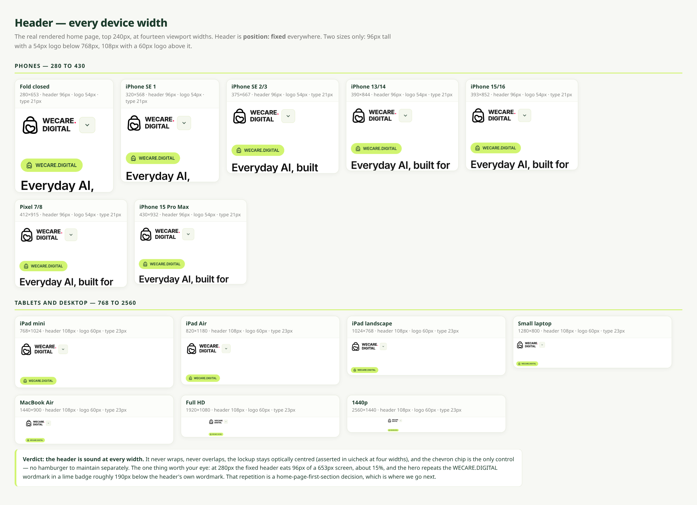
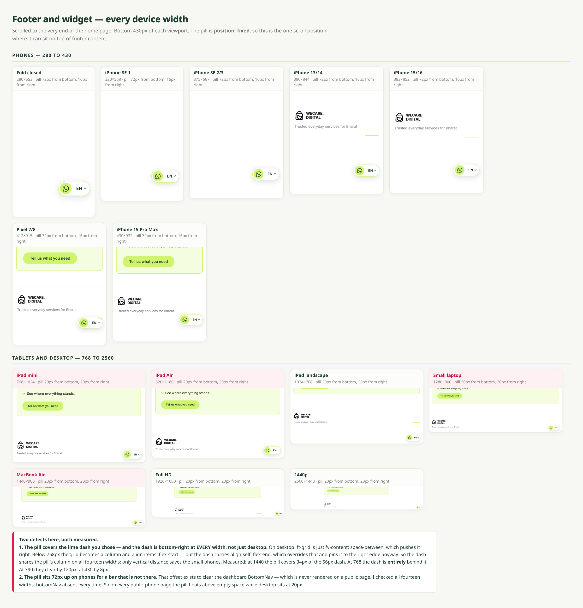
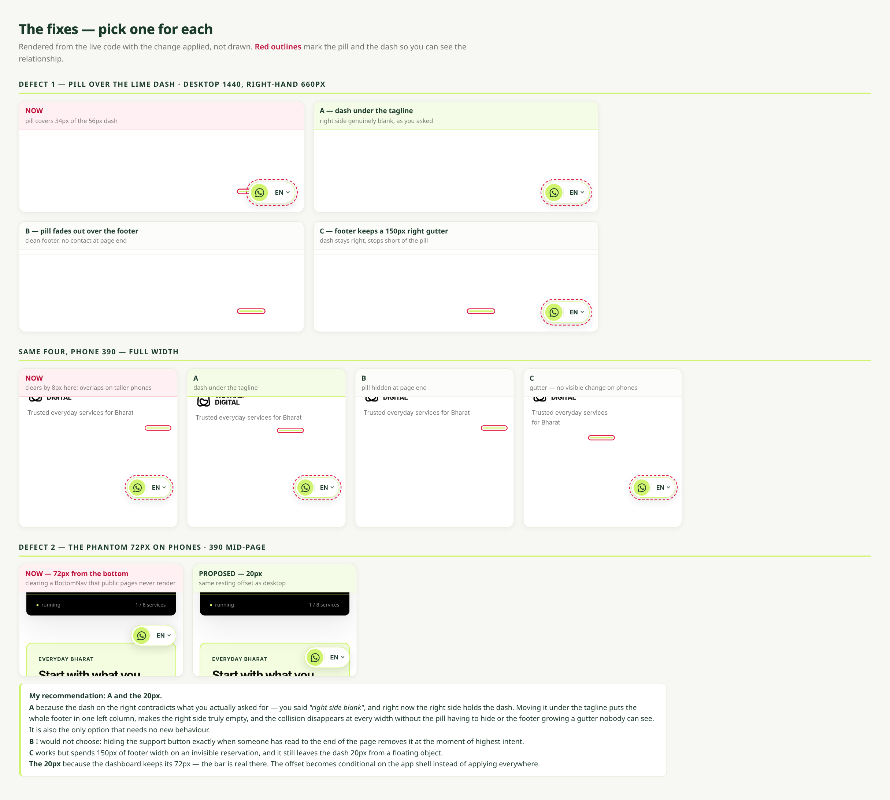
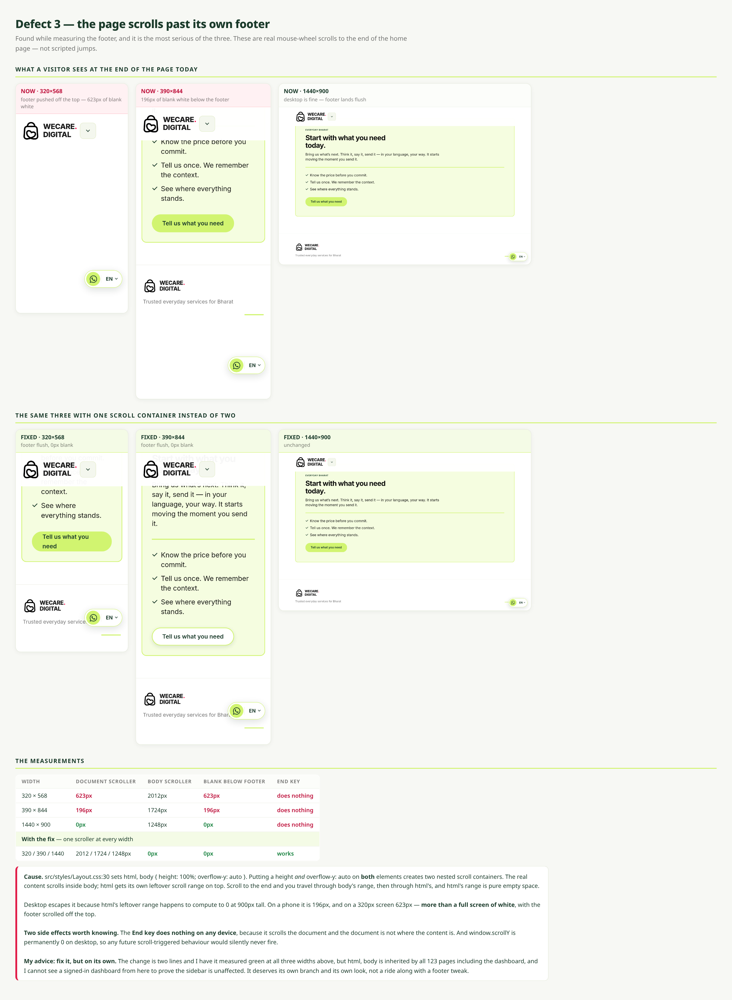
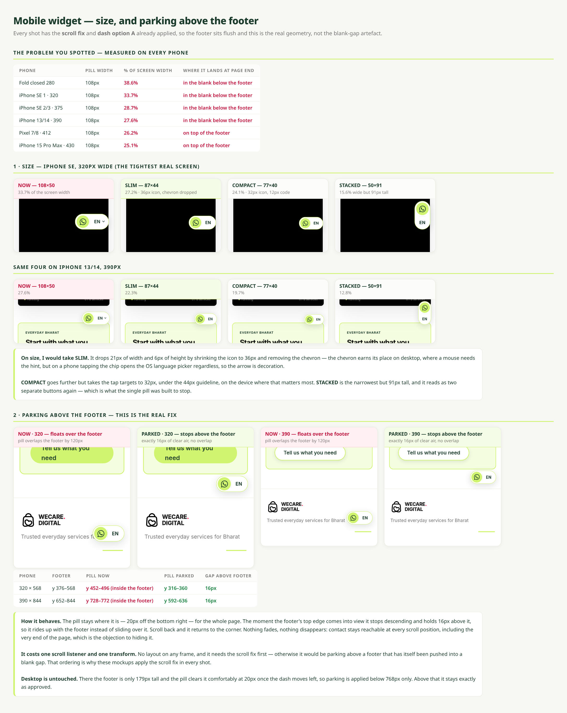
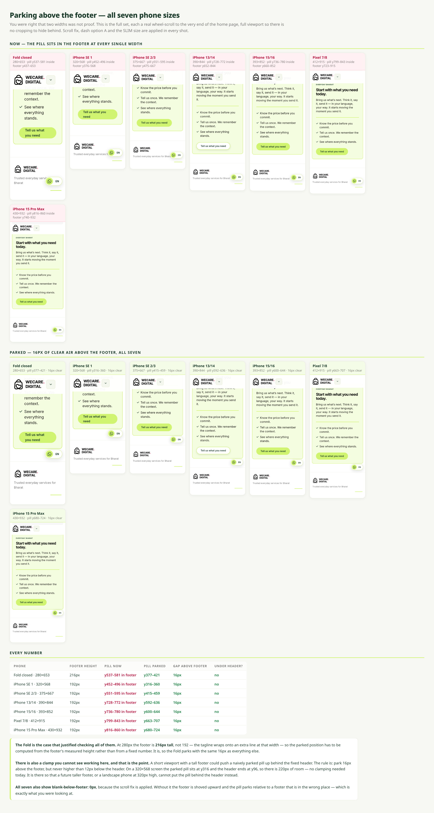

# Header / footer / widget — device audit and mockups

Nothing in `src/` is changed on this branch. These are measurements and mockups only, for a decision.

Every image is the **real rendered home page** at a real device size, captured with the same Chromium the test harness uses. Nothing is drawn or illustrated. Red outlines are added only to mark the pill and the dash so the relationship is visible.

Fourteen widths measured: 280, 320, 375, 390, 393, 412, 430, 768, 820, 1024, 1280, 1440, 1920, 2560.

---

## 1 · Header — no defects



Two sizes only: **96px tall with a 54px logo** below 768px, **108px with a 60px logo** above it. Fixed at every width. It never wraps, never overlaps, the lockup stays optically centred, and the chevron chip is the only control — there is no separate hamburger to keep in step.

Two things to carry into the first-section work, neither a defect:

- At 280px the fixed header takes 96px of a 653px screen, about 15% of it, permanently.
- The hero repeats **WECARE.DIGITAL** in a lime badge roughly 190px below the header's own wordmark, so the same words appear twice in one screenful.

---

## 2 · Footer and widget — two defects



Scrolled to the very end of the page — the one scroll position where a fixed pill can sit on top of footer content.

### ① The pill covers the lime dash

The dash is bottom-**right** at every width, not just on desktop. On desktop `.ft-grid` is `justify-content: space-between`, which pushes it right. Below 768px the grid becomes a column with `align-items: flex-start` — but the dash carries `align-self: flex-end`, which overrides that and pins it to the right edge anyway. So it shares the pill's column everywhere; only vertical distance saves the small phones.

| Width | Overlap with the 56px dash |
| --- | --- |
| 1440 | **34px covered** (61% of it) |
| 768 | **entirely behind the pill** |
| 430 | clears by 8px |
| 390 | clears by 120px |

### ② The pill floats 72px up on phones, for a bar that is not there

The 72px offset exists to clear the dashboard `BottomNav`. `BottomNav` is only rendered by `Layout.tsx`, which public pages never use. Checked at all fourteen widths: **absent every time**. Desktop sits at 20px, so phones are inconsistent with desktop and the gap is above empty space.

---

## 3 · The options — pick one for each



### For the dash

| | What it does | Cost |
| --- | --- | --- |
| **A** | Dash moves under the tagline. Right side genuinely blank. | None. No new behaviour, collision gone at every width. |
| **B** | Pill fades out while the footer is in view. | Removes the support button exactly when someone has read to the end. |
| **C** | Footer keeps a 150px right gutter. | Spends 150px on an invisible reservation; dash still sits 20px from a floating object. |

**Recommended: A.** You asked for the right side of the footer to be blank, and right now the right side holds the dash. Moving it under the tagline puts the whole footer in one left column, makes the right side actually empty, and removes the collision at every width without the pill having to hide or the footer growing a gutter nobody sees.

### For the offset

**72px → 20px on public pages.** The dashboard keeps 72px, because there the bar is real. The offset becomes conditional on the app shell instead of applying everywhere.

---

## 4 · The defect I would fix first — the page scrolls past its own footer



These are real mouse-wheel scrolls to the end of the page, not scripted jumps.

`src/styles/Layout.css:30` sets:

```css
html, body {
  height: 100%;
  overflow-y: auto;
}
```

A height **and** `overflow-y: auto` on **both** elements creates two nested scroll containers. The content scrolls inside `body`; `html` keeps its own leftover scroll range stacked on top of it — and that leftover range is pure empty space.

| Width | Document scroller | Body scroller | Blank below footer | `End` key |
| --- | --- | --- | --- | --- |
| 320 × 568 | 623px | 2012px | **623px** — footer scrolls off the top | dead |
| 390 × 844 | 196px | 1724px | **196px** | dead |
| 1440 × 900 | 0px | 1248px | 0px | dead |
| **with the fix** | 2012 / 1724 / 1248px | **0px** | **0px** | works |

On a 320px phone, reaching the end of the home page shows a **completely blank white screen** — the fixed header and the pill, nothing else. Desktop escapes it only because html's leftover range happens to compute to 0 at 900px tall.

Two side effects worth knowing:

- The **`End` key does nothing on any device**, because it scrolls the document and the document is not where the content lives.
- `window.scrollY` is permanently **0** on desktop, so any future scroll-triggered behaviour would silently never fire.

The fix is two lines and is measured green at all three widths above. But `html, body` is inherited by all 123 pages including the dashboard, and a signed-in dashboard cannot be rendered from the sandbox to prove the sidebar survives it. **It deserves its own branch and its own review, not a ride along with a footer tweak.**

---

## 5 · The mobile widget — size, and parking above the footer



Your two observations, both confirmed. Every shot on this board has the scroll fix and dash option A already applied, so the footer sits flush and this is the real geometry rather than the blank-gap artefact.

### It takes too much space

The pill is 108px wide at every width, which on a phone is a quarter to well over a third of the screen.

| Phone | % of screen width | Where it lands at the end of the page |
| --- | --- | --- |
| Fold closed · 280 | **38.6%** | in the blank below the footer |
| iPhone SE 1 · 320 | **33.7%** | in the blank below the footer |
| iPhone SE 2/3 · 375 | **28.7%** | in the blank below the footer |
| iPhone 13/14 · 390 | **27.6%** | in the blank below the footer |
| Pixel 7/8 · 412 | **26.2%** | on top of the footer |
| iPhone 15 Pro Max · 430 | **25.1%** | on top of the footer |

Four sizes are rendered on the board at 320px and 390px:

| | Size | 320px screen | Trade |
| --- | --- | --- | --- |
| **NOW** | 108 × 50 | 33.7% | — |
| **SLIM** | 87 × 44 | 27.2% | 36px icon, chevron dropped. Tap targets stay ≥ 44px. |
| **COMPACT** | 77 × 40 | 24.1% | 32px icon — under the 44px touch guideline. |
| **STACKED** | 50 × 91 | 15.6% | Narrowest, but 91px tall and reads as two buttons again. |

**Recommended: SLIM.** It loses 21px of width and 6px of height by shrinking the icon to 36px and dropping the chevron. The chevron earns its place on desktop, where a mouse needs the hint; on a phone, tapping the chip opens the OS language picker regardless, so the arrow is decoration.

**COMPACT** is smaller but takes the tap targets to 32px on the device where that matters most. **STACKED** is narrowest but splits back into two objects, which is what the single pill was built to stop.

### Above the footer, not below it

| Phone | Footer | Pill now | Pill parked | Gap above footer |
| --- | --- | --- | --- | --- |
| 320 × 568 | y 376–568 | y 452–496 — **inside the footer** | y 316–360 | **16px** |
| 390 × 844 | y 652–844 | y 728–772 — **inside the footer** | y 592–636 | **16px** |

The pill stays 20px off the bottom right for the whole page. The moment the footer's top edge comes into view it stops descending and holds 16px above it, riding up with the footer instead of sliding over it. Scroll back and it returns to the corner.

Nothing fades and nothing disappears — contact stays reachable at every scroll position including the very end of the page, which is the objection to hiding it.

It costs one scroll listener and one transform, so no layout on any frame. **It needs the scroll fix first**, otherwise it would park above a footer that has itself been pushed into a blank gap. That ordering is why every shot on this board has the scroll fix applied.

**Desktop is untouched.** There the footer is 179px tall and the pill clears it at 20px once the dash moves left, so parking applies below 768px only.

---

## 6 · Parking above the footer — proved on all seven phone sizes



Two widths was not proof. This is the full set: every phone size, each a real wheel-scroll to the very end of the home page, captured at **full viewport** so there is no cropping to hide behind. Scroll fix, dash option A and the SLIM size applied in every shot.

| Phone | Footer height | Pill now | Pill parked | Gap above footer | Under header? |
| --- | --- | --- | --- | --- | --- |
| Fold closed · 280×653 | **216px** | y537–581 — in footer | y377–421 | 16px | no |
| iPhone SE 1 · 320×568 | 192px | y452–496 — in footer | y316–360 | 16px | no |
| iPhone SE 2/3 · 375×667 | 192px | y551–595 — in footer | y415–459 | 16px | no |
| iPhone 13/14 · 390×844 | 192px | y728–772 — in footer | y592–636 | 16px | no |
| iPhone 15/16 · 393×852 | 192px | y736–780 — in footer | y600–644 | 16px | no |
| Pixel 7/8 · 412×915 | 192px | y799–843 — in footer | y663–707 | 16px | no |
| iPhone 15 Pro Max · 430×932 | 192px | y816–860 — in footer | y680–724 | 16px | no |

**The Fold is the case that justified checking all of them.** At 280px the footer is **216px tall, not 192** — the tagline wraps onto an extra line at that width. So the parked position has to be computed from the footer's *measured* height rather than from a fixed number. It is, which is why the Fold parks with the same 16px as everything else. A hardcoded offset would have been correct on six phones and wrong on the narrowest one.

**There is also a clamp that is not exercised here, and that is deliberate.** A short viewport with a tall footer could push a naively parked pill up behind the fixed header. The rule is: park 16px above the footer, but never higher than 12px below the header. On a 320×568 screen the parked pill sits at y316 and the header ends at y96, so there is 220px of room and nothing clamps today. It exists so a future taller footer, or a landscape phone 320px high, cannot put the pill behind the header instead of above the footer.

All seven also report **`blank-below-footer: 0px`**, because the scroll fix is applied. Without it the footer is shoved upward and the pill parks relative to a footer that is in the wrong place — which is exactly what you were looking at.

---

## Decisions needed

1. Dash — **A**, **B** or **C**?
2. Phone offset 72px → 20px — **yes / no**?
3. Scroll fix — **now**, on its own branch, or **park it**?
4. Mobile pill size — **SLIM**, **COMPACT**, **STACKED** or leave as is?
5. Park above the footer on phones — **yes / no**?
6. Still open from the last round: delete `src/pages/contact-test/index.tsx`? It is de-listed so it is no longer public, but the file is still in the tree.
