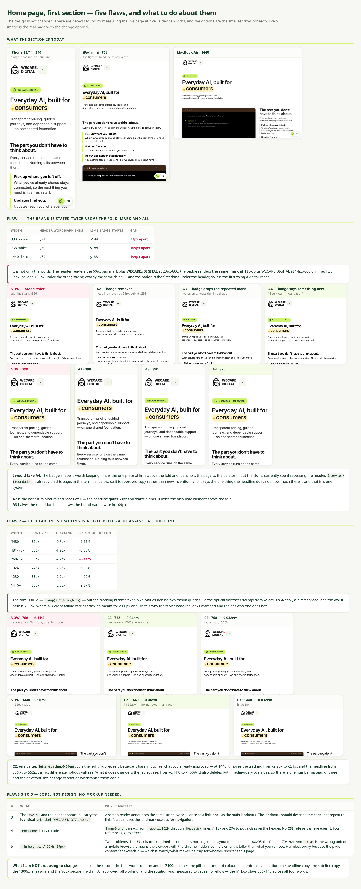

# Home page, first section — five flaws, and the smallest fix for each

Nothing in `src/` is changed on this branch. Measurements and mockups only.

**The design is not changed.** These are defects found by measuring the live page at twelve device widths, and every image is the real page with the change applied — not a drawing.

---

## Flaw 1 — the brand is stated twice above the fold, mark and all

| Width | Header wordmark ends | Lime badge starts | Gap |
| --- | --- | --- | --- |
| 390 phone | y71 | y144 | **73px apart** |
| 768 tablet | y79 | y188 | **109px apart** |
| 1440 desktop | y79 | y188 | **109px apart** |

It is not only the words. The header renders the 60px bag mark plus **WECARE.** / **DIGITAL** at 23px/800. The badge renders **the same mark at 18px** plus WECARE.DIGITAL at 14px/600 on lime. Two lockups, one 109px under the other, saying exactly the same thing — and the badge is the first thing under the header, so it is the first thing a visitor reads.

| | What it does |
| --- | --- |
| **NOW** | brand twice; sub-line starts y356 |
| **A2** | badge removed — headline moves up 58px, sub-line at y298 |
| **A3** | badge drops the repeated mark, keeps the words and the lime shape |
| **A4** | badge says `8 services · 1 foundation` |

**Recommended: A4.** The badge shape is worth keeping — it is the only piece of lime above the fold and it anchors the page to the palette — but the slot is currently spent repeating the header. `8 services · 1 foundation` is **already on this page**, in the terminal below, so it is approved copy rather than new invention, and it says the one thing the headline does not: how much there is, and that it is one system.

**A2** is the honest minimum and reads well; the headline gains 58px and starts higher. It loses the only lime element above the fold. **A3** halves the repetition but still says the brand name twice within 109px.

---

## Flaw 2 — the headline's tracking is a fixed pixel value against a fluid font

| Width | Font size | Tracking | As a % of the font |
| --- | --- | --- | --- |
| ≤480 | 36px | -0.8px | -2.22% |
| 481–767 | 36px | -1.2px | -3.33% |
| **768–820** | 36px | -2.2px | **-6.11%** |
| 1024 | 44px | -2.2px | -5.00% |
| 1280 | 55px | -2.2px | -4.00% |
| 1440+ | 60px | -2.2px | -3.67% |

The font is fluid — `clamp(36px,4.3vw,60px)` — but the tracking is **three fixed pixel values behind two media queries**. So optical tightness swings from **-2.22% to -6.11%**, a 2.75× spread, and the worst case is 768px, where a 36px headline carries tracking meant for a 60px one. That is why the tablet headline looks cramped and the desktop one does not.

**Recommended: C2 — `letter-spacing: -0.04em`.**

It is the right fix precisely because it barely touches what is already approved: at 1440 the tracking moves from -2.2px to -2.4px and the headline from 556px to 552px — a 4px difference nobody will see. What it *does* change is the tablet case, from -6.11% to -4.00%. It also deletes both media-query overrides, so there is one number instead of three and the next font-size change cannot desynchronise them again.

C3 (`-0.032em`, -3.20%) is the looser alternative if -4% still reads tight.

---

## Flaws 3 to 5 — code, not design. No mockup needed.

| # | What | Why it matters |
| --- | --- | --- |
| **3** | `<main>` and the header home link carry the **identical** `aria-label="WECARE.DIGITAL home"` | A screen reader announces the same string twice — once as a link, once as the main landmark. The landmark should describe the page, not repeat the link, and repeating it makes the landmark useless for navigation. |
| **4** | `.hdr-home` is dead code | `homeBrand` threads from `_app.tsx:1029` through `Header.tsx` lines 7, 187 and 296 to put a class on the header. **No CSS rule anywhere uses it.** Four references, zero effect. |
| **5** | `min-height: calc(100vh - 69px)` | Two problems. The **69px is unexplained** — it matches nothing in the layout (the header is 108/96, the footer 179/192). And `100vh` is the wrong unit on a mobile browser: it means the viewport with the chrome hidden, so the element is taller than what can be seen. Harmless today because the page content far exceeds it — which is exactly what makes it a trap for whoever shortens this page. |

---

## What is deliberately NOT being changed

On the record, so nothing is touched by accident:

- the four-word rotation and its 2400 ms timer
- the pill's tint-and-dot colours
- the entrance animation
- the headline copy and the sub-line copy
- the 1300px measure and the 96px section rhythm

All approved, all working. The rotation was measured for reflow and causes none — the `h1` box stays 556×143px across all four words, because the pill's width transition absorbs the difference.

---

## Decisions needed

1. Badge — **A4** (`8 services · 1 foundation`), **A2** (remove), **A3** (drop the mark), or leave it?
2. Tracking — **C2** (`-0.04em`), **C3** (`-0.032em`), or leave it?
3. Flaws 3, 4, 5 — fix all three? They are small and independent.
