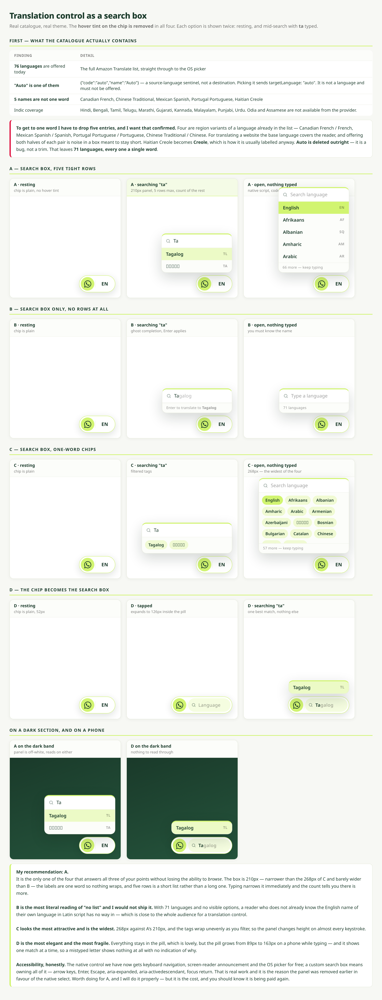

# Translation control as a search box

Nothing in `src/` is changed on this branch. Mockups and findings only, for a decision.

The **hover tint on the chip is removed in all four options** — that part needs no choice.

> **One caveat about the image.** The Indic names render as empty boxes (□□□□□) because the headless browser that produced it has no Tamil or Devanagari fonts installed. On a real phone or laptop they render correctly. Everything else in the image is accurate — sizes, colours, spacing, filtering.

---

## First — what the catalogue actually contains

Pulled live from `https://api.wecare.digital/site-language/languages`, saved here as [`live-catalogue.json`](./live-catalogue.json).

| Finding | Detail |
| --- | --- |
| **76 languages are offered today** | The full Amazon Translate list, passed straight through to the OS picker |
| **"Auto" is one of them** | `{"code":"auto","name":"Auto"}` — a *source*-language sentinel, not a destination. Selecting it sends `targetLanguage: "auto"`. It is not a language and must not be offered. **This is a bug, not a trim.** |
| **5 names are not one word** | Canadian French, Chinese Traditional, Mexican Spanish, Portugal Portuguese, Haitian Creole |
| Indic coverage | Hindi, Bengali, Tamil, Telugu, Marathi, Gujarati, Kannada, Malayalam, Punjabi, Urdu. **Odia and Assamese are not available from the provider.** |

### Getting to "one word max" means dropping five entries — please confirm

Four of the five are **region variants of a language already in the list**:

| Drop | Because | Kept |
| --- | --- | --- |
| Canadian French | variant | French |
| Mexican Spanish | variant | Spanish |
| Portugal Portuguese | variant | Portuguese |
| Chinese Traditional | variant | Chinese |

For translating a website the base language serves the reader, and offering both halves of each pair is noise in a box meant to stay short. Haitian Creole becomes **Creole**, which is how it is usually labelled anyway.

That leaves **71 languages, every one a single word.**

---

## The four options

Each is shown resting, and mid-search with `ta` typed.

| | What it is | Width | Verdict |
| --- | --- | --- | --- |
| **A** | Search box + up to 5 tight rows, with a count of the rest | **210px** | **Recommended** |
| **B** | Search box only, ghost completion, no rows at all | 208px | Would not ship |
| **C** | Search box + one-word chips in a wrapped grid | 268px | Prettiest, widest |
| **D** | The chip itself expands into the search box, inside the pill | pill grows to 163px | Most elegant, most fragile |

### Why A

It is the only one that answers all three of your points without losing the ability to **browse**. 210px — narrower than C's 268px and barely wider than B. Labels are one word so nothing wraps. Five rows is a short list rather than a long one, typing narrows it immediately, and the count tells you there is more.

### Why not B

It is the most literal reading of "no list", and that is the problem. With 71 languages and nothing visible, a reader who does not already know the English name of their own language *in Latin script* has no way in — which is close to the entire audience for a translation control.

### Why not C

The most attractive of the four and the widest. 268px against A's 210px, and the tags wrap unevenly as you filter, so the panel changes height on almost every keystroke.

### Why not D

Everything stays inside the pill, which is genuinely nicer. But the pill grows from 89px to 163px on a phone while typing, and it shows one match at a time — so a single mistyped letter shows nothing at all, with no indication why.

---

## Two things I need you to decide

**1. The label: native script or English?**

A Tamil reader scans for **தமிழ்**, not "Tamil" — that is the standard for language pickers, and both are one word. But typing is the other half: search will match **both** the native name and the English name, so `ta`, `tam` or `தம` all find Tamil.

- **Native script** where we have it (11 languages: Hindi, Bengali, Tamil, Telugu, Marathi, Gujarati, Kannada, Malayalam, Punjabi, Urdu, English), English name for the other 60. This is what the mockup shows.
- **English name for all 71** — uniform and scannable for a mixed audience, but worse for the readers the feature exists for.

**2. Confirm the five drops and the Auto deletion** above.

---

## The cost, stated plainly

The native `<select>` we have today gets keyboard navigation, screen-reader announcement and the OS picker **for free**. A custom search box means owning all of it: arrow keys, Enter, Escape, `aria-expanded`, `aria-activedescendant`, focus return on close, and an outside-click that does not fight the pill.

That is real work, and it is the reason the previous custom panel was removed in favour of the native select earlier in this redesign. It is worth doing for A and I will do it properly — but the cost is being paid a second time, and you should know that going in.
